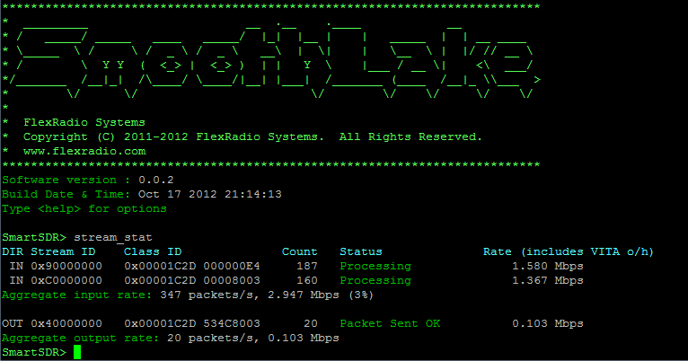
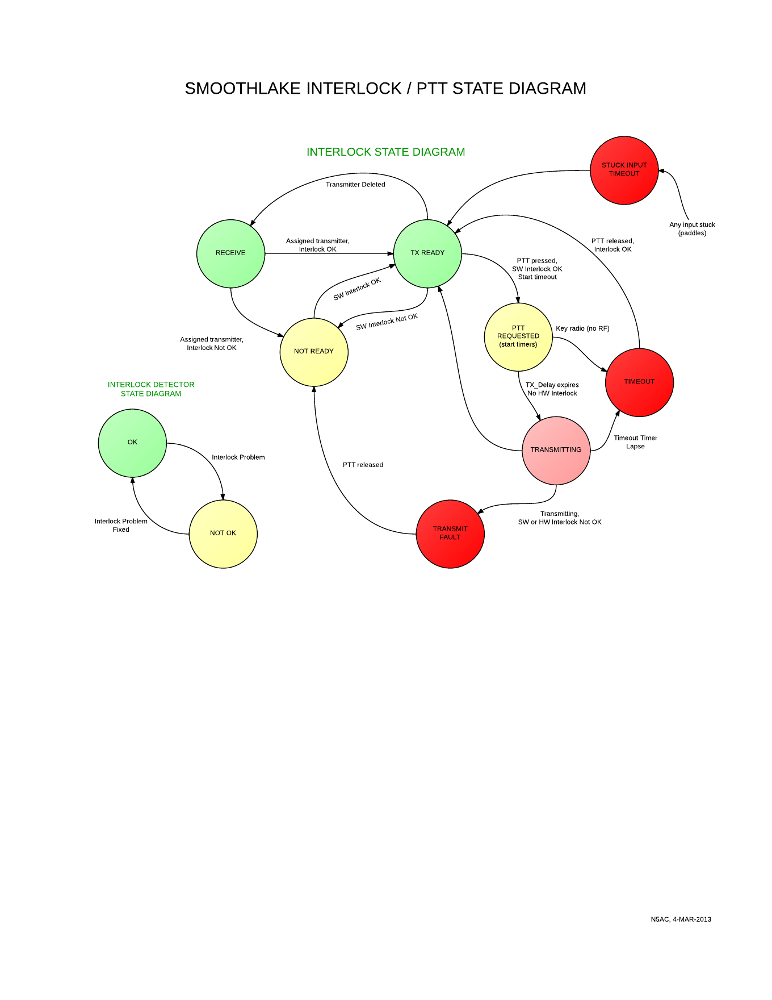
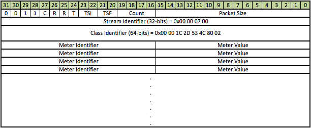
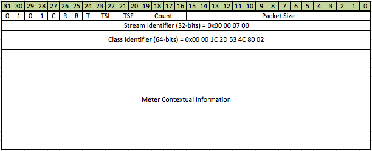
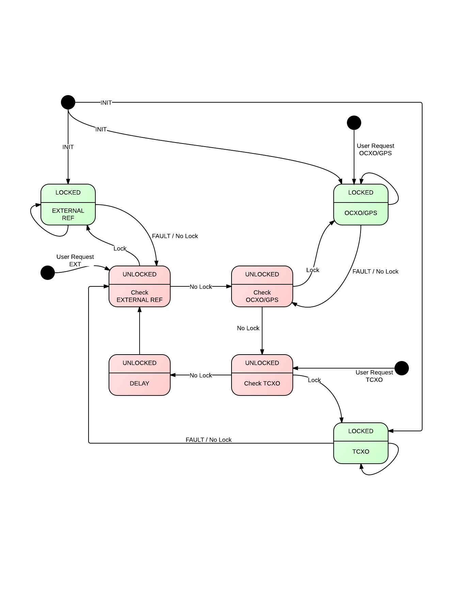
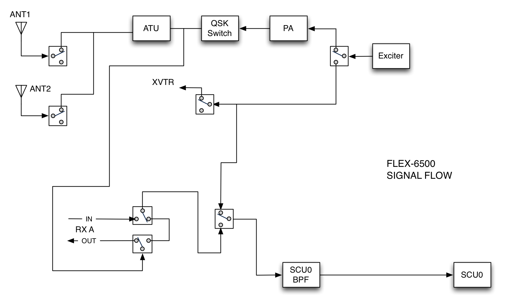
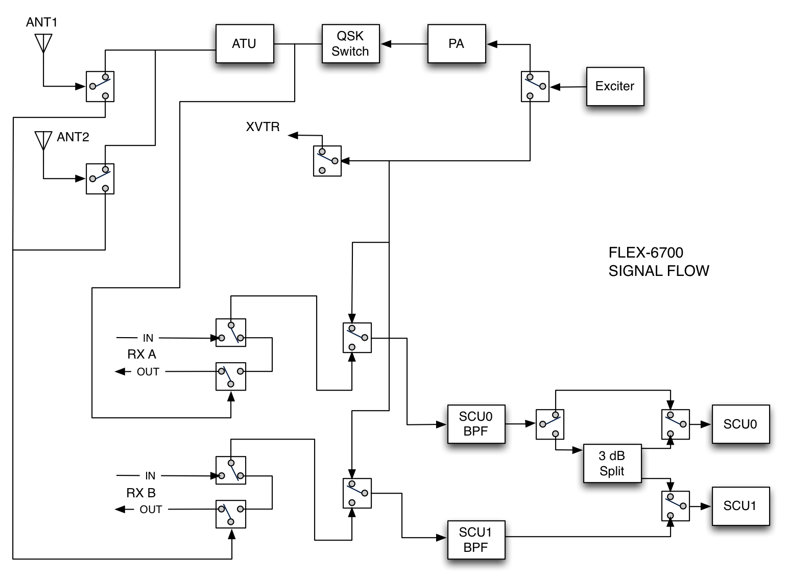

# FlexRadio SmartSDR Complete API Documentation
*Consolidated from official GitHub wiki*

---

## 📚 Table of Contents

1. [Home](#home)
2. [SmartSDR TCPIP API](#smartsdr-tcpip-api)
3. [TCPIP slice](#tcpip-slice)
4. [TCPIP transmit](#tcpip-transmit)
5. [TCPIP filt](#tcpip-filt)
6. [TCPIP audio client](#tcpip-audio-client)
7. [TCPIP display pan](#tcpip-display-pan)
8. [TCPIP sub](#tcpip-sub)
9. [Known API Responses](#known-api-responses)
10. [SmartSDR Status Responses](#smartsdr-status-responses)
11. [SmartSDR Messages](#smartsdr-messages)
12. [ Footer](#_footer)
13. [Alpha Testing](#alpha-testing)
14. [Boolean State](#boolean-state)
15. [Colors](#colors)
16. [Command b](#command-b)
17. [Command chain](#command-chain)
18. [Command cls](#command-cls)
19. [Command filt](#command-filt)
20. [Command mmx](#command-mmx)
21. [Command scu](#command-scu)
22. [Command stream stat](#command-stream-stat)
23. [Command sub](#command-sub)
24. [Command version](#command-version)
25. [Discovery protocol](#discovery-protocol)
26. [Front Panel LED Indications](#front-panel-led-indications)
27. [Interlock State Transition Diagram](#interlock-state-transition-diagram)
28. [Main Page](#main-page)
29. [Metering Protocol](#metering-protocol)
30. [Panadapter](#panadapter)
31. [PowerGenius Ethernet API](#powergenius-ethernet-api)
32. [Reference Selection State Diagram](#reference-selection-state-diagram)
33. [RF Signal Flow Diagrams](#rf-signal-flow-diagrams)
34. [SmartSDR Client Documentation](#smartsdr-client-documentation)
35. [SmartSDR Command Line API](#smartsdr-command-line-api)
36. [SmartSDR Ethernet API](#smartsdr-ethernet-api)
37. [SmartSDR FlexLib .NET API](#smartsdr-flexlib-.net-api)
38. [SmartSDR GUI Behaviors](#smartsdr-gui-behaviors)
39. [SmartSDR Supported Modes](#smartsdr-supported-modes)
40. [SmartSDR Terminology](#smartsdr-terminology)
41. [TCPIP amplifier](#tcpip-amplifier)
42. [TCPIP antenna list](#tcpip-antenna-list)
43. [TCPIP atu](#tcpip-atu)
44. [TCPIP client](#tcpip-client)
45. [TCPIP cw](#tcpip-cw)
46. [TCPIP cwx](#tcpip-cwx)
47. [TCPIP dax](#tcpip-dax)
48. [TCPIP display panafall](#tcpip-display-panafall)
49. [TCPIP display panf](#tcpip-display-panf)
50. [TCPIP eq](#tcpip-eq)
51. [TCPIP file](#tcpip-file)
52. [TCPIP info](#tcpip-info)
53. [TCPIP interlock](#tcpip-interlock)
54. [TCPIP keepalive](#tcpip-keepalive)
55. [TCPIP memory](#tcpip-memory)
56. [TCPIP message](#tcpip-message)
57. [TCPIP meter](#tcpip-meter)
58. [TCPIP mic](#tcpip-mic)
59. [TCPIP mixer](#tcpip-mixer)
60. [TCPIP name](#tcpip-name)
61. [TCPIP ping](#tcpip-ping)
62. [TCPIP preamp](#tcpip-preamp)
63. [TCPIP profile](#tcpip-profile)
64. [TCPIP radio](#tcpip-radio)
65. [TCPIP read mclpower](#tcpip-read-mclpower)
66. [TCPIP remote audio](#tcpip-remote-audio)
67. [TCPIP scu preamp](#tcpip-scu-preamp)
68. [TCPIP scu](#tcpip-scu)
69. [TCPIP spot](#tcpip-spot)
70. [TCPIP stream](#tcpip-stream)
71. [TCPIP tnf](#tcpip-tnf)
72. [TCPIP trace](#tcpip-trace)
73. [TCPIP unsub](#tcpip-unsub)
74. [TCPIP version](#tcpip-version)
75. [TCPIP waveform](#tcpip-waveform)
76. [TCPIP xmit](#tcpip-xmit)
77. [TCPIP xvtr](#tcpip-xvtr)
78. [Windows FAQ](#windows-faq)
79. [Windows Operations Manual](#windows-operations-manual)
80. [Windows Troubleshooting Guide](#windows-troubleshooting-guide)

---


## Home

## FLEX-6000 Hardware

-   [RF Signal Flow Diagrams](RF-Signal-Flow-Diagrams "wikilink")
-   [Reference Selection State
    Diagram](Reference-Selection-State-Diagram "wikilink")
-   [Front Panel LED
    Indications](Front-Panel-LED-Indications "wikilink")

## SmartSDR API

-   [SmartSDR Terminology](SmartSDR-Terminology "wikilink")
-   [SmartSDR Ethernet API](SmartSDR-Ethernet-API "wikilink")
    -   [SmartSDR TCP/IP API](SmartSDR-TCPIP-API "wikilink")
    -   [Metering protocol](Metering-protocol "wikilink")
    -   [Discovery protocol](Discovery-protocol "wikilink")
-   [SmartSDR Command Line API](SmartSDR-Command-Line-API "wikilink")
-   [SmartSDR GUI Behaviors](SmartSDR-GUI-Behaviors "wikilink")
-   [SmartSDR FlexLib .NET API](SmartSDR-FlexLib-.NET-API "wikilink")
-   [Programming the API: a Primer by
    G3WGV](https://g3wgv.com/flexradio/API-Primer-V1.002.pdf)

## PowerGenius API

-   [PowerGenius Ethernet API](PowerGenius-Ethernet-API "wikilink")

## FLEX-6000 Signature Series Documentation

-   [FLEX-6000 Hardware Manual
    (English)](http://www.flexradio.com/downloads/flex-6000-hardware-reference-manual-pdf/)
-   [FLEX-6000 Hardware Manual
    (German)](http://www.flexradio.com/downloads/flex-6000_referenzhandbuch-pdf/)

<!-- -->

-   [SmartSDR for Windows Software Users Guide
    (English)](http://www.flexradio.com/downloads/smartsdr-software-users-guide-pdf/)
-   [SmartSDR for Windows Software Users Guide
    (German)](http://www.flexradio.com/downloads/smartsdr_betriebshandbuch-pdf/)

## SmartSDR Alpha/Beta Testing

-   [Alpha Testing](Alpha-Testing "wikilink")


---


## SmartSDR TCPIP API

## SmartSDR TCP/IP API

The SmartSDR TCP/IP API performs the following functions:

1.  Issuing [commands](#Command-Format "wikilink") to the radio
2.  Querying the radio for status
3.  Receiving streaming [status information](#Status-Format "wikilink")
    from the radio
4.  Locating radios via the discovery protocol

The command API is accessed using a TCP/IP socket connection to port
4992 of the radio. To locate radios on the local network, use the
[discovery protocol](Discovery-Protocol "wikilink")

## SmartSDR TCP/IP Command Protocol

### Command Prologue

Upon connecting to the client port, SmartSDR will provide the version
number of the interface and the client handle identifier. Both of these
are provided each time the client connects to the radio.

#### VERSION

Protocol version is sent from the radio to the client to notify the
client of the protocol version to be used.

    V<d.e.a.b>

    V          = indicates version information
    <d.e.a.b>  = major version number in decimal '.' minor version number in decimal '.' a '.' b

Example:

    V1.0.0.0

The 'a' and 'b' numbers are developers discretion and are subject to
change without notice. Generally, no decisions should be made on these
numbers.

#### HANDLE

The handle provided by the radio is a 32-bit hexadecimal number that
uniquely identifies this client connection. It will subsequently be sent
to the the client, along with handles of other clients, to denote which
clients executed actions that triggered [status
responses](#Status-Format "wikilink"). Handle Information (from radio to
client):

    H<handle>

    H         = indicates that the handle follows
    <handle>  = 32-bit hexadecimal handle

Example:

    H6F4EC23D

### Command Format

Once the connection is established, the client may begin sending
commands to the radio. Commands follow a general ASCII format. Command
format (from client to radio):

    C[D]<seq_number>|command<terminator>

    C             = indicates a command
    D             = optional D after the C requests verbose debug output for this command execution which is returned in the response
    <seq_number>  = numeric, up to 32-bits
    <terminator>  = 0x0D, 0x0A, or 0x0D 0x0A

### Response Format

All commands receive responses from the radio. One and only one response
will be sent for each command received by the radio. The response is
tied to the command by the sequence number supplied by the client. This
sequence number will be echoed back to the client in the response. The
client should check the hex response to determine if the command issued
was successful. A zero (0) value indicates success. Any other value
represents a failure of the command to execute. The response value is
unique and provides insight into the failure mode. It is recommended
that any decisions that are made in the client based on a response
should use the hexadecimal response to make the decisions. Response
Format (from radio to client):

    R<seq_number>|<hex_response>|Message[|Debug output]

    <seq_number>   = numeric, up to 32-bits -- echoed from the command sent from the client
    <hex response> = ASCII hexadecimal number (32-bit) return value (see table below for possibilities)
    <message>      = response value for parsing
    <debug output> = optional debug free-format text to assist in application development.

It is generally not recommended that the debug output be parsed by
computer to extract information since the debug output could change at
any time.

A list of responses can be found on the
[known_responses](Known-API-Responses "wikilink") page.

### Status Format

Objects in the radio will send out status when they are changed. To find
out about objects, the client must have either subscribed to status for
the object ot controlled the object first (in which case an automatic
subscription is entered on the client's behalf). Status messages are
asynchronous and can be sent to the client at any time. Status Format
(from radio to client):

    S<handle>|<message>

    <handle>    = the handle of the client that triggered the update (or 0 for a command line/system change)
    <message>   = status value for parsing

The period character is used as a decimal separator independent of
locale. A detailed list of status responses can be found in [SmartSDR
Status Responses](SmartSDR-Status-Responses "wikilink")

### Message Format

Messages from the radio can be emitted to the client to let the client
know about various status changes, alarms, etc. inside the radio.
Messages are generally free format and also have a 32-bit message number
so that they may be trapped by the client and displayed differently if
appropriate. Message Format (from radio to client):

    M<message_num>|<message_text>

    <message_num>    = 32-bit hexadecimal number where bits 24-25 contain the severity of the message (0=Informational, 1=Warning, 2=Error, 3=Fatal Error)
    <message_text>   = text to show operator if this message should be displayed

If command A is executed before command B, all status reported by
command A will be sent before the first status reported by command B.

A detailed list of messages can be found in [SmartSDR
Messages](SmartSDR-Messages "wikilink")

## SmartSDR TCP/IP Commands

-   [amplifier](TCPIP-amplifier "wikilink") → register and control
    amplifier clients
-   [antenna-list](TCPIP-antenna-list "wikilink") → retrieve a list of
    available antennas
-   [atu](TCPIP-atu "wikilink") → antenna tuner commands
-   [audio client](TCPIP-audio-client "wikilink") → Add/Remove/Set
    Gain/Pan of Slices for each client
-   [client](TCPIP-client "wikilink") → identify, register or make
    changes to client settings
-   [cw](TCPIP-cw "wikilink") → make changes to the CW keyer or CW mode
    parameters
-   [cwx](TCPIP-cwx "wikilink") → send CW with ASCII characters and
    update/play the CW macros
-   [dax](TCPIP-dax "wikilink") → control DAX subsystem, subscribe to
    audio or I/Q samples
-   [display pan](TCPIP-display-pan "wikilink") → creation and control
    of panadapter displays
-   [display panf](TCPIP-display-panf "wikilink") → creation and
    control of panafall displays
-   [eq](TCPIP-eq "wikilink") → adjust RX or TX equalizer
-   [file](TCPIP-file "wikilink") → file upload interface for updating
    the radio, importing settings and loading waveforms
-   [filt](TCPIP-filt "wikilink") → adjust slice receiver filter
    settings
-   [info](TCPIP-info "wikilink") → get radio information such as model
    and serial number
-   [interlock](TCPIP-interlock "wikilink") → adjust transmitter
    interlock settings, TX1/2/3 outputs, timeouts, etc.
-   [keepalive](TCPIP-keepalive "wikilink") → enable or disable the
    TCP/IP channel keepalive system
-   [memory](TCPIP-memory "wikilink") → update and display memories
-   [message](TCPIP-message "wikilink") → display an important message
    on client systems
-   [meter](TCPIP-meter "wikilink") → control or list meters in radio
-   [mic](TCPIP-mic "wikilink") → adjust mic settings or change mic
    source
-   [mixer](TCPIP-mixer "wikilink") → adjust audio mixer settings
-   [name](TCPIP-name "wikilink") → identify the name of the current
    client program
-   [ping](TCPIP-ping "wikilink") → inform the keep-alive mechanism
    that the client remains active
-   [profile](TCPIP-profile "wikilink") → save, load or get info on
    transmit or global profiles
-   [preamp](TCPIP-preamp "wikilink") → adjust preamplifier settings on
    an SCU
-   [radio](TCPIP-radio "wikilink") → adjust radio name or callsign or
    change GPS parameters
-   [read_mclpower](TCPIP-read-mclpower "wikilink") → read power in dBm
    from attached Mini-Circuits USB Power Meter
-   [remote_audio](TCPIP-remote-audio "wikilink") → control audio to a
    remote client
-   [slice](TCPIP-slice "wikilink") → creation or manipulation of slice
    receivers
-   [spot](TCPIP-spot "wikilink") → create, modify, remove spots that
    show up on the Panadapter
-   [stream](TCPIP-stream "wikilink") → create or remove radio data
    streams (for use in DAX, for exmaple)
-   [sub](TCPIP-sub "wikilink") → creation of status subscriptions to
    objects
-   [scu](TCPIP-scu "wikilink") → manipulation of Spectrum Capture
    Units (SCUs) including preamplifiers, etc.
-   [tnf](TCPIP-tnf "wikilink") → create/save/adjust tracking notch
    filter (TNF) settings
-   [trace](TCPIP-trace "wikilink") → return results of a command trace
-   [transmit](TCPIP-transmit "wikilink") → adjust transmitter settings
    including mic levels, monitor levels, vox settings, power and tune
    settings
-   [unsub](TCPIP-unsub "wikilink") → removal of status subscriptions
    to objects
-   [version](TCPIP-version "wikilink") → report versions of radio
    firmware that are currently running
-   [waveform](TCPIP-waveform "wikilink") → register and control
    waveforms
-   [xmit](TCPIP-xmit "wikilink") → place or remove the radio from
    transmit
-   [xvtr](TCPIP-xvtr "wikilink") → create, remove or adjust
    transverter settings

---


## TCPIP slice

### CREATE

Create a slice receiver. *See [SmartSDR Supported
Modes](SmartSDR-Supported-Modes "wikilink") for a complete list of
supported modes*

    C[D]<seq_number>|slice create [freq=<MHz>][pan=<streamID>][ant=<antenna_port>][mode=<mode>][clone_slice=<source_slice>]

    <MHz>          = frequency in MHz, up to 15 significant digits
    <streamID>     = stream identification
    <antenna_port> = antenna designator: ANT1, ANT2, RXA, RXB, or XVTR
    <mode>         = alphanumeric mode designator: usb, lsb, cw, am ...
    <source_slice> = slice to be cloned

Example:

    C21|slice create freq=10.0 ant=ANT1 mode=usb

See [Response Format](SmartSDR-TCPIP-API#Response-Format "wikilink")
for details on the format of the response messages from the radio

| Hex Response | Message    | Debug Output / Meaning                                      |
|--------------|------------|-------------------------------------------------------------|
| 00000000     | <slice_rx> | OK Slice receiver <num> created on <freq>MHz on port <port> |
| 50000001     |            | Unable to get foundation receiver assignment                |
| 50000003     |            | License check failed, cannot create slice receiver          |
| 50000004     |            | Slice parameter error                                       |
| 50000005     |            | The number or type of parameters supplied is incorrect      |
| 50000016     |            | Malformed Command                                           |
| 5000002C     |            | Incorrect number of parameters                              |
| 50000032     |            | Bad Mode                                                    |

Responses

`   `<slice_rx>` = the slice receiver number assigned to this slice receiver`
`   `
`   `

Response Example:

    R21|0|2|OK Slice receiver 2 created on 10.000 MHz on port ANT1

### GET_ERROR

Returns the frequency error of a slice. Slices are tuned using a set of
digital tuning elements that can be slightly off-frequency. This command
will report the known difference in the requested and actual frequency.
Note that this command is only useful if the radio is GPS locked or
locked to a 10MHz reference. The result does not take into account any
drift in the internal OCXO or TCXO. Note that the FLEX-6500 and
FLEX-6700(R) use a PLL master oscillator with a very narrow loop
bandwidth (10Hz) that will have around a 3-4 cycle-per-minute sinusoid
that will modulate the receiver and transmitter. Typical error induced
by the oscillation is in the vicinity of 3mHz peak-to-peak. Long-term
averaging should null out this error (v1.10.8 and later)

    C[D]<seq_number>|slice get_error <slice_rx>

    <slice_rx>    =  the slice receiver number that has the error.  Slice receivers are numbered starting with zero (0)

Example:

    C21|slice get_error 0

See [Response Format](SmartSDR-TCPIP-API#Response_Format "wikilink")
for details on the format of the response messages from the radio

| Hex Response | Message                           | Debug Output / Meaning                                                                                                                                                 |
|--------------|-----------------------------------|------------------------------------------------------------------------------------------------------------------------------------------------------------------------|
| 00000000     | <rx_error_value>,<tx_error_value> | <rx_error_value> is the frequency offset in mHz for the receiver (tx for transmitter). Negative values indicate the receiver or transmitter is tuned low in frequency. |
| 50000004     |                                   | Incorrect number of parameters                                                                                                                                         |
| 50000005     |                                   | The number or type of parameters supplied is incorrect                                                                                                                 |
| 5000000D     |                                   | Invalid Slice Receiver                                                                                                                                                 |
| 5000002C     |                                   | Incorrect number of parameters                                                                                                                                         |

Responses

Response Example:

    R21|0|+3.56432,-11.346234

### REMOVE

Remove (delete) a slice receiver

    C[D]<seq_number>|slice r <slice_rx>

    <slice_rx>    =  the slice receiver number to be removed.  Slice receivers are numbered starting with zero (0)

Example:

    C19|slice r 0

See [Response Format](SmartSDR-TCPIP-API#Response_Format "wikilink")
for details on the format of the response messages from the radio

| Hex Response | Message | Debug Output / Meaning                                 |
|--------------|---------|--------------------------------------------------------|
| 00000000     |         | Successfully deleted slice receiver                    |
| 50000005     |         | The number or type of parameters supplied is incorrect |
| 5000000D     |         | Invalid Slice Receiver                                 |
| 5000002C     |         | Incorrect number of parameters                         |
| 534C9999     |         | The slice number provided is invalid                   |

Responses

Response Example:

    R19|0||

### TUNE

Tune the slice receiver to a new frequency

    C[D]<seq_number>|slice t <slice_rx> <frequency> [autopan=<0|1>]

    <slice_rx>    =  the slice receiver number to be removed.  Slice receivers are numbered starting with zero (0)
    <frequency>   =  the new frequency for the slice receiver specified in MHz
    autopan specifies if panadapters should be tuned to keep slice in view

Example:

    C12|slice t 1 14.2055

See [Response Format](SmartSDR-TCPIP-API#Response_Format "wikilink")
for details on the format of the response messages from the radio

| Hex Response | Message | Debug Output / Meaning                                                                   |
|--------------|---------|------------------------------------------------------------------------------------------|
| 00000000     |         | Successfully tuned slice receiver                                                        |
| 50000005     |         | The number or type of parameters supplied is incorrect                                   |
| 5000000C     |         | The frequency requested is out of range                                                  |
| 5000000D     |         | Invalid slice receiver number                                                            |
| 5000001D     |         | Insufficient resources to tune to that frequency (requires new minimixer, not available) |
| 534C9999     |         | The slice number provided is invalid                                                     |

Responses

Response Example:

    R12|0||

### LIST

Retrieve a list of slice receivers currently enabled. Note that the
single letter after the slice command is a lower case L, not a number
one.

    C[D]<seq_number>|slice list

Example:

    C41|slice list

See [Response Format](SmartSDR-TCPIP-API#Response_Format "wikilink")
for details on the format of the response messages from the radio

| Hex Response | Message      | Debug Output / Meaning           |
|--------------|--------------|----------------------------------|
| 00000000     | <slice list> | list of slice receivers provided |
|              |              |                                  |

Responses

Response Example:

    R41|0|0 1 3 4|

In this example, slice receivers 0, 1, 3 and 4 are all enabled and in
use.

### SET

Changes various operational parameters specific to the slice receiver.

    C[D]<seq_number>|slice s <slice_rx> <parameter=value> [<parameter=value>...]

Example:

    C41|slice s 0 nr=50

Parameters that can be set and the appropriate values are listed in the
table below:

| Parameter     | Value                                                                                                                            |
|---------------|:---------------------------------------------------------------------------------------------------------------------------------|
| active        | select (active=1) or deselect (active=0) the specified slice                                                                     |
| agc_mode      | specify the agc mode \<off\|slow\|med\|fast\>                                                                                    |
| agc_off_level | specify at what level agc will turn off                                                                                          |
| agc_threshold | set the agc threshold \<0-100\>                                                                                                  |
| anf           | automatic notch filter state (on or off)                                                                                         |
| anf_level     | automatic notch filter level: 0=OFF, range 0-100                                                                                 |
| apf           |                                                                                                                                  |
| apf_level     | set apf level \<0-100\>                                                                                                          |
| dax           | dax channel to be used by the specified slice receiver                                                                           |
| diversity     | enable/disable diversity                                                                                                         |
| mode          | demodulation mode (*See [SmartSDR Supported Modes](SmartSDR_Supported_Modes "wikilink") for a complete list of supported modes*). Note that changing the mode may alter the associated meters for the slice object. |
| nb            | noise blanking state (on or off)                                                                                                 |
| nb_level      | noise blanking level: 0=OFF, range 0-100                                                                                         |
| nr            | noise reduction state (on or off)                                                                                                |
| nr_level      | noise reduction level: 0=OFF, range 0-100                                                                                        |
| tnf           | enable/disable tnf \<T\|F\>                                                                                                      |
| tx            | enable (tx=1) or disable (tx=0) transmission via the specified slice                                                             |
| txant         | specify the tx antenna port ex: ANT1                                                                                             |
| wnb           | enable/disable white noise blanker \<on\|off\>                                                                                   |
| wnb_level     | set the wnb level \<0-100\>                                                                                                      |                      
| step          | specifies a step                                                                                                                 |
| step_list     | returns list of steps                                                                                                            |
| record        | starts recording <0|1>                                                                                                           |
| play          | starts playing recording <0|1>                                                                                                   |
| fm_deviation  | changes the frequency deviation in Hz                                                                                            |
| dfm_pre_de_emphasis | <T|F>                                                                                                                      |
| rf_gain       | changes frequency gain <-10|0|10|20|30>                                                                                          |
| audio_level   | audio level <0-100>                                                                                                              |
| audio_pan     | pan audio level <0-100>                                                                                                          |
| sample_rate   | adjust sample rate <24000|48000|96000>                                                                                           |
| squelch       | enable/disable squelch <1|0>                                                                                                     |
| squelch_level | squelch level state <1|m|h|<0-100>>                                                                                              |
| pos_mute      | toggle pos mute <0|1>                                                                                                            |

See [Response Format](SmartSDR-TCPIP-API#Response_Format "wikilink")
for details on the format of the response messages from the radio

| Hex Response | Message | Debug Output / Meaning                                                             |
|--------------|---------|------------------------------------------------------------------------------------|
| 00000000     |         | OK - update successful                                                             |
| 5000000F     |         | Invalid DSP process (the process you attempted to set it not in this signal chain) |
| 50000016     |         | Malformed command                                                                  |
| 5000002D     |         | Bad field                                                                          |
| 5000002F     |         | Unimplemented mode (mode recognized, but not yet implemented)                      |
| 50000030     |         | Signal chain error - likely bad mode                                               |
| 50000032     |         | Unrecognized mode (string)                                                         |
| 50000033     |         | Parameter out of range                                                             |

Responses

Response Example:

    R41|0|0 1 3 4|

In this example, slice receivers 0, 1, 3 and 4 are all enabled and in
use.

---


## TCPIP transmit

### TUNE

    C[D]<seq_number>|transmit tune on|off

Example:

    C19|transmit tune off

See [Response Format](SmartSDR-TCPIP-API#Response-Format "wikilink")
for details on the format of the response messages from the radio

| Hex Response | Message | Debug Output / Meaning         |
|--------------|---------|--------------------------------|
| 00000000     |         | OK                             |
| 5000002C     |         | Incorrect number of parameters |
| 5000003D     |         | TX not supported               |
| 50000042     |         | Not ready to transmit          |
| 50000043     |         | No Transmitter                 |

Responses

Response Example:

    R19|0|

### SET

Changes various operational parameters specific to transmission.

    C[D]<seq_number>|transmit set <parameter=value> [<parameter=value>...]

Example:

    C41|transmit set dax=1

Parameters that can be set and the appropriate values are listed in the
table below:

| Parameter               | Value                                                                                       |
|-------------------------|:--------------------------------------------------------------------------------------------|
| compander               | enable/disable                                                                              |
| compander_level         | range 0-100                                                                                 |
| dax                     | enable (dax=1) or disable (dax=0) DAX as the primary transmit audio source                  |
| extra_mic_gain          | range 0-24dB                                                                                |
| extra_line_gain         | range 0-2dB                                                                                 |
| hwalc_enabled           | enable/disable                                                                              |
| max_power_level         | range 0-100                                                                                 |
| met_in_rx               | enable/disable                                                                              |
| miclevel                | microphone level: range 0-100                                                               |
| mon_pan_cw              | sidetone volume: range 0-100                                                                |
| mon_pan_sb              | sidetone volume: range 0-100                                                                |
| mon_gain_cw             | sidetone volume: range 0-100                                                                |
| mon_gain_sb             | sidetone volume: range 0-100                                                                |
| mon                     | sidetone volume: range 0-100                                                                |
| rfpower                 | range 0-100                                                                                 |
| show_tx_in_waterfall    | enable/disable                                                                              |
| speech_processor_enable | enable (speech_processor_enable=1) or disable (speech_processor_enable=0) speech processing |
| speech_processor_level  | speech processing level: 0=normal, 1=DX, 2=DX+                                              |
| tunepower               | tuning power level: range 0-100                                                             |
| vox                     | enable/disable                                                                              |
| vox_level               | range 0-100                                                                                 |
| vox_delay               | delay in ms                                                                                 |
| filter_low,high         | bandwidth filter frequency: low >= 0, high <= 10000                                                                                            | 

See [Response Format](SmartSDR-TCPIP-API#Response-Format "wikilink")
for details on the format of the response messages from the radio

| Hex Response | Message | Debug Output / Meaning |
|--------------|---------|------------------------|
| 00000000     |         | OK - update successful |
| 50000016     |         | Malformed command      |
| 5000002D     |         | Bad field              |
| 50000033     |         | Parameter out of range |

Responses

### BANDSET

Bandset configuration settings


    C[D]<seq_number>|transmit bandset <band_id> <key>=<value> rfpower=<0-100> tunepower=<0-100> hwalc_enabled=<0|1>

Example:
    
   C41|transmit bandset 1 <key>=1 rfpower=50 tunepower=30 hwalc_enable=1

See [Response Format](SmartSDR-TCPIP-API#Response-Format "wikilink")
for details on the format of the response messages from the radio

| Hex Response | Message | Debug Output / Meaning |
|--------------|---------|------------------------|
| 00000000     |         | OK                     |
| 50000016     |         | Malformed command      |
| 50000033     |         | Parameter out of range |

### MIRROR_FPGA

Transmit mirror_fpga with ip address and port destination
    
   C[D]<seq_number>|transmit mirror_fpga off | ip={IP_ADDR} port={DEST_PORT}

Responses

Example:

   C41|transmit mirror_fpga on ip=192.168.20.8 port=32

| Hex Response | Message | Debug Output / Meaning |
|--------------|---------|------------------------|
| 00000000     |         | OK                     |
| 50000016     |         | Malformed command      |
| 5000002C     |         | Incorrect number of parameters|

Responses

---


## TCPIP filt

### FILT

Set the filter parameters for a slice

    C[D]<seq_number>|filt <slice> <low> <high>
    where <slice> is the slice index on which to change the filter
          <low> is the low cut in Hz
          <high> is the high cut in Hz

Example:

    C19|filt A 100 2800

See [Response Format](SmartSDR-TCPIP-API#Response-Format "wikilink")
for details on the format of the response messages from the radio

| Hex Response | Message | Debug Output / Meaning         |
|--------------|---------|--------------------------------|
| 00000000     |         | OK                             |
| 5000000D     |         | Incorrect slice reciever       |
| 5000002C     |         | Incorrect number of parameters |

Responses

Response Example:

    R19|0|

---


## TCPIP audio client

### ADD

Adds a slice receiver to a client's audio stream

    C[D]<seq_number>|audio client <id> slice <index> add

    <id>           = The Client ID which to add the slice stream
    <index>        = The slice index whose stream to add

Example:

    C42|audio client 1234ABCD slice 0 add

See [Response Format](SmartSDR-TCPIP-API#Response_Format "wikilink")
for details on the format of the response messages from the radio

| Hex Response | Message | Debug Output / Meaning                               |
|--------------|---------|------------------------------------------------------|
| 00000000     |         | OK Slice <index> added to <Client ID>                |
| 5000000D     |         | Invalid slice receiver (<index>)                     |
| 50000024     |         | No Audio Client found for submitted Client ID (<id>) |
| 5000002C     |         | Incorrect number of parameters                       |

Responses

Response Example:

    R42|0||OK OK Slice 0 added to 1234ABCD

### REMOVE

Remove (delete) a slice receiver stream from a client

    C[D]<seq_number>|audio client <id> slice <index> remove

    <id>    =  The Client ID from which to remove the slice stream
    <index> =  The index of the slice to be removed

Example:

    C43|audio client 1234ABCD slice 0 remove

See [Response Format](SmartSDR-TCPIP-API#Response_Format "wikilink")
for details on the format of the response messages from the radio

| Hex Response | Message | Debug Output / Meaning                               |
|--------------|---------|------------------------------------------------------|
| 00000000     |         | OK Successfully removed slice <index> from <id>      |
| 5000000D     |         | Invalid slice receiver (<index>)                     |
| 50000024     |         | No Audio Client found for submitted Client ID (<id>) |
| 50000025     |         | slice <index> not found for (<id>)                   |
| 5000002C     |         | Incorrect number of parameters                       |

Responses

Response Example:

    R43|0||OK Successfully removed slice 0 from 1234ABCD

### GAIN

Set the slice gain for a client

    C[D]<seq_number>|audio client <id> slice <index> gain <val>

    <id>          =  the Client ID to modify
    <index>       =  the slice receiver stream to modify the gain.  The receivers are numbered starting with zero (0)
    <val>         =  the new gain value to use - number in the range [0.0, 1.0]

Example:

    C44|audio client 1234ABCD slice 0 gain 0.7

See [Response Format](SmartSDR-TCPIP-API#Response_Format "wikilink")
for details on the format of the response messages from the radio

| Hex Response | Message | Debug Output / Meaning                                       |
|--------------|---------|--------------------------------------------------------------|
| 00000000     |         | OK slice <index> gain set to <val> for <id>                  |
| 5000000D     |         | Invalid slice receiver number                                |
| 50000024     |         | No Audio Client found for submitted Client ID (<id>)         |
| 50000025     |         | slice <index> not found in Audio Client (<id>)               |
| 50000026     |         | Gain value not within the required \[0.0,1.0\] range (<val>) |
| 5000002C     |         | Incorrect number of parameters                               |

Responses

Response Example:

    R44|0||OK slice 0 gain set to 0.7 for 1234ABCD

### MUTE

Mute or un-mute the slice for a client

    C[D]<seq_number>|audio client <id> slice <index> mute <val>

    <id>          =  the Client ID to modify
    <index>       =  the slice receiver stream to modify the gain.  The receivers are numbered starting with zero (0)
    <val>         =  1 to mute, 0 to un-mute

Example:

    C44|audio client 0 slice 0 mute 1

See [Response Format](SmartSDR-TCPIP-API#Response_Format "wikilink")
for details on the format of the response messages from the radio

| Hex Response | Message | Debug Output / Meaning                               |
|--------------|---------|------------------------------------------------------|
| 00000000     |         | OK slice <index> muted or un-muted for <id>          |
| 5000000D     |         | Invalid slice receiver number                        |
| 50000024     |         | No Audio Client found for submitted Client ID (<id>) |
| 50000025     |         | slice <index> not found in Audio Client (<id>)       |
| 5000002C     |         | Incorrect number of parameters                       |

Responses

Response Example:

    R44|0||OK slice 0 muted for 0

### PAN

Set the slice audio balance (how much audio goes to each ear)

    C[D]<seq_number>|audio client <id> slice <index> pan <val>

    <id>    =  The Client ID to modify
    <index> =  The slice receiver stream to modify.   Slice receivers are numbered starting at 0.
    <val>   =  The value to set balance in the range [0.0, 1.0] where 0.0 is full left and 1.0 is full right.

Example:

    C45|audio client 1234ABCD slice 0 pan 0.4

See [Response Format](SmartSDR-TCPIP-API#Response_Format "wikilink")
for details on the format of the response messages from the radio

| Hex Response | Message | Debug Output / Meaning                                 |
|--------------|---------|--------------------------------------------------------|
| 00000000     |         | OK slice <index> pan set to <val> for <id>             |
| 5000000D     |         | Invalid slice receiver (<index>)                       |
| 50000024     |         | No Audio Client found for submitted Client ID (<id>)   |
| 50000025     |         | slice <index> not found for <id>                       |
| 50000027     |         | Pan value not within required \[0.0, 1.0\] range <val> |
| 5000002C     |         | Incorrect number of parameters                         |

Responses

Response Example:

    R45|0||OK slice 0 pan set to 0.4 for 1234ABCD

---


## TCPIP display pan

### CREATE

Create a panadapter display.

<span style="background:yellow">Only the GUI client may create a
Panadapter successfully today. Issue \#2323 has been added to address
this bug.</span>

    C[D]<seq_number>|display pan c freq=<frequency> [ant=[antenna]] [x=[width]] [y=[height]]

    <frequency>    = frequency in MHz, up to 15 significant digits
    [antenna]      = (optional) antenna port designator (ANT1, ANT2, RX_A, RX_B, XVTR)
    [width]        = (optional) the width of the display in pixels
    [height]       = (optional) the height of the display in pixels

Example:

    C21|display pan c 10.0 1 800 400

See [Response Format](SmartSDR-TCPIP-API#Response_Format "wikilink")
for details on the format of the response messages from the radio

| Hex Response | Message                                      | Debug Output / Meaning                                             |
|--------------|----------------------------------------------|--------------------------------------------------------------------|
| 00000000     | <panadapter stream id>,<waterfall stream id> |                                                                    |
| 50000001     |                                              | Unable to get foundation receiver assignment                       |
| 50000003     |                                              | License check failed, cannot create slice receiver                 |
| 50000005     |                                              | The number or type of parameters supplied is incorrect             |
| 50000016     |                                              | Malformed command (unable to parse the frequency, or similar field |
| 5000002C     |                                              | Incorrect number of parameters                                     |
| 5000002D     |                                              | Bad field                                                          |

Responses

`   `<panadapter stream id>` = the 32-bit hex ID number of the stream to be used as a reference in the client.  Your client implementation should save this value so that it can be used in subsequent "set" commands.`

`   `<waterfall stream id>` = similar reference to the waterfall stream that is automatically created with the Pandapter object.`
`   `
`   `

Response Example:

    R21|0|0x40000000,0x42000000

### REMOVE

Remove (delete) a panadapter display

    C[D]<seq_number>|display pan r <stream_id>

    <stream_id>    =  the panadapter stream ID returned in the prior create command

Example:

    C19|display pan r 0x40000000

See [Response Format](SmartSDR-TCPIP-API#Response_Format "wikilink")
for details on the format of the response messages from the radio

| Hex Response | Message | Debug Output / Meaning                                 |
|--------------|---------|--------------------------------------------------------|
| 00000000     |         | Successfully deleted panadapter                        |
| 50000005     |         | The number or type of parameters supplied is incorrect |
| 534C9999     |         | The slice number provided is invalid                   |

Responses

Response Example:

    R19|0||

### RFGAIN_INFO

Retrieve settings that govern the RF Gain control in the radio. Since
the RF Gain is a function of hardware implementations, each radio may
have different control settings. This command retrieves the details that
will make implementation of a control surface possible.

    C[D]<seq_number>|display pan rfgain_info <stream_id>

    <stream_id>    =  the panadapter stream ID returned in the prior create command

Example:

    C21|display pan rfgain_info 0x40000000

See [Response Format](SmartSDR-TCPIP-API#Response_Format "wikilink")
for details on the format of the response messages from the radio

| Hex Response | Message                             | Debug Output / Meaning                                          |
|--------------|-------------------------------------|-----------------------------------------------------------------|
| 00000000     | <low>,<high>,<step>\[,<marker>\]... | the response contains the details needed to implement a control |

Responses

<low> : low setting for the control
<high> : high setting for the control
<step> : the increment between steps, or granularity of the control
<marker> : the locations of one or more markers to be placed on the control if possible. Each will be separated from the next by a comma

Response Example:

    R21|0|-10,30,10,0,20

In this case the control should have setting that go from -10 to 30 in
steps of 10 (so -10, 0, 10, 20, 30) and there should be a market at 0
and 20 if possible.

### SET

Change parameters that affect the panadapter display or underlying
hardware

    C[D]<seq_number>|display pan s <stream_id> <param=value> [<param=value>...]

    <stream_id>    =  the panadapter stream ID returned in the prior create command
    <param=value>  =  a parameter and new value to be changed (one or more of these)

Example:

    C12|display pan s xpixels=1000 ypixels=500

| Parameter   | Meaning and Values \|+Valid set parameters                                                                                                                                              |
|-------------|:----------------------------------------------------------------------------------------------------------------------------------------------------------------------------------------|
| center      | change center frequency in MHz of the panadapter display (14.100, for example)                                                                                                          |
| bandwidth   | change bandwidth in MHz of the panadapter display (0.100, for example)                                                                                                                  |
| xpixels     | change the width of the panadapter display in pixels (1000, for example)                                                                                                                |
| ypixels     | change the height of the panadapter display in pixels (500, for example)                                                                                                                |
| fps         | change the desired number of frames of panadapter data per second to be received (15-30 frames per second is typical)                                                                   |
| min_dbm     | change the minimum (y-pixel-min) of the display in dBm (-150.0, for example)                                                                                                            |
| max_dbm     | change the maximum (y-pixel-max) of the display in dBm (0.0, for example)                                                                                                               |
| port        | change the target port number for the data[^1]                                                                                                                                          |
| ant         | change the antenna for this display. The valid list of antennas can be retrieved with the [TCP/IP antenna list](TCPIP-antenna-list "wikilink") command                                 |
| rfgain      | change the rfgain for the SCU. The valid range for this command must be found using the rfgain_info command.[^2]                                                                        |
| average     | change the level of averaging displayed \<0-100\>                                                                                                                    |
| band        | set which band is being used for the panafall. If specifying a regular HF band, command takes the form of band=<num> . If specifying a XVTR band, command takes the form of band=x<num> | 
| reset_band  | reset the band | 
| autocenter  | auto center the panadapter \<1\|0\> | 
| line_duration  | set the waterfall line duration <1-100> |
| daxiq_channel | set the associated DAX IQ Channel <1-4> |


See [Response Format](SmartSDR-TCPIP-API#Response_Format "wikilink")
for details on the format of the response messages from the radio

| Hex Response | Message | Debug Output / Meaning                                                                   |
|--------------|---------|------------------------------------------------------------------------------------------|
| 00000000     |         | Successfully deleted slice receiver                                                      |
| 50000005     |         | The number or type of parameters supplied is incorrect                                   |
| 5000000C     |         | The frequency requested is out of range                                                  |
| 5000000D     |         | Invalid slice receiver number                                                            |
| 5000001D     |         | Insufficient resources to tune to that frequency (requires new minimixer, not available) |
| 534C9999     |         | The slice number provided is invalid                                                     |

Responses

Response Example:

    R12|0||

## Notes

<references/>

[^1]: Generally you should filter based on VITA-49 packet headers, not
    port. Some microcontroller implementations may require port
    filtering, though

[^2]: Preamp and attenuator selection and settings are calculated
    automatically by SmartSDR based on this parameter

---


## TCPIP sub

### Overview

This command will subscribe to messages produced by SmartSDR to inform a
client of the status of certain objects. Once a subscription has been
enabled, status messages will be sent to the client for changes in the
object that is the target of the subscription. In the event that a
subscription request is made for an object that does not exist, the
following response will be generated:

| Hex Response | Message | Debug Output / Meaning           |
|--------------|---------|----------------------------------|
| 500000A3     |         | Invalid subscription object name |

Responses

To unsubscribe from an object, use the [unsub](TCPIP-unsub "wikilink")
command. This will revert the previous subscription command and
discontinue status messages about the object.

### SUB AMPLIFIER

Subscribe to status of any amplifiers that have registered with the
radio over TCP/IP. (v1.10.8 and later)

    C[D]<seq_number>|sub amplifier <handle|all>

    <handle|all>  = the 32-bit handle of the amplifier (if it is known) or all to subscribe to all amplifiers

Example:

    C21|sub amplifier all

See [Response Format](SmartSDR-TCPIP-API#Response-Format "wikilink")
for details on the format of the response messages from the radio

| Hex Response | Message | Debug Output / Meaning         |
|--------------|---------|--------------------------------|
| 00000000     |         | OK subscription registered     |
| 5000002C     |         | Incorrect number of parameters |

Responses

Response Example:

    R21|0|

### SUB ATU

Subscribe to status of the internal antenna tuner (ATU) when present.

    C[D]<seq_number>|sub atu all

Example:

    C21|sub atu all

See [Response Format](SmartSDR-TCPIP-API#Response-Format "wikilink")
for details on the format of the response messages from the radio

| Hex Response | Message | Debug Output / Meaning         |
|--------------|---------|--------------------------------|
| 00000000     |         | OK subscription registered     |
| 5000002C     |         | Incorrect number of parameters |

Responses

Response Example:

    R21|0|

### SUB AUDIO_STREAM

Subscribe to data from all or a specific audio stream.

    C[D]<seq_number>|sub audio_stream <stream_id|all>

    < stream_id |all>  = the stream id to subscribe to or the word "all" to subscribe to all

Example:

    C21|sub audio_stream all

See [Response Format](SmartSDR-TCPIP-API#Response-Format "wikilink")
for details on the format of the response messages from the radio

| Hex Response | Message | Debug Output / Meaning         |
|--------------|---------|--------------------------------|
| 00000000     |         | OK subscription registered     |
| 5000002C     |         | Incorrect number of parameters |

Responses

Response Example:

    R21|0|

### SUB CWX

Subscribe to changes to the CWX memories that are able to transmit
specific CW phrases on command.

    C[D]<seq_number>|sub cwx all

Example:

    C21|sub cwx all

See [Response Format](SmartSDR-TCPIP-API#Response-Format "wikilink")
for details on the format of the response messages from the radio

| Hex Response | Message | Debug Output / Meaning         |
|--------------|---------|--------------------------------|
| 00000000     |         | OK subscription registered     |
| 5000002C     |         | Incorrect number of parameters |

Responses

Response Example:

    R21|0|

### SUB DAX

Subscribe to changes to a specific DAX audio channel or all DAX
channels.

    C[D]<seq_number>|sub dax <dax_channel|all>

    <dax_channel|all>  = the DAX audio channel to subscribe to or the word "all" to subscribe to all

Example:

    C21|sub dax_channel all

See [Response Format](SmartSDR-TCPIP-API#Response-Format "wikilink")
for details on the format of the response messages from the radio

| Hex Response | Message | Debug Output / Meaning         |
|--------------|---------|--------------------------------|
| 00000000     |         | OK subscription registered     |
| 5000002C     |         | Incorrect number of parameters |

Responses

Response Example:

    R21|0|

### SUB DAX_IQ

Subscribe to changes to a specific DAX I/Q channel or all DAX I/Q
channels.

    C[D]<seq_number>|sub dax_iq <dax_iq_channel|all>

    <dax_iq_channel|all>  = the DAX I/Q channel to subscribe to or the word "all" to subscribe to all

Example:

    C21|sub dax_iq_channel all

See [Response Format](SmartSDR-TCPIP-API#Response-Format "wikilink")
for details on the format of the response messages from the radio

| Hex Response | Message | Debug Output / Meaning         |
|--------------|---------|--------------------------------|
| 00000000     |         | OK subscription registered     |
| 5000002C     |         | Incorrect number of parameters |

Responses

Response Example:

    R21|0|

### SUB FOUNDATION

Subscribe to data from all or a specific foundation receiver. When any
of the data that defines the foundation receiver changes, a status
update will be sent to the client. This allows a client to keep track of
objects in the radio. For example if a client is displaying panadapter 1
and another client moves the panadapter, the subscription will allow the
second client to get an update on the new frequency.

    C[D]<seq_number>|sub foundation <foundation_rx|all>

    <foundation_rx|all>  = the number of the foundation receiver to subscribe to or the word "all" to subscribe to all

Example:

    C21|sub foundation all

See [Response Format](SmartSDR-TCPIP-API#Response-Format "wikilink")
for details on the format of the response messages from the radio

| Hex Response | Message | Debug Output / Meaning         |
|--------------|---------|--------------------------------|
| 00000000     |         | OK subscription registered     |
| 5000002C     |         | Incorrect number of parameters |

Responses

Response Example:

    R21|0|

### SUB GPS

Subscribe to data from the on-board GPS receiver (must be present). Data
provided is from the GPS data strings that come from the engine and
include latitude, longitude, grid square, altitude, satellites tracked
and in-view, speed, frequency error, GPS status, track angle and the
current time. This command will only function on FLEX-6000 that is GPS
capable. On platforms that are not GPS capable (FLEX-6300, for example),
the incorrect parameters response will be generated.

    C[D]<seq_number>|sub gps all

Example:

    C21|sub gps all

See [Response Format](SmartSDR-TCPIP-API#Response-Format "wikilink")
for details on the format of the response messages from the radio

| Hex Response | Message | Debug Output / Meaning                                                  |
|--------------|---------|-------------------------------------------------------------------------|
| 00000000     |         | OK subscription registered                                              |
| 5000002C     |         | Incorrect number of parameters or platform not capable of GPS operation |

Responses

Response Example:

    R21|0|

### SUB MEMORIES

Subscribe to changes, additions and deletions to the memory table.

    C[D]<seq_number>|sub memories all

Example:

    C19|sub memories all

See [Response Format](SmartSDR-TCPIP-API#Response-Format "wikilink")
for details on the format of the response messages from the radio

| Hex Response | Message | Debug Output / Meaning               |
|--------------|---------|--------------------------------------|
| 00000000     |         | Successfully subscribed to the meter |

Responses

Response Example:

    R19|0||

### SUB METER

Subscribe to a specific meter. The list of meters must be obtained first
by selecting the [Meter List](Metering-protocol "wikilink") command and
obtaining a list of meters.

    C[D]<seq_number>|sub meter <meter_id>

    <meter_id>    =  the identifier of the meter

Example:

    C19|sub meter 1

See [Response Format](SmartSDR-TCPIP-API#Response_Format "wikilink")
for details on the format of the response messages from the radio

| Hex Response | Message | Debug Output / Meaning               |
|--------------|---------|--------------------------------------|
| 00000000     |         | Successfully subscribed to the meter |

Responses

Response Example:

    R19|0||

### SUB PAN

Subscribe to data from all panadapters. When any of the data that
defines any panadapter changes, a status update will be sent to the
client.

    C[D]<seq_number>|sub pan all>

Example:

    C21|sub pan all

See [Response Format](SmartSDR-TCPIP-API#Response_Format "wikilink")
for details on the format of the response messages from the radio

| Hex Response | Message | Debug Output / Meaning         |
|--------------|---------|--------------------------------|
| 00000000     |         | OK subscription registered     |
| 5000002C     |         | Incorrect number of parameters |

Responses

Response Example:

    R21|0|

### SUB RADIO

Subscribe to radio-wide data. Radio-wide data includes a number of types
of information not bound to other objects including:

-   file upload/download status
-   client registrations/deregistrations
-   interlock status (for transmitter state and ability to transmit)
-   Tracking Notch Filters (TNF)
-   Memories
-   Profiles
-   Radio status including:

` * number of slices available`
` * filter sharpness state`
` * network parameters`
` * lineout gain`
` * remote on enable status`
` * PLL for adjustment of frequency standard`
` * radio nickname`
` * binaural status (radio-wide)`
` * full duplex status`
` * RTTY mark frequency default`
` * security including enforcement of private IP connections`

-   TURF (for region transmit frequency rules)

<!-- -->

    C[D]<seq_number>|sub radio all>

Example:

    C21|sub radio all

See [Response Format](SmartSDR-TCPIP-API#Response_Format "wikilink")
for details on the format of the response messages from the radio

| Hex Response | Message | Debug Output / Meaning         |
|--------------|---------|--------------------------------|
| 00000000     |         | OK subscription registered     |
| 5000002C     |         | Incorrect number of parameters |

Responses

Response Example:

    R21|0|

### SUB SCU

Subscribe to data from all or a specific SCU. When any of the data that
defines the SCU, a status update will be sent to the client. This allows
a client to keep track of objects in the radio. For example if a client
is displaying SCU 1 and another client enables the preamp, the
subscription will allow the second client to get an update on the preamp
status.

    C[D]<seq_number>|sub scu <slice_rx|all>

    <slice_rx|all>  = the number of the scu to subscribe to or the word "all" to subscribe to all

Example:

    C21|sub scu all

See [Response Format](SmartSDR-TCPIP-API#Response_Format "wikilink")
for details on the format of the response messages from the radio

| Hex Response | Message | Debug Output / Meaning         |
|--------------|---------|--------------------------------|
| 00000000     |         | OK subscription registered     |
| 5000002C     |         | Incorrect number of parameters |

Responses

Response Example:

    R21|0|

### SUB SLICE

Subscribe to data from all or a specific slice receiver. When any of the
data that defines the slice receiver changes, a status update will be
sent to the client. This allows a client to keep track of objects in the
radio. For example if a client is displaying slice receiver 1 and
another client moves the receiver, the subscription will allow the
second client to get an update on the new position of the slice
receiver.

    C[D]<seq_number>|sub slice <slice_rx|all>

    <slice_rx|all>  = the number of the slice receiver to subscribe to or the word "all" to subscribe to all

Example:

    C21|sub slice all

See [Response Format](SmartSDR-TCPIP-API#Response_Format "wikilink")
for details on the format of the response messages from the radio

| Hex Response | Message | Debug Output / Meaning         |
|--------------|---------|--------------------------------|
| 00000000     |         | OK subscription registered     |
| 5000002C     |         | Incorrect number of parameters |

Responses

Response Example:

    R21|0|

### SUB TX

Subscribe to data from the transmitter including power settings, speech
processor status, mic levels, VOX status, transmit frequency and power,
etc.

    C[D]<seq_number>|sub tx all

Example:

    C21|sub tx all

See [Response Format](SmartSDR-TCPIP-API#Response_Format "wikilink")
for details on the format of the response messages from the radio

| Hex Response | Message | Debug Output / Meaning         |
|--------------|---------|--------------------------------|
| 00000000     |         | OK subscription registered     |
| 5000002C     |         | Incorrect number of parameters |

Responses

Response Example:

    R21|0|

### SUB USB_CABLE

Subscribe to updates in the USB cable table or status of any of the
current USB cables. (requires SmartSDR v1.10 or later)

    C[D]<seq_number>|sub usb_cable all

Example:

    C21|sub usb_cable all

See [Response Format](SmartSDR-TCPIP-API#Response_Format "wikilink")
for details on the format of the response messages from the radio

| Hex Response | Message | Debug Output / Meaning         |
|--------------|---------|--------------------------------|
| 00000000     |         | OK subscription registered     |
| 5000002C     |         | Incorrect number of parameters |

Responses

Response Example:

    R21|0|

### SUB XVTR

Subscribe to data from the transverter objects.

    C[D]<seq_number>|sub xvtr <unit|all>

    <unit|all>  = the unit number of the transverter object or the word "all" to subscribe to all

Example:

    C21|sub xvtr all

See [Response Format](SmartSDR-TCPIP-API#Response_Format "wikilink")
for details on the format of the response messages from the radio

| Hex Response | Message | Debug Output / Meaning         |
|--------------|---------|--------------------------------|
| 00000000     |         | OK subscription registered     |
| 5000002C     |         | Incorrect number of parameters |

Responses

Response Example:

    R21|0|

## Notes

<references/>

---


## Known API Responses

The SmartSDR API can produce a number of error codes that provide clues
about why a particular command failed. This list contains the list of
error, warning and information codes that exist at the time of last
update of this page. Note that they are listed as a C header file and
you will need to interpret the code values in order to arrive at the hex
value for the message you may be receiving.

    ///*! \file messages.h
    // *  \brief CMessages
    // *
    // *    Copyright 2012-2015 FlexRadio Systems.  All Rights Reserved.
    // *
    // *  Unauthorized use, duplication or distribution of this software is
    // *  strictly prohibited by law.
    // *
    // *    \author Stephen Hicks, N5AC
    // *
    // *  DATE:   04-SEP-2012
    // *
    // */

    #ifndef SL_MESSAGES_H
    #define SL_MESSAGES_H


    #define SL_ERROR_BASE                   0x50000000
    #define SL_INFO                         0x10000000
    #define SL_WARNING                      0x31000000
    #define SL_ERROR                        0xE2000000
    #define SL_FATAL                        0xF3000000

    #define SL_MYSQL                        0x00001000

    #define SL_NO_FOUNDATION_RCVR           SL_ERROR_BASE + 0x001
    extern const char*SL_R_NO_FOUNDATION_RCVR;
    #define SL_LICENSE_NO_SLICE_AVAIL       SL_ERROR_BASE + 0x002
    #define SL_ERROR_ALL_SLICES_IN_USE      SL_ERROR_BASE + 0x003
    #define SL_ERROR_SLICE_PARAM            SL_ERROR_BASE + 0x004
    extern const char* SL_R_ERROR_SLICE_PARAM;
    #define SL_MALLOC_FAIL_SIGNAL_CHAIN     SL_ERROR_BASE + 0x005
    #define SL_MALLOC_FAIL_DSP_PROCESS      SL_ERROR_BASE + 0x006
    #define SL_NO_SCU_AVAILABLE             SL_ERROR_BASE + 0x007
    #define SL_SCU_NOT_IN_USE               SL_ERROR_BASE + 0x008
    #define SL_NO_FOUNDATION_RX_AVAILABLE   SL_ERROR_BASE + 0x009
    #define SL_FOUNDATION_RX_NOT_IN_USE     SL_ERROR_BASE + 0x00A
    #define SL_OUT_OF_MEMORY                SL_ERROR_BASE + 0x00B
    #define SL_FREQUENCY_OUT_OF_RANGE       SL_ERROR_BASE + 0x00C
    extern const char* SL_R_FREQUENCY_OUT_OF_RANGE;
    #define SL_INVALID_SLICE_RECEIVER       SL_ERROR_BASE + 0x00D
    extern const char* SL_R_INVALID_SLICE_RECEIVER;
    #define SL_INVALID_FOUNDATION_RX        SL_ERROR_BASE + 0x00E
    #define SL_INVALID_DSP_PROCESS          SL_ERROR_BASE + 0x00F
    #define SL_INVALID_SIGNAL_CHAIN         SL_ERROR_BASE + 0x010
    #define SL_FREQUENCY_TOO_HIGH           SL_ERROR_BASE + 0x011
    #define SL_NYQUIST_MISMATCH             SL_ERROR_BASE + 0x012
    #define SL_BAD_COMMAND                  SL_ERROR_BASE + 0x013
    extern const char* SL_R_BAD_COMMAND;
    #define SL_UNKNOWN_COMMAND              SL_ERROR_BASE + 0x015
    extern const char* SL_R_UNKNOWN_COMMAND;
    #define SL_MALFORMED_COMMAND            SL_ERROR_BASE + 0x016
    extern const char* SL_R_MALFORMED_COMMAND;
    #define SL_NO_SUB                       SL_ERROR_BASE + 0x017
    extern const char* SL_R_NO_SUB;
    #define SL_BAD_SCU_NUMBER               SL_ERROR_BASE + 0x018
    extern const char* SL_R_BAD_SCU_NUMBER;
    #define SL_UNKNOWN_PREAMP               SL_ERROR_BASE + 0x019
    extern const char* SL_R_UNKNOWN_PREAMP;
    #define SL_NULL_POINTER_IN_SIG_CHAIN    SL_ERROR_BASE + 0x01A
    extern const char* SL_R_NULL_POINTER_IN_SIG_CHAIN;
    #define SL_REF_COUNT_UNDERFLOW          SL_ERROR_BASE + 0x01B
    extern const char* SL_R_REF_COUNT_UNDERFLOW;
    #define SL_INVALID_MINIMIXER_RX         SL_ERROR_BASE + 0x01C
    extern const char* SL_R_INVALID_MINIMIXER_RX;
    #define SL_NO_MINIMIXER                 SL_ERROR_BASE + 0x01D
    extern const char* SL_R_NO_MINIMIXER;
    #define SL_SHARED_MINIMIXER             SL_ERROR_BASE + 0x01E
    extern const char* SL_R_SHARED_MINIMIXER;
    #define SL_NO_MINIMIXER_IN_RANGE        SL_ERROR_BASE + 0x01F
    extern const char* SL_R_NO_MINIMIXER_IN_RANGE;
    #define SL_MMX_LIMIT_REACHED            SL_ERROR_BASE + 0x020
    #define SL_SECURITY_FAULT               SL_ERROR_BASE + 0x021
    extern const char* SL_R_SECURITY_FAULT;
    #define SL_RECAHED_MMX_LIMIT            SL_ERROR_BASE + 0x022
    #define SL_FOUNDATION_MMX_LIMIT         SL_ERROR_BASE + 0x023
    extern const char* SL_R_FOUNDATION_MMX_LIMIT;
    #define SL_AUDIO_CLIENT_NOT_FOUND           SL_ERROR_BASE+0x024
    extern const char* SL_R_AUDIO_CLIENT_NOT_FOUND;
    #define SL_AUDIO_CLIENT_STREAM_ID_NOT_FOUND SL_ERROR_BASE+0x025
    extern const char* SL_R_AUDIO_CLIENT_STREAM_ID_NOT_FOUND;
    #define SL_AUDIO_CLIENT_GAIN_INVALID        SL_ERROR_BASE+0x026
    extern const char* SL_R_AUDIO_CLIENT_GAIN_INVALID;
    #define SL_AUDIO_CLIENT_PAN_INVALID     SL_ERROR_BASE+0x027
    extern const char* SL_R_AUDIO_CLIENT_PAN_INVALID;
    #define SL_SLICE_RECEIVER_NOT_IN_USE    SL_ERROR_BASE + 0x028
    extern const char* SL_R_SLICE_RECEIVER_NOT_IN_USE;
    #define SL_CLIENT_STREAM_ID_NOT_FOUND   SL_ERROR_BASE + 0x029
    extern const char* SL_R_CLIENT_STREAM_ID_NOT_FOUND;
    #define SL_UNKNOWN_ANT_PORT             SL_ERROR_BASE + 0x02A
    extern const char* SL_R_UNKNOWN_ANT_PORT;
    #define SL_INVALID_NUMERIC_VALUE        SL_ERROR_BASE + 0x02B
    extern const char* SL_R_INVALID_NUMERIC_VALUE;
    #define SL_INCORRECT_NUM_PARAMS         SL_ERROR_BASE + 0x02C
    extern const char* SL_R_INCORRECT_NUM_PARAMS;
    #define SL_BAD_FIELD                    SL_ERROR_BASE + 0x02D
    extern const char* SL_R_BAD_FIELD;
    #define SL_NO_SUBSCRIPTION              SL_ERROR_BASE + 0x02E
    extern const char* SL_R_UNIMPLEMENTED_MODE;
    #define SL_UNIMPLEMENTED_MODE           SL_ERROR_BASE + 0x02F
    #define SL_SIGNAL_CHAIN_ERROR           SL_ERROR_BASE + 0x030
    #define SL_RFGAIN_OUT_OF_RANGE          SL_ERROR_BASE + 0x031
    extern const char* SL_R_RFGAIN_OUT_OF_RANGE;
    #define SL_BAD_MODE                     SL_ERROR_BASE + 0x032
    extern const char* SL_R_BAD_MODE;
    #define SL_PARAM_OUT_OF_RANGE           SL_ERROR_BASE + 0x033
    extern const char* SL_R_PARAM_OUT_OF_RANGE;
    #define SL_BAD_METER                    SL_ERROR_BASE + 0x034
    extern const char* SL_R_BAD_METER;
    #define SL_LOW_LEVEL                    SL_ERROR_BASE + 0x035
    extern const char* SL_R_LOW_LEVEL;
    #define SL_INVALID_METER                SL_ERROR_BASE + 0x036
    #define SL_TERMINATE                    SL_ERROR_BASE + 0x037
    #define SL_NO_COMMAND                   SL_ERROR_BASE + 0x038
    #define SL_FFT_FPS_OUT_OF_RANGE         SL_ERROR_BASE + 0x039
    extern const char* SL_R_FFT_FPS_OUT_OF_RANGE;
    #define SL_CLOSE_CLIENT                 SL_ERROR_BASE + 0x03A
    #define SL_TXSC_INVALID_TONE_INDEX      SL_ERROR_BASE + 0x03B
    #define SL_INVALID_TX_ANTENNA           SL_ERROR_BASE + 0x03C
    extern const char* SL_R_INVALID_TX_ANTENNA;
    #define SL_TX_NOT_SUPPORTED             SL_ERROR_BASE + 0x03D
    extern const char* SL_R_TX_NOT_SUPPORTED;
    #define SL_BAD_ADC_SOURCE               SL_ERROR_BASE + 0x03E
    #define SL_BAD_CAL_TABLE_TYPE           SL_ERROR_BASE + 0x03F
    #define SL_BAD_CAL_TABLE_POINTS         SL_ERROR_BASE + 0x040
    #define SL_CAL_TABLE_READ_FAIL          SL_ERROR_BASE + 0x041
    extern const char* SL_R_TRANSMIT_NOT_READY;
    #define SL_NOT_READY_TO_TRANSMIT        SL_ERROR_BASE + 0x042
    extern const char* SL_R_NO_TRANSMITTER;
    #define SL_NO_TRANSMITTER               SL_ERROR_BASE + 0x043
    #define SL_INVALID_TUNE_POWER           SL_ERROR_BASE + 0x044
    #define SL_UNCALIBRATED_POWER           SL_ERROR_BASE + 0x045
    #define SL_BITE2_FAULT                  SL_ERROR_BASE + 0x046
    #define SL_CALIBRATION_WRITE_FAIL       SL_ERROR_BASE + 0x047
    #define SL_INVALID_RF_POWER             SL_ERROR_BASE + 0x048
    #define SL_READ_EMPTY_CAL_TABLE         SL_ERROR_BASE + 0x049
    #define SL_INVALID_ADL5201_DEVICE       SL_ERROR_BASE + 0x04A
    #define SL_INVALID_MIC_LEVEL            SL_ERROR_BASE + 0x04B
    #define SL_INVALID_ALSA_CONTROL_NAME    SL_ERROR_BASE + 0x04C
    #define SL_INVALID_OSC_INDEX            SL_ERROR_BASE + 0x04D
    #define SL_INVALID_BOOLEAN              SL_ERROR_BASE + 0x04E
    #define SL_INVALID_BIAS_CAL_TARGET      SL_ERROR_BASE + 0x04F
    #define SL_INVALID_PA_CLASS             SL_ERROR_BASE + 0x050
    #define SL_MCL_INIT_FAILURE             SL_ERROR_BASE + 0x051
    #define SL_UNEXPECTED_FILE_SIZE         SL_ERROR_BASE + 0x052
    #define SL_FILE_SERVER_BUSY             SL_ERROR_BASE + 0x053
    #define SL_INVALID_TX_EQ_STAGE          SL_ERROR_BASE + 0x054
    #define SL_INVALID_RX_EQ_STAGE          SL_ERROR_BASE + 0x055
    #define SL_INVALID_FILTER               SL_ERROR_BASE + 0x056
    #define SL_STORAGE_NOT_INITIALIZED      SL_ERROR_BASE + 0x057
    extern const char* SL_R_INVALID_FILTER;
    #define SL_PTT_TIMEOUT                  SL_ERROR_BASE + 0x058
    extern const char* SL_PTT_TIMEOUT_FMT;
    #define SL_INVALID_STREAM_ID            SL_ERROR_BASE + 0x059
    extern const char* SL_R_INVALID_STREAM_ID;
    #define SL_NO_CHANGE_ANT_IN_TX          SL_ERROR_BASE + 0x060
    extern const char* SL_R_NO_CHANGE_ANT_IN_TX;
    #define SL_INVALID_DSP_ALG_FOR_MODE     SL_ERROR_BASE + 0x061
    #define SL_INVALID_CLIENT               SL_ERROR_BASE + 0x062
    #define SL_INVALID_FREQUENCY            SL_ERROR_BASE + 0x063
    #define SL_NO_IP_OR_PORT                SL_ERROR_BASE + 0x064
    #define SL_INVALID_DAX_CHANNEL          SL_ERROR_BASE + 0x065
    extern const char* SL_R_NO_IP_OR_PORT;
    #define SL_NO_DAX_TX                    SL_ERROR_BASE + 0x066
    extern const char* SL_R_NO_DAX_TX;
    #define SL_INVALID_DAX_IQ_CHANNEL       SL_ERROR_BASE + 0x066
    extern const char* SL_R_INVALID_DAX_IQ_CHANNEL;
    #define SL_INVALID_DAX_IQ_RATE          SL_ERROR_BASE + 0x067
    extern const char* SL_R_INVALID_DAX_IQ_RATE;
    #define SL_SLICE_IS_LOCKED              SL_ERROR_BASE + 0x068
    extern const char* SL_R_SLICE_IS_LOCKED;
    #define SL_FREQUENCY_TOO_LOW            SL_ERROR_BASE + 0x069
    #define SL_FULL_DUPLEX_NOT_AVAILABLE     SL_ERROR_BASE + 0x06A
    extern const char* SL_R_FULL_DUPLEX_NOT_AVAILABLE;
    #define SL_DAXIQ_DUPLEX_NOT_AVAILABLE   SL_ERROR_BASE + 0x06B
    extern const char* SL_R_DAXIQ_DUPLEX_NOT_AVAILABLE;
    #define SL_INVALID_BAND_FOR_PERSISTENCE SL_ERROR_BASE + 0x06C
    #define SL_LOOP_NOT_VALID_FOR_MODEL     SL_ERROR_BASE + 0x06D
    extern const char* SL_R_LOOP_NOT_VALID_FOR_MODEL;
    extern const char* SL_R_OUT_OF_MEMORY;
    #define SLM_INVALID_CLIENT_NOT_PAN      SL_ERROR_BASE + 0x06E
    #define SL_NO_VALID_CLIENT              SL_ERROR_BASE + 0x06F
    extern const char* SL_R_NO_VALID_CLIENT;
    #define SL_EXCESS_TX_COMPRESSION_FAIL   SL_ERROR_BASE + 0x070
    #define SL_NO_RECORDED_DATA             SL_ERROR_BASE + 0x071
    #define SL_BAD_ECO_TABLE_TYPE           SL_ERROR_BASE + 0x072
    #define SL_EMPTY_ECO_TABLE              SL_ERROR_BASE + 0x073
    #define SL_FULL_ECO_TABLE               SL_ERROR_BASE + 0x074
    #define SL_BAD_ECO_NUMBER               SL_ERROR_BASE + 0x075
    extern const char* SL_R_BAD_ECO_NUMBER;
    #define SL_ECO_NOT_FOUND                SL_ERROR_BASE + 0x076
    extern const char* SL_R_ECO_NOT_FOUND;
    #define SL_NO_HEADLESS_SLCS             SL_ERROR_BASE + 0x077
    #define SL_INVALID_PROFILE              SL_ERROR_BASE + 0x078
    extern const char* SL_R_INVALID_PROFILE;
    #define SL_INVALID_CMD_WHILE_XMIT       SL_ERROR_BASE + 0x079
    #define SL_CWX_BAD_MACRO                SL_ERROR_BASE + 0x07A
    extern const char* SL_R_CWX_BAD_MACRO;
    #define SL_CWX_BUFFER_OVERFLOW          SL_ERROR_BASE + 0x07B
    extern const char* SL_R_CWX_BUFFER_OVERFLOW;
    #define SL_XVTR_NOT_FOUND               SL_ERROR_BASE + 0x7C
    #define SL_XVTR_CREATE_FAIL             SL_ERROR_BASE + 0x7D
    #define SL_XVTR_DELETED                 SL_ERROR_BASE + 0x7E
    #define SL_DIVERSITY_ANT_MISMATCH       SL_ERROR_BASE + 0x07F
    extern const char* SL_R_DIVERISTY_ANT_MISMATCH;
    #define SL_INVALID_DATABASE_SCHEMA_VERSION  SL_ERROR_BASE + 0x080
    extern const char* SL_R_INVALID_WAVEFORM;
    #define SL_INVALID_WAVEFORM             SL_ERROR_BASE + 0x081
    #define SL_RESPONSE_WITHOUT_COMMAND     SL_ERROR_BASE + 0x082
    #define SL_UNABLE_TO_SEND_RESPONSE      SL_ERROR_BASE + 0x083
    #define SL_INVALID_MEMORY_INDEX      SL_ERROR_BASE + 0x084
    extern const char* SL_R_INVALID_MEMORY_INDEX;
    #define SL_INVALID_CMD_FOR_MODE     SL_ERROR_BASE + 0x085
    extern const char* SL_R_INVALID_CMD_FOR_MODE;
    #define SL_LOCK_NOT_FOUND               SL_ERROR_BASE + 0x086
    #define SL_KEEPALIVE_FAIL               SL_ERROR_BASE + 0x087
    #define SL_REMOVE_CLIENT                SL_ERROR_BASE + 0x088
    #define SL_CLIENT_CLOSED_SOCKET         SL_ERROR_BASE + 0x089
    #define SL_INVALID_ATU_PROFILE_ID        SL_ERROR_BASE + 0x08A
    #define SL_INVALID_ATU_PROFILE_NAME  SL_ERROR_BASE + 0x08B
    #define SL_ATU_PROFILE_NAME_ALREADY_EXISTS   SL_ERROR_BASE + 0x08C
    #define SL_INVALID_EINTERLOCK           SL_ERROR_BASE + 0x08D
    extern const char* SL_R_INVALID_EINTERLOCK;
    #define SL_COULD_NOT_CREATE_AUDIO_CLIENT    SL_ERROR_BASE + 0x08E
    extern const char * SL_R_COULD_NOT_CREATE_AUDIO_CLIENT;
    #define SL_NULL_POINTER                     SL_ERROR_BASE + 0x08F
    extern const char* SL_R_NULL_POINTER;
    #define SL_CWX_INVALID_INDEX            SL_ERROR_BASE + 0x090
    extern const char * SL_R_CWX_INVALID_INDEX;
    #define SL_CWX_INSERT_FAILED            SL_ERROR_BASE + 0x091
    extern const char * SL_R_CWX_INSERT_FAILED;
    #define SL_CLIENT_DISCONNECTED_BY_ANOTHER_CLIENT SL_ERROR_BASE + 0x092
    extern const char * SL_R_CLIENT_DISCONNECTED_BY_ANOTHER_CLIENT;
    #define SL_BAD_NTP_RATE                 SL_ERROR_BASE + 0x093
    #define SL_INVALID_IPV4_IP              SL_ERROR_BASE + 0x094
    extern const char * SL_R_INVALID_IPV4_IP;
    #define SL_CLIENT_DISCONNECTED_BY_ABORT SL_ERROR_BASE + 0x95
    #define SL_INVALID_PTT_CMD_IN_CW_MESSAGE    SL_ERROR_BASE + 0x96
    extern const char * SL_R_INVALID_PTT_CMD_IN_CW_MESSAGE;
    #define SL_USB_SERIAL_NUMBER_NOT_FOUND  SL_ERROR_BASE + 0x097
    extern const char * SL_R_USB_SERIAL_NUMBER_NOT_FOUND;
    #define SL_INVALID_CABLE_TYPE           SL_ERROR_BASE + 0x098
    extern const char * SL_R_INVALID_CABLE_TYPE;
    #define SL_INVALID_FREQUENCY_RANGE      SL_ERROR_BASE + 0x099
    extern const char * SL_R_INVALID_FREQUENCY_RANGE;
    #define SL_EXCEEDS_MAX_CHAR_LIMIT       SL_ERROR_BASE + 0x09A
    extern const char * SL_R_EXCEEDS_MAX_CHAR_LIMIT;
    #define SL_INVALID_SOURCE_TYPE          SL_ERROR_BASE + 0x09B
    extern const char * SL_R_INVALID_SOURCE_TYPE;
    #define SL_INVALID_OUTPUT_TYPE          SL_ERROR_BASE + 0x09C
    extern const char * SL_R_INVALID_OUTPUT_TYPE;
    #define SL_INVALID_BCD_BIT_VALUE        SL_ERROR_BASE + 0x09D
    extern const char * SL_R_INVALID_BCD_BIT_VALUE;
    extern const char * SL_R_V49PACKET_LENGTH;
    #define SL_INVALID_BIT_CABLE            SL_ERROR_BASE + 0x09E
    extern const char * SL_R_INVALID_BIT_CABLE;
    #define SL_USB_CABLE_DELETE_FAILED      SL_ERROR_BASE + 0x09F
    extern const char * SL_R_USB_CABLE_DELETE_FAILED;
    #define SL_USB_CABLE_CANT_CHANGE_INVALID_TYPE   SL_ERROR_BASE + 0xA0
    extern const char * SL_R_USB_CABLE_CANT_CHANGE_INVALID_TYPE;
    #define SL_CWX_UNTERMINATED_INLINE_CMD      SL_ERROR_BASE + 0xA1
    extern const char * SL_R_CWX_UNTERMINATED_INLINE_CMD;
    #define SL_CWX_INVALID_INLINE_CMD           SL_ERROR_BASE + 0xA2
    extern const char * SL_R_CWX_INVALID_INLINE_CMD;
    #define SL_INVALID_SUBSCRIPTION         SL_ERROR_BASE + 0xA3
    extern const char * SL_R_INVALID_SUBSCRIPTION;


    #define SL_MYSQL_CONNECTION_FAIL        SL_ERROR_BASE + SL_MYSQL + 0x001
    #define SL_MYSQL_LOGIN_FAIL             SL_ERROR_BASE + SL_MYSQL + 0x002
    #define SL_MYSQL_NOT_CONNECTED          SL_ERROR_BASE + SL_MYSQL + 0x003
    #define SL_MYSQL_PCB_ALREADY_REG        SL_ERROR_BASE + SL_MYSQL + 0x004
    #define SL_MYSQL_PCB_NOT_REGISTERED     SL_ERROR_BASE + SL_MYSQL + 0x005
    #define SL_MYSQL_PCB_SN_BLANK           SL_ERROR_BASE + SL_MYSQL + 0x006
    #define SL_MYSQL_PCB_SN_TOO_LONG        SL_ERROR_BASE + SL_MYSQL + 0x007
    #define SL_MYSQL_MNEMONIC_BLANK         SL_ERROR_BASE + SL_MYSQL + 0x008
    #define SL_MYSQL_MNEMONIC_TOO_LONG      SL_ERROR_BASE + SL_MYSQL + 0x009
    #define SL_MYSQL_PCB_REV_BLANK          SL_ERROR_BASE + SL_MYSQL + 0x00A
    #define SL_MYSQL_PCB_REV_TOO_LONG       SL_ERROR_BASE + SL_MYSQL + 0x00B
    #define SL_MYSQL_PCB_MODEL_BLANK        SL_ERROR_BASE + SL_MYSQL + 0x00C
    #define SL_MYSQL_PCB_MODEL_TOO_LONG     SL_ERROR_BASE + SL_MYSQL + 0x00D
    #define SL_MYSQL_BAD_TESTID             SL_ERROR_BASE + SL_MYSQL + 0x00E
    #define SL_MYSQL_PART_DESIG_BLANK       SL_ERROR_BASE + SL_MYSQL + 0x00F
    #define SL_MYSQL_SW_NAME_BLANK          SL_ERROR_BASE + SL_MYSQL + 0x010
    #define SL_MYSQL_SW_VERSION_BLANK       SL_ERROR_BASE + SL_MYSQL + 0x011
    #define SL_MYSQL_BOM_REV_BLANK          SL_ERROR_BASE + SL_MYSQL + 0x012
    #define SL_MYSQL_BOM_REV_TOO_LONG       SL_ERROR_BASE + SL_MYSQL + 0x013
    #define SL_MYSQL_BOM_BLANK              SL_ERROR_BASE + SL_MYSQL + 0x014
    #define SL_MYSQL_BOM_TOO_LONG           SL_ERROR_BASE + SL_MYSQL + 0x015
    #define SL_MYSQL_MODEL_BLANK            SL_ERROR_BASE + SL_MYSQL + 0x016
    #define SL_MYSQL_MODEL_TOO_LONG         SL_ERROR_BASE + SL_MYSQL + 0x017

    // This response is sent when SmartSDR does not generate a result itself, forcing a default
    // response.  This generally indicates that the command code has failed to close the response
    // loop on all command paths
    #define SL_RESP_UNKNOWN                 SL_ERROR_BASE + 0x00001000
    extern const char* SL_R_RESP_UNKNOWN;

    #define SLM_I_CLIENT_CONNECTED          SL_INFO + 0x0001
    #define SLM_I_UNKNOWN_CLIENT            SL_INFO + 0x0002
    #define SL_I_CWX_NOTHING_TO_ERASE       SL_INFO + 0x0003
    extern const char* SLM_I_CWX_NOTHING_TO_ERASE;


    #define SLM_F_MAX_CLIENTS               SL_FATAL + 0x0001
    #define SLM_F_FPGA_TEMP_ERR             SL_FATAL + 0x0002
    #define SLM_F_REV_POWER_ERR             SL_FATAL + 0x0003
    // this is a bogus error displayed on a stolen radio
    #define SLM_F_OVERTEMP                  SL_FATAL + 0x0004

    #define SLM_W_SERVICE                   SL_WARNING + 0x0001
    #define SLM_W_NO_TRANSMITTER            SL_WARNING + 0x0002
    #define SLM_W_INTERLOCK                 SL_WARNING + 0x0003
    #define SL_W_NOTHING_TO_SEND            SL_WARNING + 0x0004
    #define SLM_W_FPGA_TEMP_WARN            SL_WARNING + 0x0005
    #define SL_W_CWX_NO_MORE                SL_WARNING + 0x0007
    #define SLM_W_DEFAULT_PROFILE           SL_WARNING + 0x0008
    #define SL_W_ATU_MAX_POWER_INTERFERENCE SL_WARNING + 0x0009

---


## SmartSDR Status Responses

## Slice Receiver Status

Slice receiver responses always start with the standard status header
and are followed by the word 'slice' and the slice number that
corresponds to the update. Each status line will only contain updates
for a single slice. Here is the format for a slice update:

    S<client>|slice <slice_rx> <field_value_pair> ...

    <client>            = the hexadecimal client that precipitated the change to the value
    <slice_rx>          = the slice receiver being updated
    <field_value_pair>  = a field name and its new value, may occur one or more times

Not all field-value-pairs are required in an update and in many
situations only one field will be provided. For example, when tuning
only the frequency is likely to be emitted. The field-value-pairs are
available in this list:

| Field Name   | Value Type   | Example              | Field Description                                                                                                                     |
|--------------|--------------|----------------------|---------------------------------------------------------------------------------------------------------------------------------------|
| in_use       | 0 or 1       | in_use=0             | A boolean (0=False) indicating if the slice receiver is in use. If no clients are using the slice, this value will be false           |
| RF_frequency | double       | RF_frequency=14.2012 | The current carrier frequency of the slice receiver in MHz                                                                            |
| antenna_id   | unsigned int | antenna_id=1         | The current antenna in use by the slice receiver. A list of antenna ports vs. the numbers provided here is available \*\*\*here\*\*\* |
| mode         | string       | mode=USB             | The demodulation [mode](#Supported_Modes "wikilink") for the slice receiver.                                                          |
| wide         | 0 or 1       | wide=1               | Indicates if the underlying SCU is in wideband mode (no preselectors, wide=1) or narrowband mode (preselectors on, wide=0)            |
| filter_lo    | double       | filter_lo=0.0003     | Lower frequency of final filter in the demodulator in MHz (in this example 300Hz)                                                     |
| filter_hi    | double       | filter_hi=0.0024     | Upper frequency of final filter in the demodulator in MHz (in this example 2.4kHz)                                                    |
|              |              |                      |                                                                                                                                       |

Example slice status response:

    SA4E3D1C9|slice 2 in_use=1 RF_frequency=1.44 antenna_id=5 mode=USB wide=1 filter_lo=0.0003 filter_hi=0.0024

#### Supported Modes

| Mode Name | Mode Description     |
|-----------|----------------------|
| USB       | Upper Sideband       |
| LSB       | Lower Sideband       |
| CW        | CW (sideband)        |
| AM        | Amplitude Modulation |
|           |                      |

## Panadapter Status

Panadapter responses always start with the standard status header and
are followed by the words 'display pan' and the output stream that
corresponds to the panadapter. This stream identification number is
provided on creation of the panadapter and is the unique handle for
manipulating and receiving status on the panadapter. Each status line
will only contain updates for a single panadapter. Here is the format
for a panadapter update:

    S<client>|display pan <stream_id> <field_value_pair> ...

    <client>            = the hexadecimal client that precipitated the change to the value
    <stream_id>         = the 32-bit hexadecimal stream ID for the panadapter, such as 0x11223344
    <field_value_pair>  = a field name and its new value, may occur one or more times

Not all field-value-pairs are required in an update and in many
situations only one field will be provided. The field-value-pairs are
available in this list:

| Field Name | Value Type   | Example         | Field Description                                                        |
|------------|--------------|-----------------|--------------------------------------------------------------------------|
| center     | double       | center=14.2051  | A double precision frequency that is the center of the panadapter in MHz |
| bandwidth  | double       | bandwidth=0.200 | The bandwidth to be displayed in MHz                                     |
| x-pixels   | unsigned int | x-pixels=500    | Width of the panadapter display in pixels                                |
| y-pixels   | unsigned int | y-pixels=200    | Height of the panadapter display in pixels                               |
| fps        | unsigned int | fps=20          | Frame rate in frames per second                                          |
|            |              |                 |                                                                          |

Example slice status response:

    SA4E3D1C9|display pan 0x40000000 center=1.3 bandwidth=0.384 x_pixels=300 y_pixels=200 fps=20

## Interlock / PTT Status

The FLEX-6000 uses an interlock model that prevents the transmitter from
keying unless interlock conditions are met. The status of the interlock
and the transmitter are sent to the client to assist in displaying the
status and helping the operator troubleshoot the interlock status. Here
is the format for a interlock update:

    S0|interlock state=<state> [reason=<reason>] [source=<source>] [timeout=<timeout_ms>]
                [acc_txreq_enable=<T|F>] [rca_txreq_enable=<T|F>] [acc_txreq_polarity=<T|F>] [rca_txreq_polarity=<T|F>]

    <state>         = the current interlock state. Always shown
    <reason>        = if the radio is unable to transmit, a reason why it cannot.  Only shown when there is an interlock problem
    <source>        = if the radio is transmitting, the source of the PTT.  Only shown when the radio is transmitting
    <T|F>           = 'T' for TRUE or 'F' for FALSE when used with enables.  For TXREQ line polarity, 'T' indicates that it is OK to transmit when this line is +V and 'F' when 0 V.

| Interlock State | Meaning                                                                                                              |
|-----------------|:---------------------------------------------------------------------------------------------------------------------|
| RECEIVE         | The radio is either receive only or no slice has been designated as the transmitter                                  |
| READY           | The radio is ready to transmit                                                                                       |
| NOT_READY       | The radio has an assigned transmitter, but cannot transmit because of an interlock problem                           |
| PTT_REQUESTED   | PTT has been pressed and the radio has engaged the transmitter, but waiting on hardware interlocks before sending RF |
| TRANSMITTING    | The radio transmitter is engaged                                                                                     |
| TX_FAULT        | An interlock condition occurred during transmit and the transmitter has been shut off                                |
| TIMEOUT         | The transmitter was running, but stopped because the timeout timer was exceeded                                      |
| STUCK_INPUT     | An input is stuck in the "on" position and the transmitter has been disabled                                         |

See the [Interlock State Transition
Diagram](Interlock-State-Transition-Diagram "wikilink") for details on
state transitions

| PTT Source | Meaning                                                         |
|------------|:----------------------------------------------------------------|
| SW         | Software PTT such as a MOX button on a client or CAT            |
| MIC        | The front-panel microphone connector (foster)                   |
| ACC        | The PTT pin on the accessory connector on the rear of the radio |
| RCA        | The PTT foot-switch connector on the read of the radio          |

| Interlock Reasons | Meaning                                                                                                      |
|-------------------|:-------------------------------------------------------------------------------------------------------------|
| RCA_TXREQ         | The TXREQ line on the rear of the radio (RCA connector) is asserted. Check the polarity and enabled state    |
| ACC_TXREQ         | The TXREQ line on the accessory connector (DB15 connector) is asserted. Check the polarity and enabled state |
| BAD_MODE          | The transmit antenna, receive antenna and SCU combination is invalid for transmit                            |
| TOO_FAR           | While using the PA, the transmitter was tuned outside of the current PA filter range                         |
| PA_RANGE          | The PA cannot transmit on this frequency                                                                     |

Example slice status response:

    S0|interlock state=TRANSMITTING source=RCA

---


## SmartSDR Messages

| Message Num | Message Text                                                                                                               | Meaning \|+SmartSDR Messages and their meanings                                                                                                          |
|-------------|:---------------------------------------------------------------------------------------------------------------------------|:---------------------------------------------------------------------------------------------------------------------------------------------------------|
| 0x10000001  | Client <handle> connected from IP <IP address>                                                                             | Notification that another client has connected to the radio                                                                                              |
| 0x31000001  | Service mode enabled on remote device                                                                                      | A service connection or command has been entered on the radio. Must be reset with a power cycle                                                          |
| 0xF3000001  | The maximum number of connected clients has been reached                                                                   | No additional client connections can be made. Close a client to add an additional one                                                                    |
| 0xF3000002  | OPERATING TEMPERATURE EXCEEDED. REBOOT REQUIRED.                                                                           | The radio is shutting down to prevent thermal damage                                                                                                     |
| 0x31000005  | APPROACHING MAX TEMP. TAKE CORRECTIVE ACTION.                                                                              | The radio is reaching maximum operational temperature. Reduce temperature to avoid automatic shutdown                                                    |
| 0xF3000004  | Radio internal temp sensor fault, return for service                                                                       | Internal temperature sensors are not functioning; the radio requires service to prevent thermal damage in the event of an over temperature event         |
| 0xF3000005  | Cannot connect to the same radio from the same PC                                                                          | Only one connection is allowed to an external PC for each radio                                                                                          |
| 0x31000002  | Transmit slice has not been selected                                                                                       | Without a transmit slice selected, the radio does not have a frequency for the transmitter. Select a slice to be the transmitter                         |
| 0x31000003  | Interlock is preventing transmission                                                                                       | Interlock prevention mechanisms are denying transmit. The most likely cause is an external device that is not ready such as an ATU, Amplifier or coupler |
| 0xE2000058  | The PTT timeout timer has elapsed. Release PTT to reset.                                                                   | Push-to-talk has been pressed longer than the timer setting. Release the PTT and transmit again if required                                              |
| 0x31000008  | Default profile cannot be modified.                                                                                        | An attempt was made to change the internal, default profile. Create a unique profile and save.                                                           |
| 0x31000008  | Import Config failed.                                                                                                      | An attempt to import a configuration from disk has failed. The file is likely corrupted or the wrong type.                                               |
| 0xF3000003  | Excess Power Detected on Receiver (\>+20 dBm), transmitter has been unkeyed and receiver disconnected to protect hardware. | Power into the receiver exceeds thresholds set for the current hardware type                                                                             |
| 0x31000009  | ATU tune error. Max power set too low for ATU                                                                              | Increase the tune power and retry automatic tuner                                                                                                        |
| 0x3100000A  | Cannot delete the 'Default' profile                                                                                        | Create a new profile instead of attempting to delete the default profile                                                                                 |

---


##  Footer

<figure></figure>


---


## Alpha Testing

# SmartSDR-Win Alpha Testing

## Nomenclature:

-   Zoom – changing the bandwidth of the Panadapter. Zoom out=greater
    frequency spread; Zoom in=narrower frequency spread.
-   Slice-Zoom – combines a Panadapter Zoom In or Zoom Out with a slice
    being the center zoom point
-   Pan – Changing the relative frequency of the Panadapter.
-   Tuning Mode – These are defined modes of control behavior of the
    Panadapter as a slice is being tuned. They are user selectable from
    the Panadapter
-   Focus – the slice that is being controlled by the tuning device
    (previously called the active slice).
-   Positive Control – User must initiate an action to enable/disable a
    particular control
-   FC – FlexControl
-   HID – Human Interface Device – A mouse or FC
-   CP – Control Panel

## 16-Jan-2013 (0.5.0): Feature that Work:

### Panadapter Actions:

-   Create Initial Panadapter with one Slice with program invocation
-   Left click / Drag Panadapter
-   Slice off screen indicator / double click to bring into focus
-   **ZOOM IN:** Left click on horizontal frequency labels and drag to
    the right
-   **ZOOM OUT:** Left click on horizontal frequency labels and drag to
    the left
-   **ZOOM IN with Slice Staying Centered:** Left click on horizontal
    frequency labels under Slice and drag to the right
-   **ZOOM OUT with Slice Staying Centered:** Left click on horizontal
    frequency labels under Slice and drag to the left
-   Double click on Slice Off Screen Indicator to pan the Panadapter to
    slice location

### Slice Actions:

-   **Slice Drag Tuning:** Display finger icon in RX filter/Left
    click/Drag Slice
-   **Fine Slice Tuning:** Place cursor in slice RX filter area and use
    scroll wheel to tune (tune step fixed @ 10 Hz)
-   **Tuning via Direct Keyboard Entry:** Left click in Slice frequency
    display to highlight / enter frequency via keyboard to change
    frequency of the slice (example: 14 = 14 MHz , 14.3 = 14.200 MHz,
    14200 = 14.200 MHz, 7245 = 7.245 MHz)
-   **Change Filter Bandwidth:** Position mouse cursor on filter shirt
    edge until cursor changes, click and drag filter skirt edges to
    adjust (like pSDR)
-   '''''**'Slice CP-\>Speaker Icon** (audio controls): Audio gain
    slider control
-   **Slice CP-\>Slice Indicator:**clicking on the slice designator
    indicator will minimize the slice CP. Clicking on it again will make
    it reappear

### Panadapter Control Panel Actions:

**Panadapter-\>ANT:** RF Gain (preamp) works. (far left= -10dB, 1st
detent=0dB, in-between detents=10dB, 2nd detent=20dB, far right=30dB)

---


## Boolean State

Many SmartSDR API command parameters that require a boolean state to
indicate an on or off value will accept a number of different values.
The table below lists common values that can be used for the on or off
values.

| Value | Meaning |
|-------|:--------|
| 0     | off     |
| \-    | off     |
| F     | off     |
| off   | off     |
| 1     | on      |
| \+    | on      |
| T     | on      |
| on    | on      |

---


## Colors

<html>
<table>
<caption>

256 Xterm Colors Codes - Full Chart.

</caption>
<thead>
<tr>
<th>

Display

</th>
<th>

Xterm Number

</th>
<th>

Xterm Name

</th>
<th>

HEX

</th>
</tr>
</thead>
<tbody>
<tr>
<td style="background:#000000">
</td>
<td>

0

</td>
<td>

Black <span>(SYSTEM)</span>

</td>
<td>

\#000000

</td>
</tr>
<tr>
<td style="background:#800000">
</td>
<td>

1

</td>
<td>

Maroon <span>(SYSTEM)</span>

</td>
<td>

\#800000

</td>
</tr>
<tr>
<td style="background:#008000">
</td>
<td>

2

</td>
<td>

Green <span>(SYSTEM)</span>

</td>
<td>

\#008000

</td>
</tr>
<tr>
<td style="background:#808000">
</td>
<td>

3

</td>
<td>

Olive <span>(SYSTEM)</span>

</td>
<td>

\#808000

</td>
</tr>
<tr>
<td style="background:#000080">
</td>
<td>

4

</td>
<td>

Navy <span>(SYSTEM)</span>

</td>
<td>

\#000080

</td>
</tr>
<tr>
<td style="background:#800080">
</td>
<td>

5

</td>
<td>

Purple <span>(SYSTEM)</span>

</td>
<td>

\#800080

</td>
</tr>
<tr>
<td style="background:#008080">
</td>
<td>

6

</td>
<td>

Teal <span>(SYSTEM)</span>

</td>
<td>

\#008080

</td>
</tr>
<tr>
<td style="background:#c0c0c0">
</td>
<td>

7

</td>
<td>

Silver <span>(SYSTEM)</span>

</td>
<td>

\#c0c0c0

</td>
</tr>
<tr>
<td style="background:#808080">
</td>
<td>

8

</td>
<td>

Grey <span>(SYSTEM)</span>

</td>
<td>

\#808080

</td>
</tr>
<tr>
<td style="background:#ff0000">
</td>
<td>

9

</td>
<td>

Red <span>(SYSTEM)</span>

</td>
<td>

\#ff0000

</td>
</tr>
<tr>
<td style="background:#00ff00">
</td>
<td>

10

</td>
<td>

Lime <span>(SYSTEM)</span>

</td>
<td>

\#00ff00

</td>
</tr>
<tr>
<td style="background:#ffff00">
</td>
<td>

11

</td>
<td>

Yellow <span>(SYSTEM)</span>

</td>
<td>

\#ffff00

</td>
</tr>
<tr>
<td style="background:#0000ff">
</td>
<td>

12

</td>
<td>

Blue <span>(SYSTEM)</span>

</td>
<td>

\#0000ff

</td>
</tr>
<tr>
<td style="background:#ff00ff">
</td>
<td>

13

</td>
<td>

Fuchsia <span>(SYSTEM)</span>

</td>
<td>

\#ff00ff

</td>
</tr>
<tr>
<td style="background:#00ffff">
</td>
<td>

14

</td>
<td>

Aqua <span>(SYSTEM)</span>

</td>
<td>

\#00ffff

</td>
</tr>
<tr>
<td style="background:#ffffff">
</td>
<td>

15

</td>
<td>

White <span>(SYSTEM)</span>

</td>
<td>

\#ffffff

</td>
</tr>
<tr>
<td style="background:#000000">
</td>
<td>

16

</td>
<td>

Grey0

</td>
<td>

\#000000

</td>
</tr>
<tr>
<td style="background:#00005f">
</td>
<td>

17

</td>
<td>

NavyBlue

</td>
<td>

\#00005f

</td>
</tr>
<tr>
<td style="background:#000087">
</td>
<td>

18

</td>
<td>

DarkBlue

</td>
<td>

\#000087

</td>
</tr>
<tr>
<td style="background:#0000af">
</td>
<td>

19

</td>
<td>

Blue3

</td>
<td>

\#0000af

</td>
</tr>
<tr>
<td style="background:#0000d7">
</td>
<td>

20

</td>
<td>

Blue3

</td>
<td>

\#0000d7

</td>
</tr>
<tr>
<td style="background:#0000ff">
</td>
<td>

21

</td>
<td>

Blue1

</td>
<td>

\#0000ff

</td>
</tr>
<tr>
<td style="background:#005f00">
</td>
<td>

22

</td>
<td>

DarkGreen

</td>
<td>

\#005f00

</td>
</tr>
<tr>
<td style="background:#005f5f">
</td>
<td>

23

</td>
<td>

DeepSkyBlue4

</td>
<td>

\#005f5f

</td>
</tr>
<tr>
<td style="background:#005f87">
</td>
<td>

24

</td>
<td>

DeepSkyBlue4

</td>
<td>

\#005f87

</td>
</tr>
<tr>
<td style="background:#005faf">
</td>
<td>

25

</td>
<td>

DeepSkyBlue4

</td>
<td>

\#005faf

</td>
</tr>
<tr>
<td style="background:#005fd7">
</td>
<td>

26

</td>
<td>

DodgerBlue3

</td>
<td>

\#005fd7

</td>
</tr>
<tr>
<td style="background:#005fff">
</td>
<td>

27

</td>
<td>

DodgerBlue2

</td>
<td>

\#005fff

</td>
</tr>
<tr>
<td style="background:#008700">
</td>
<td>

28

</td>
<td>

Green4

</td>
<td>

\#008700

</td>
</tr>
<tr>
<td style="background:#00875f">
</td>
<td>

29

</td>
<td>

SpringGreen4

</td>
<td>

\#00875f

</td>
</tr>
<tr>
<td style="background:#008787">
</td>
<td>

30

</td>
<td>

Turquoise4

</td>
<td>

\#008787

</td>
</tr>
<tr>
<td style="background:#0087af">
</td>
<td>

31

</td>
<td>

DeepSkyBlue3

</td>
<td>

\#0087af

</td>
</tr>
<tr>
<td style="background:#0087d7">
</td>
<td>

32

</td>
<td>

DeepSkyBlue3

</td>
<td>

\#0087d7

</td>
</tr>
<tr>
<td style="background:#0087ff">
</td>
<td>

33

</td>
<td>

DodgerBlue1

</td>
<td>

\#0087ff

</td>
</tr>
<tr>
<td style="background:#00af00">
</td>
<td>

34

</td>
<td>

Green3

</td>
<td>

\#00af00

</td>
</tr>
<tr>
<td style="background:#00af5f">
</td>
<td>

35

</td>
<td>

SpringGreen3

</td>
<td>

\#00af5f

</td>
</tr>
<tr>
<td style="background:#00af87">
</td>
<td>

36

</td>
<td>

DarkCyan

</td>
<td>

\#00af87

</td>
</tr>
<tr>
<td style="background:#00afaf">
</td>
<td>

37

</td>
<td>

LightSeaGreen

</td>
<td>

\#00afaf

</td>
</tr>
<tr>
<td style="background:#00afd7">
</td>
<td>

38

</td>
<td>

DeepSkyBlue2

</td>
<td>

\#00afd7

</td>
</tr>
<tr>
<td style="background:#00afff">
</td>
<td>

39

</td>
<td>

DeepSkyBlue1

</td>
<td>

\#00afff

</td>
</tr>
<tr>
<td style="background:#00d700">
</td>
<td>

40

</td>
<td>

Green3

</td>
<td>

\#00d700

</td>
</tr>
<tr>
<td style="background:#00d75f">
</td>
<td>

41

</td>
<td>

SpringGreen3

</td>
<td>

\#00d75f

</td>
</tr>
<tr>
<td style="background:#00d787">
</td>
<td>

42

</td>
<td>

SpringGreen2

</td>
<td>

\#00d787

</td>
</tr>
<tr>
<td style="background:#00d7af">
</td>
<td>

43

</td>
<td>

Cyan3

</td>
<td>

\#00d7af

</td>
</tr>
<tr>
<td style="background:#00d7d7">
</td>
<td>

44

</td>
<td>

DarkTurquoise

</td>
<td>

\#00d7d7

</td>
</tr>
<tr>
<td style="background:#00d7ff">
</td>
<td>

45

</td>
<td>

Turquoise2

</td>
<td>

\#00d7ff

</td>
</tr>
<tr>
<td style="background:#00ff00">
</td>
<td>

46

</td>
<td>

Green1

</td>
<td>

\#00ff00

</td>
</tr>
<tr>
<td style="background:#00ff5f">
</td>
<td>

47

</td>
<td>

SpringGreen2

</td>
<td>

\#00ff5f

</td>
</tr>
<tr>
<td style="background:#00ff87">
</td>
<td>

48

</td>
<td>

SpringGreen1

</td>
<td>

\#00ff87

</td>
</tr>
<tr>
<td style="background:#00ffaf">
</td>
<td>

49

</td>
<td>

MediumSpringGreen

</td>
<td>

\#00ffaf

</td>
</tr>
<tr>
<td style="background:#00ffd7">
</td>
<td>

50

</td>
<td>

Cyan2

</td>
<td>

\#00ffd7

</td>
</tr>
<tr>
<td style="background:#00ffff">
</td>
<td>

51

</td>
<td>

Cyan1

</td>
<td>

\#00ffff

</td>
</tr>
<tr>
<td style="background:#5f0000">
</td>
<td>

52

</td>
<td>

DarkRed

</td>
<td>

\#5f0000

</td>
</tr>
<tr>
<td style="background:#5f005f">
</td>
<td>

53

</td>
<td>

DeepPink4

</td>
<td>

\#5f005f

</td>
</tr>
<tr>
<td style="background:#5f0087">
</td>
<td>

54

</td>
<td>

Purple4

</td>
<td>

\#5f0087

</td>
</tr>
<tr>
<td style="background:#5f00af">
</td>
<td>

55

</td>
<td>

Purple4

</td>
<td>

\#5f00af

</td>
</tr>
<tr>
<td style="background:#5f00d7">
</td>
<td>

56

</td>
<td>

Purple3

</td>
<td>

\#5f00d7

</td>
</tr>
<tr>
<td style="background:#5f00ff">
</td>
<td>

57

</td>
<td>

BlueViolet

</td>
<td>

\#5f00ff

</td>
</tr>
<tr>
<td style="background:#5f5f00">
</td>
<td>

58

</td>
<td>

Orange4

</td>
<td>

\#5f5f00

</td>
</tr>
<tr>
<td style="background:#5f5f5f">
</td>
<td>

59

</td>
<td>

Grey37

</td>
<td>

\#5f5f5f

</td>
</tr>
<tr>
<td style="background:#5f5f87">
</td>
<td>

60

</td>
<td>

MediumPurple4

</td>
<td>

\#5f5f87

</td>
</tr>
<tr>
<td style="background:#5f5faf">
</td>
<td>

61

</td>
<td>

SlateBlue3

</td>
<td>

\#5f5faf

</td>
</tr>
<tr>
<td style="background:#5f5fd7">
</td>
<td>

62

</td>
<td>

SlateBlue3

</td>
<td>

\#5f5fd7

</td>
</tr>
<tr>
<td style="background:#5f5fff">
</td>
<td>

63

</td>
<td>

RoyalBlue1

</td>
<td>

\#5f5fff

</td>
</tr>
<tr>
<td style="background:#5f8700">
</td>
<td>

64

</td>
<td>

Chartreuse4

</td>
<td>

\#5f8700

</td>
</tr>
<tr>
<td style="background:#5f875f">
</td>
<td>

65

</td>
<td>

DarkSeaGreen4

</td>
<td>

\#5f875f

</td>
</tr>
<tr>
<td style="background:#5f8787">
</td>
<td>

66

</td>
<td>

PaleTurquoise4

</td>
<td>

\#5f8787

</td>
</tr>
<tr>
<td style="background:#5f87af">
</td>
<td>

67

</td>
<td>

SteelBlue

</td>
<td>

\#5f87af

</td>
</tr>
<tr>
<td style="background:#5f87d7">
</td>
<td>

68

</td>
<td>

SteelBlue3

</td>
<td>

\#5f87d7

</td>
</tr>
<tr>
<td style="background:#5f87ff">
</td>
<td>

69

</td>
<td>

CornflowerBlue

</td>
<td>

\#5f87ff

</td>
</tr>
<tr>
<td style="background:#5faf00">
</td>
<td>

70

</td>
<td>

Chartreuse3

</td>
<td>

\#5faf00

</td>
</tr>
<tr>
<td style="background:#5faf5f">
</td>
<td>

71

</td>
<td>

DarkSeaGreen4

</td>
<td>

\#5faf5f

</td>
</tr>
<tr>
<td style="background:#5faf87">
</td>
<td>

72

</td>
<td>

CadetBlue

</td>
<td>

\#5faf87

</td>
</tr>
<tr>
<td style="background:#5fafaf">
</td>
<td>

73

</td>
<td>

CadetBlue

</td>
<td>

\#5fafaf

</td>
</tr>
<tr>
<td style="background:#5fafd7">
</td>
<td>

74

</td>
<td>

SkyBlue3

</td>
<td>

\#5fafd7

</td>
</tr>
<tr>
<td style="background:#5fafff">
</td>
<td>

75

</td>
<td>

SteelBlue1

</td>
<td>

\#5fafff

</td>
</tr>
<tr>
<td style="background:#5fd700">
</td>
<td>

76

</td>
<td>

Chartreuse3

</td>
<td>

\#5fd700

</td>
</tr>
<tr>
<td style="background:#5fd75f">
</td>
<td>

77

</td>
<td>

PaleGreen3

</td>
<td>

\#5fd75f

</td>
</tr>
<tr>
<td style="background:#5fd787">
</td>
<td>

78

</td>
<td>

SeaGreen3

</td>
<td>

\#5fd787

</td>
</tr>
<tr>
<td style="background:#5fd7af">
</td>
<td>

79

</td>
<td>

Aquamarine3

</td>
<td>

\#5fd7af

</td>
</tr>
<tr>
<td style="background:#5fd7d7">
</td>
<td>

80

</td>
<td>

MediumTurquoise

</td>
<td>

\#5fd7d7

</td>
</tr>
<tr>
<td style="background:#5fd7ff">
</td>
<td>

81

</td>
<td>

SteelBlue1

</td>
<td>

\#5fd7ff

</td>
</tr>
<tr>
<td style="background:#5fff00">
</td>
<td>

82

</td>
<td>

Chartreuse2

</td>
<td>

\#5fff00

</td>
</tr>
<tr>
<td style="background:#5fff5f">
</td>
<td>

83

</td>
<td>

SeaGreen2

</td>
<td>

\#5fff5f

</td>
</tr>
<tr>
<td style="background:#5fff87">
</td>
<td>

84

</td>
<td>

SeaGreen1

</td>
<td>

\#5fff87

</td>
</tr>
<tr>
<td style="background:#5fffaf">
</td>
<td>

85

</td>
<td>

SeaGreen1

</td>
<td>

\#5fffaf

</td>
</tr>
<tr>
<td style="background:#5fffd7">
</td>
<td>

86

</td>
<td>

Aquamarine1

</td>
<td>

\#5fffd7

</td>
</tr>
<tr>
<td style="background:#5fffff">
</td>
<td>

87

</td>
<td>

DarkSlateGray2

</td>
<td>

\#5fffff

</td>
</tr>
<tr>
<td style="background:#870000">
</td>
<td>

88

</td>
<td>

DarkRed

</td>
<td>

\#870000

</td>
</tr>
<tr>
<td style="background:#87005f">
</td>
<td>

89

</td>
<td>

DeepPink4

</td>
<td>

\#87005f

</td>
</tr>
<tr>
<td style="background:#870087">
</td>
<td>

90

</td>
<td>

DarkMagenta

</td>
<td>

\#870087

</td>
</tr>
<tr>
<td style="background:#8700af">
</td>
<td>

91

</td>
<td>

DarkMagenta

</td>
<td>

\#8700af

</td>
</tr>
<tr>
<td style="background:#8700d7">
</td>
<td>

92

</td>
<td>

DarkViolet

</td>
<td>

\#8700d7

</td>
</tr>
<tr>
<td style="background:#8700ff">
</td>
<td>

93

</td>
<td>

Purple

</td>
<td>

\#8700ff

</td>
</tr>
<tr>
<td style="background:#875f00">
</td>
<td>

94

</td>
<td>

Orange4

</td>
<td>

\#875f00

</td>
</tr>
<tr>
<td style="background:#875f5f">
</td>
<td>

95

</td>
<td>

LightPink4

</td>
<td>

\#875f5f

</td>
</tr>
<tr>
<td style="background:#875f87">
</td>
<td>

96

</td>
<td>

Plum4

</td>
<td>

\#875f87

</td>
</tr>
<tr>
<td style="background:#875faf">
</td>
<td>

97

</td>
<td>

MediumPurple3

</td>
<td>

\#875faf

</td>
</tr>
<tr>
<td style="background:#875fd7">
</td>
<td>

98

</td>
<td>

MediumPurple3

</td>
<td>

\#875fd7

</td>
</tr>
<tr>
<td style="background:#875fff">
</td>
<td>

99

</td>
<td>

SlateBlue1

</td>
<td>

\#875fff

</td>
</tr>
<tr>
<td style="background:#878700">
</td>
<td>

100

</td>
<td>

Yellow4

</td>
<td>

\#878700

</td>
</tr>
<tr>
<td style="background:#87875f">
</td>
<td>

101

</td>
<td>

Wheat4

</td>
<td>

\#87875f

</td>
</tr>
<tr>
<td style="background:#878787">
</td>
<td>

102

</td>
<td>

Grey53

</td>
<td>

\#878787

</td>
</tr>
<tr>
<td style="background:#8787af">
</td>
<td>

103

</td>
<td>

LightSlateGrey

</td>
<td>

\#8787af

</td>
</tr>
<tr>
<td style="background:#8787d7">
</td>
<td>

104

</td>
<td>

MediumPurple

</td>
<td>

\#8787d7

</td>
</tr>
<tr>
<td style="background:#8787ff">
</td>
<td>

105

</td>
<td>

LightSlateBlue

</td>
<td>

\#8787ff

</td>
</tr>
<tr>
<td style="background:#87af00">
</td>
<td>

106

</td>
<td>

Yellow4

</td>
<td>

\#87af00

</td>
</tr>
<tr>
<td style="background:#87af5f">
</td>
<td>

107

</td>
<td>

DarkOliveGreen3

</td>
<td>

\#87af5f

</td>
</tr>
<tr>
<td style="background:#87af87">
</td>
<td>

108

</td>
<td>

DarkSeaGreen

</td>
<td>

\#87af87

</td>
</tr>
<tr>
<td style="background:#87afaf">
</td>
<td>

109

</td>
<td>

LightSkyBlue3

</td>
<td>

\#87afaf

</td>
</tr>
<tr>
<td style="background:#87afd7">
</td>
<td>

110

</td>
<td>

LightSkyBlue3

</td>
<td>

\#87afd7

</td>
</tr>
<tr>
<td style="background:#87afff">
</td>
<td>

111

</td>
<td>

SkyBlue2

</td>
<td>

\#87afff

</td>
</tr>
<tr>
<td style="background:#87d700">
</td>
<td>

112

</td>
<td>

Chartreuse2

</td>
<td>

\#87d700

</td>
</tr>
<tr>
<td style="background:#87d75f">
</td>
<td>

113

</td>
<td>

DarkOliveGreen3

</td>
<td>

\#87d75f

</td>
</tr>
<tr>
<td style="background:#87d787">
</td>
<td>

114

</td>
<td>

PaleGreen3

</td>
<td>

\#87d787

</td>
</tr>
<tr>
<td style="background:#87d7af">
</td>
<td>

115

</td>
<td>

DarkSeaGreen3

</td>
<td>

\#87d7af

</td>
</tr>
<tr>
<td style="background:#87d7d7">
</td>
<td>

116

</td>
<td>

DarkSlateGray3

</td>
<td>

\#87d7d7

</td>
</tr>
<tr>
<td style="background:#87d7ff">
</td>
<td>

117

</td>
<td>

SkyBlue1

</td>
<td>

\#87d7ff

</td>
</tr>
<tr>
<td style="background:#87ff00">
</td>
<td>

118

</td>
<td>

Chartreuse1

</td>
<td>

\#87ff00

</td>
</tr>
<tr>
<td style="background:#87ff5f">
</td>
<td>

119

</td>
<td>

LightGreen

</td>
<td>

\#87ff5f

</td>
</tr>
<tr>
<td style="background:#87ff87">
</td>
<td>

120

</td>
<td>

LightGreen

</td>
<td>

\#87ff87

</td>
</tr>
<tr>
<td style="background:#87ffaf">
</td>
<td>

121

</td>
<td>

PaleGreen1

</td>
<td>

\#87ffaf

</td>
</tr>
<tr>
<td style="background:#87ffd7">
</td>
<td>

122

</td>
<td>

Aquamarine1

</td>
<td>

\#87ffd7

</td>
</tr>
<tr>
<td style="background:#87ffff">
</td>
<td>

123

</td>
<td>

DarkSlateGray1

</td>
<td>

\#87ffff

</td>
</tr>
<tr>
<td style="background:#af0000">
</td>
<td>

124

</td>
<td>

Red3

</td>
<td>

\#af0000

</td>
</tr>
<tr>
<td style="background:#af005f">
</td>
<td>

125

</td>
<td>

DeepPink4

</td>
<td>

\#af005f

</td>
</tr>
<tr>
<td style="background:#af0087">
</td>
<td>

126

</td>
<td>

MediumVioletRed

</td>
<td>

\#af0087

</td>
</tr>
<tr>
<td style="background:#af00af">
</td>
<td>

127

</td>
<td>

Magenta3

</td>
<td>

\#af00af

</td>
</tr>
<tr>
<td style="background:#af00d7">
</td>
<td>

128

</td>
<td>

DarkViolet

</td>
<td>

\#af00d7

</td>
</tr>
<tr>
<td style="background:#af00ff">
</td>
<td>

129

</td>
<td>

Purple

</td>
<td>

\#af00ff

</td>
</tr>
<tr>
<td style="background:#af5f00">
</td>
<td>

130

</td>
<td>

DarkOrange3

</td>
<td>

\#af5f00

</td>
</tr>
<tr>
<td style="background:#af5f5f">
</td>
<td>

131

</td>
<td>

IndianRed

</td>
<td>

\#af5f5f

</td>
</tr>
<tr>
<td style="background:#af5f87">
</td>
<td>

132

</td>
<td>

HotPink3

</td>
<td>

\#af5f87

</td>
</tr>
<tr>
<td style="background:#af5faf">
</td>
<td>

133

</td>
<td>

MediumOrchid3

</td>
<td>

\#af5faf

</td>
</tr>
<tr>
<td style="background:#af5fd7">
</td>
<td>

134

</td>
<td>

MediumOrchid

</td>
<td>

\#af5fd7

</td>
</tr>
<tr>
<td style="background:#af5fff">
</td>
<td>

135

</td>
<td>

MediumPurple2

</td>
<td>

\#af5fff

</td>
</tr>
<tr>
<td style="background:#af8700">
</td>
<td>

136

</td>
<td>

DarkGoldenrod

</td>
<td>

\#af8700

</td>
</tr>
<tr>
<td style="background:#af875f">
</td>
<td>

137

</td>
<td>

LightSalmon3

</td>
<td>

\#af875f

</td>
</tr>
<tr>
<td style="background:#af8787">
</td>
<td>

138

</td>
<td>

RosyBrown

</td>
<td>

\#af8787

</td>
</tr>
<tr>
<td style="background:#af87af">
</td>
<td>

139

</td>
<td>

Grey63

</td>
<td>

\#af87af

</td>
</tr>
<tr>
<td style="background:#af87d7">
</td>
<td>

140

</td>
<td>

MediumPurple2

</td>
<td>

\#af87d7

</td>
</tr>
<tr>
<td style="background:#af87ff">
</td>
<td>

141

</td>
<td>

MediumPurple1

</td>
<td>

\#af87ff

</td>
</tr>
<tr>
<td style="background:#afaf00">
</td>
<td>

142

</td>
<td>

Gold3

</td>
<td>

\#afaf00

</td>
</tr>
<tr>
<td style="background:#afaf5f">
</td>
<td>

143

</td>
<td>

DarkKhaki

</td>
<td>

\#afaf5f

</td>
</tr>
<tr>
<td style="background:#afaf87">
</td>
<td>

144

</td>
<td>

NavajoWhite3

</td>
<td>

\#afaf87

</td>
</tr>
<tr>
<td style="background:#afafaf">
</td>
<td>

145

</td>
<td>

Grey69

</td>
<td>

\#afafaf

</td>
</tr>
<tr>
<td style="background:#afafd7">
</td>
<td>

146

</td>
<td>

LightSteelBlue3

</td>
<td>

\#afafd7

</td>
</tr>
<tr>
<td style="background:#afafff">
</td>
<td>

147

</td>
<td>

LightSteelBlue

</td>
<td>

\#afafff

</td>
</tr>
<tr>
<td style="background:#afd700">
</td>
<td>

148

</td>
<td>

Yellow3

</td>
<td>

\#afd700

</td>
</tr>
<tr>
<td style="background:#afd75f">
</td>
<td>

149

</td>
<td>

DarkOliveGreen3

</td>
<td>

\#afd75f

</td>
</tr>
<tr>
<td style="background:#afd787">
</td>
<td>

150

</td>
<td>

DarkSeaGreen3

</td>
<td>

\#afd787

</td>
</tr>
<tr>
<td style="background:#afd7af">
</td>
<td>

151

</td>
<td>

DarkSeaGreen2

</td>
<td>

\#afd7af

</td>
</tr>
<tr>
<td style="background:#afd7d7">
</td>
<td>

152

</td>
<td>

LightCyan3

</td>
<td>

\#afd7d7

</td>
</tr>
<tr>
<td style="background:#afd7ff">
</td>
<td>

153

</td>
<td>

LightSkyBlue1

</td>
<td>

\#afd7ff

</td>
</tr>
<tr>
<td style="background:#afff00">
</td>
<td>

154

</td>
<td>

GreenYellow

</td>
<td>

\#afff00

</td>
</tr>
<tr>
<td style="background:#afff5f">
</td>
<td>

155

</td>
<td>

DarkOliveGreen2

</td>
<td>

\#afff5f

</td>
</tr>
<tr>
<td style="background:#afff87">
</td>
<td>

156

</td>
<td>

PaleGreen1

</td>
<td>

\#afff87

</td>
</tr>
<tr>
<td style="background:#afffaf">
</td>
<td>

157

</td>
<td>

DarkSeaGreen2

</td>
<td>

\#afffaf

</td>
</tr>
<tr>
<td style="background:#afffd7">
</td>
<td>

158

</td>
<td>

DarkSeaGreen1

</td>
<td>

\#afffd7

</td>
</tr>
<tr>
<td style="background:#afffff">
</td>
<td>

159

</td>
<td>

PaleTurquoise1

</td>
<td>

\#afffff

</td>
</tr>
<tr>
<td style="background:#d70000">
</td>
<td>

160

</td>
<td>

Red3

</td>
<td>

\#d70000

</td>
</tr>
<tr>
<td style="background:#d7005f">
</td>
<td>

161

</td>
<td>

DeepPink3

</td>
<td>

\#d7005f

</td>
</tr>
<tr>
<td style="background:#d70087">
</td>
<td>

162

</td>
<td>

DeepPink3

</td>
<td>

\#d70087

</td>
</tr>
<tr>
<td style="background:#d700af">
</td>
<td>

163

</td>
<td>

Magenta3

</td>
<td>

\#d700af

</td>
</tr>
<tr>
<td style="background:#d700d7">
</td>
<td>

164

</td>
<td>

Magenta3

</td>
<td>

\#d700d7

</td>
</tr>
<tr>
<td style="background:#d700ff">
</td>
<td>

165

</td>
<td>

Magenta2

</td>
<td>

\#d700ff

</td>
</tr>
<tr>
<td style="background:#d75f00">
</td>
<td>

166

</td>
<td>

DarkOrange3

</td>
<td>

\#d75f00

</td>
</tr>
<tr>
<td style="background:#d75f5f">
</td>
<td>

167

</td>
<td>

IndianRed

</td>
<td>

\#d75f5f

</td>
</tr>
<tr>
<td style="background:#d75f87">
</td>
<td>

168

</td>
<td>

HotPink3

</td>
<td>

\#d75f87

</td>
</tr>
<tr>
<td style="background:#d75faf">
</td>
<td>

169

</td>
<td>

HotPink2

</td>
<td>

\#d75faf

</td>
</tr>
<tr>
<td style="background:#d75fd7">
</td>
<td>

170

</td>
<td>

Orchid

</td>
<td>

\#d75fd7

</td>
</tr>
<tr>
<td style="background:#d75fff">
</td>
<td>

171

</td>
<td>

MediumOrchid1

</td>
<td>

\#d75fff

</td>
</tr>
<tr>
<td style="background:#d78700">
</td>
<td>

172

</td>
<td>

Orange3

</td>
<td>

\#d78700

</td>
</tr>
<tr>
<td style="background:#d7875f">
</td>
<td>

173

</td>
<td>

LightSalmon3

</td>
<td>

\#d7875f

</td>
</tr>
<tr>
<td style="background:#d78787">
</td>
<td>

174

</td>
<td>

LightPink3

</td>
<td>

\#d78787

</td>
</tr>
<tr>
<td style="background:#d787af">
</td>
<td>

175

</td>
<td>

Pink3

</td>
<td>

\#d787af

</td>
</tr>
<tr>
<td style="background:#d787d7">
</td>
<td>

176

</td>
<td>

Plum3

</td>
<td>

\#d787d7

</td>
</tr>
<tr>
<td style="background:#d787ff">
</td>
<td>

177

</td>
<td>

Violet

</td>
<td>

\#d787ff

</td>
</tr>
<tr>
<td style="background:#d7af00">
</td>
<td>

178

</td>
<td>

Gold3

</td>
<td>

\#d7af00

</td>
</tr>
<tr>
<td style="background:#d7af5f">
</td>
<td>

179

</td>
<td>

LightGoldenrod3

</td>
<td>

\#d7af5f

</td>
</tr>
<tr>
<td style="background:#d7af87">
</td>
<td>

180

</td>
<td>

Tan

</td>
<td>

\#d7af87

</td>
</tr>
<tr>
<td style="background:#d7afaf">
</td>
<td>

181

</td>
<td>

MistyRose3

</td>
<td>

\#d7afaf

</td>
</tr>
<tr>
<td style="background:#d7afd7">
</td>
<td>

182

</td>
<td>

Thistle3

</td>
<td>

\#d7afd7

</td>
</tr>
<tr>
<td style="background:#d7afff">
</td>
<td>

183

</td>
<td>

Plum2

</td>
<td>

\#d7afff

</td>
</tr>
<tr>
<td style="background:#d7d700">
</td>
<td>

184

</td>
<td>

Yellow3

</td>
<td>

\#d7d700

</td>
</tr>
<tr>
<td style="background:#d7d75f">
</td>
<td>

185

</td>
<td>

Khaki3

</td>
<td>

\#d7d75f

</td>
</tr>
<tr>
<td style="background:#d7d787">
</td>
<td>

186

</td>
<td>

LightGoldenrod2

</td>
<td>

\#d7d787

</td>
</tr>
<tr>
<td style="background:#d7d7af">
</td>
<td>

187

</td>
<td>

LightYellow3

</td>
<td>

\#d7d7af

</td>
</tr>
<tr>
<td style="background:#d7d7d7">
</td>
<td>

188

</td>
<td>

Grey84

</td>
<td>

\#d7d7d7

</td>
</tr>
<tr>
<td style="background:#d7d7ff">
</td>
<td>

189

</td>
<td>

LightSteelBlue1

</td>
<td>

\#d7d7ff

</td>
</tr>
<tr>
<td style="background:#d7ff00">
</td>
<td>

190

</td>
<td>

Yellow2

</td>
<td>

\#d7ff00

</td>
</tr>
<tr>
<td style="background:#d7ff5f">
</td>
<td>

191

</td>
<td>

DarkOliveGreen1

</td>
<td>

\#d7ff5f

</td>
</tr>
<tr>
<td style="background:#d7ff87">
</td>
<td>

192

</td>
<td>

DarkOliveGreen1

</td>
<td>

\#d7ff87

</td>
</tr>
<tr>
<td style="background:#d7ffaf">
</td>
<td>

193

</td>
<td>

DarkSeaGreen1

</td>
<td>

\#d7ffaf

</td>
</tr>
<tr>
<td style="background:#d7ffd7">
</td>
<td>

194

</td>
<td>

Honeydew2

</td>
<td>

\#d7ffd7

</td>
</tr>
<tr>
<td style="background:#d7ffff">
</td>
<td>

195

</td>
<td>

LightCyan1

</td>
<td>

\#d7ffff

</td>
</tr>
<tr>
<td style="background:#ff0000">
</td>
<td>

196

</td>
<td>

Red1

</td>
<td>

\#ff0000

</td>
</tr>
<tr>
<td style="background:#ff005f">
</td>
<td>

197

</td>
<td>

DeepPink2

</td>
<td>

\#ff005f

</td>
</tr>
<tr>
<td style="background:#ff0087">
</td>
<td>

198

</td>
<td>

DeepPink1

</td>
<td>

\#ff0087

</td>
</tr>
<tr>
<td style="background:#ff00af">
</td>
<td>

199

</td>
<td>

DeepPink1

</td>
<td>

\#ff00af

</td>
</tr>
<tr>
<td style="background:#ff00d7">
</td>
<td>

200

</td>
<td>

Magenta2

</td>
<td>

\#ff00d7

</td>
</tr>
<tr>
<td style="background:#ff00ff">
</td>
<td>

201

</td>
<td>

Magenta1

</td>
<td>

\#ff00ff

</td>
</tr>
<tr>
<td style="background:#ff5f00">
</td>
<td>

202

</td>
<td>

OrangeRed1

</td>
<td>

\#ff5f00

</td>
</tr>
<tr>
<td style="background:#ff5f5f">
</td>
<td>

203

</td>
<td>

IndianRed1

</td>
<td>

\#ff5f5f

</td>
</tr>
<tr>
<td style="background:#ff5f87">
</td>
<td>

204

</td>
<td>

IndianRed1

</td>
<td>

\#ff5f87

</td>
</tr>
<tr>
<td style="background:#ff5faf">
</td>
<td>

205

</td>
<td>

HotPink

</td>
<td>

\#ff5faf

</td>
</tr>
<tr>
<td style="background:#ff5fd7">
</td>
<td>

206

</td>
<td>

HotPink

</td>
<td>

\#ff5fd7

</td>
</tr>
<tr>
<td style="background:#ff5fff">
</td>
<td>

207

</td>
<td>

MediumOrchid1

</td>
<td>

\#ff5fff

</td>
</tr>
<tr>
<td style="background:#ff8700">
</td>
<td>

208

</td>
<td>

DarkOrange

</td>
<td>

\#ff8700

</td>
</tr>
<tr>
<td style="background:#ff875f">
</td>
<td>

209

</td>
<td>

Salmon1

</td>
<td>

\#ff875f

</td>
</tr>
<tr>
<td style="background:#ff8787">
</td>
<td>

210

</td>
<td>

LightCoral

</td>
<td>

\#ff8787

</td>
</tr>
<tr>
<td style="background:#ff87af">
</td>
<td>

211

</td>
<td>

PaleVioletRed1

</td>
<td>

\#ff87af

</td>
</tr>
<tr>
<td style="background:#ff87d7">
</td>
<td>

212

</td>
<td>

Orchid2

</td>
<td>

\#ff87d7

</td>
</tr>
<tr>
<td style="background:#ff87ff">
</td>
<td>

213

</td>
<td>

Orchid1

</td>
<td>

\#ff87ff

</td>
</tr>
<tr>
<td style="background:#ffaf00">
</td>
<td>

214

</td>
<td>

Orange1

</td>
<td>

\#ffaf00

</td>
</tr>
<tr>
<td style="background:#ffaf5f">
</td>
<td>

215

</td>
<td>

SandyBrown

</td>
<td>

\#ffaf5f

</td>
</tr>
<tr>
<td style="background:#ffaf87">
</td>
<td>

216

</td>
<td>

LightSalmon1

</td>
<td>

\#ffaf87

</td>
</tr>
<tr>
<td style="background:#ffafaf">
</td>
<td>

217

</td>
<td>

LightPink1

</td>
<td>

\#ffafaf

</td>
</tr>
<tr>
<td style="background:#ffafd7">
</td>
<td>

218

</td>
<td>

Pink1

</td>
<td>

\#ffafd7

</td>
</tr>
<tr>
<td style="background:#ffafff">
</td>
<td>

219

</td>
<td>

Plum1

</td>
<td>

\#ffafff

</td>
</tr>
<tr>
<td style="background:#ffd700">
</td>
<td>

220

</td>
<td>

Gold1

</td>
<td>

\#ffd700

</td>
</tr>
<tr>
<td style="background:#ffd75f">
</td>
<td>

221

</td>
<td>

LightGoldenrod2

</td>
<td>

\#ffd75f

</td>
</tr>
<tr>
<td style="background:#ffd787">
</td>
<td>

222

</td>
<td>

LightGoldenrod2

</td>
<td>

\#ffd787

</td>
</tr>
<tr>
<td style="background:#ffd7af">
</td>
<td>

223

</td>
<td>

NavajoWhite1

</td>
<td>

\#ffd7af

</td>
</tr>
<tr>
<td style="background:#ffd7d7">
</td>
<td>

224

</td>
<td>

MistyRose1

</td>
<td>

\#ffd7d7

</td>
</tr>
<tr>
<td style="background:#ffd7ff">
</td>
<td>

225

</td>
<td>

Thistle1

</td>
<td>

\#ffd7ff

</td>
</tr>
<tr>
<td style="background:#ffff00">
</td>
<td>

226

</td>
<td>

Yellow1

</td>
<td>

\#ffff00

</td>
</tr>
<tr>
<td style="background:#ffff5f">
</td>
<td>

227

</td>
<td>

LightGoldenrod1

</td>
<td>

\#ffff5f

</td>
</tr>
<tr>
<td style="background:#ffff87">
</td>
<td>

228

</td>
<td>

Khaki1

</td>
<td>

\#ffff87

</td>
</tr>
<tr>
<td style="background:#ffffaf">
</td>
<td>

229

</td>
<td>

Wheat1

</td>
<td>

\#ffffaf

</td>
</tr>
<tr>
<td style="background:#ffffd7">
</td>
<td>

230

</td>
<td>

Cornsilk1

</td>
<td>

\#ffffd7

</td>
</tr>
<tr>
<td style="background:#ffffff">
</td>
<td>

231

</td>
<td>

Grey100

</td>
<td>

\#ffffff

</td>
</tr>
<tr>
<td style="background:#080808">
</td>
<td>

232

</td>
<td>

Grey3

</td>
<td>

\#080808

</td>
</tr>
<tr>
<td style="background:#121212">
</td>
<td>

233

</td>
<td>

Grey7

</td>
<td>

\#121212

</td>
</tr>
<tr>
<td style="background:#1c1c1c">
</td>
<td>

234

</td>
<td>

Grey11

</td>
<td>

\#1c1c1c

</td>
</tr>
<tr>
<td style="background:#262626">
</td>
<td>

235

</td>
<td>

Grey15

</td>
<td>

\#262626

</td>
</tr>
<tr>
<td style="background:#303030">
</td>
<td>

236

</td>
<td>

Grey19

</td>
<td>

\#303030

</td>
</tr>
<tr>
<td style="background:#3a3a3a">
</td>
<td>

237

</td>
<td>

Grey23

</td>
<td>

\#3a3a3a

</td>
</tr>
<tr>
<td style="background:#444444">
</td>
<td>

238

</td>
<td>

Grey27

</td>
<td>

\#444444

</td>
</tr>
<tr>
<td style="background:#4e4e4e">
</td>
<td>

239

</td>
<td>

Grey30

</td>
<td>

\#4e4e4e

</td>
</tr>
<tr>
<td style="background:#585858">
</td>
<td>

240

</td>
<td>

Grey35

</td>
<td>

\#585858

</td>
</tr>
<tr>
<td style="background:#626262">
</td>
<td>

241

</td>
<td>

Grey39

</td>
<td>

\#626262

</td>
</tr>
<tr>
<td style="background:#6c6c6c">
</td>
<td>

242

</td>
<td>

Grey42

</td>
<td>

\#6c6c6c

</td>
</tr>
<tr>
<td style="background:#767676">
</td>
<td>

243

</td>
<td>

Grey46

</td>
<td>

\#767676

</td>
</tr>
<tr>
<td style="background:#808080">
</td>
<td>

244

</td>
<td>

Grey50

</td>
<td>

\#808080

</td>
</tr>
<tr>
<td style="background:#8a8a8a">
</td>
<td>

245

</td>
<td>

Grey54

</td>
<td>

\#8a8a8a

</td>
</tr>
<tr>
<td style="background:#949494">
</td>
<td>

246

</td>
<td>

Grey58

</td>
<td>

\#949494

</td>
</tr>
<tr>
<td style="background:#9e9e9e">
</td>
<td>

247

</td>
<td>

Grey62

</td>
<td>

\#9e9e9e

</td>
</tr>
<tr>
<td style="background:#a8a8a8">
</td>
<td>

248

</td>
<td>

Grey66

</td>
<td>

\#a8a8a8

</td>
</tr>
<tr>
<td style="background:#b2b2b2">
</td>
<td>

249

</td>
<td>

Grey70

</td>
<td>

\#b2b2b2

</td>
</tr>
<tr>
<td style="background:#bcbcbc">
</td>
<td>

250

</td>
<td>

Grey74

</td>
<td>

\#bcbcbc

</td>
</tr>
<tr>
<td style="background:#c6c6c6">
</td>
<td>

251

</td>
<td>

Grey78

</td>
<td>

\#c6c6c6

</td>
</tr>
<tr>
<td style="background:#d0d0d0">
</td>
<td>

252

</td>
<td>

Grey82

</td>
<td>

\#d0d0d0

</td>
</tr>
<tr>
<td style="background:#dadada">
</td>
<td>

253

</td>
<td>

Grey85

</td>
<td>

\#dadada

</td>
</tr>
<tr>
<td style="background:#e4e4e4">
</td>
<td>

254

</td>
<td>

Grey89

</td>
<td>

\#e4e4e4

</td>
</tr>
<tr>
<td style="background:#eeeeee">
</td>
<td>

255

</td>
<td>

Grey93

</td>
<td>

\#eeeeee

</td>
</tr>
</tbody>
</table>
</html>

---


## Command b

Displays a banner that shows the software version and copyright of the
SmartSDR software.

---


## Command chain

#### Dump Signal Chains

    SmartSDR> chain d

"Dumps" or lists the stages of all signal chains currently running in
SmartSDR.

---


## Command cls

    SmartSDR> cls

Sends a clear screen ANSI escape sequence to the terminal program on the
serial port to clear the screen.

---


## Command filt

Adjusts filter settings for a filter that exists in the signal chain for
a given slice receiver.

    SmartSDR> filt <slice receiver> <low> <high>

where

-   slice receiver → slice receiver to have a filter adjusted (such as
    'A')
-   low → the low cutoff for the filter in Hz
-   high → the high cutoff for the filter in Hz

---


## Command mmx

Mini-Mixers (MMXs) are mixers that allow tuning a slice receiver inside
of a foundation receiver. They can cover a range of +/- 3MHz from the
center frequency of the foundation receiver. MMXs are created for the
client when slice receivers are created. In other words, MMXs may not be
created directly, but are created as a result of the creation of a slice
receiver. For debugging purposes, the mmx command allows the operator to
dump the contents of the MMX data table.

    SmartSDR> mmx d

---


## Command scu

## Dumping the list of SCUs

    SmartSDR> scu d

Dumping the list of SCUs shows:

1.  which SCUs are in use
2.  foundation receivers connected to each SCU
3.  preselector and anti-aliasing filter settings for each SCU

## Change SCU Filter Settings

    SmartSDR> scu filter <scu> <mode>

-   scu → the SCU that is to be adjusted ('A' for example)
-   mode → valid filter modes are 160, 80, 40, 30, 20, 17, 15, 12, 10,
    6, 2, bypass, hpf

For the bands listed, the preselector for this wavelength band will be
enabled. Bypass removes all filters and HPF enables only the 1.8MHz high
pass filter. *Note that changing the filter settings changes values that
are normally selected by the SmartSDR engine. This command should only
be used for testing purposes and system performance is not guaranteed
after the execution of this command. In normal operation, more than one
filter may be selected by the SmartSDR Engine.*

## Enable or Disable Loop

     SmartSDR> scu loop <scu> <on|off>

-   scu → the SCU that is to be adjusted ('A' for example)
-   on\|off → 'on' or 'off' to enable or disable the loop function

Enables or disables the loop function for the SCU. When the loop is
enabled, the antenna in use is fed through the RX A or RX B LOOP BNC
connectors on the rear of the radio. This allows for the insertion of a
filter or preamp.

## Enable or Disable Preamps

     SmartSDR> scu pre <scu> <function>

-   scu → the SCU that is to be adjusted ('A' for example)
-   function → the preamp function selected from the table below:

| function value | preamp 1 state | preamp 2 state |
|----------------|----------------|----------------|
| '0' or 'o'     | off            | off            |
| '1'            | on             | off            |
| '2'            | off            | on             |
| '3' or 'b'     | on             | on             |

Preamp Functions

---


## Command stream stat

## Show Stream Status

In a non-networked configuration, streams flow from the FPGA to the
DaVinci. These streams carry RF data in IQ format for both demodulation
and for delivering to clients as well as FFT data. The streams must be
configured properly in the DaVinci processor before they are sent from
the FPGA. This command will show what the DaVinci is seeing from the
FPGA and if there are any errors for in-bound streams and also the
outbound streams to connected clients and their respective speeds. IN
streams are from the FPGA to the daVinci and OUT streams are from the
daVinci to client computers.

    SmartSDR> stream_stat

<figure>

<figcaption aria-hidden="true">Stream Stats</figcaption>
</figure>


---


## Command sub

The sub command allows a client to subscribe to updates on different
SmartSDR components. The list of components that support subscriptions
are:

-   slice receivers
-   foundation receivers
-   SCUs

Once a subscription is activated, any changes to this component will
cause a status message to be sent to the subscribing client. Generally
clients will subscribe to any components that they will be displaying so
that changes can be accurately reflected in any client display or
system.

## Subscribing to a Slice Receiver

    SmartSDR> sub slice <slice_receiver|all>

-   slice_receiver → is the slice receiver that is to be monitored.
    Optionally the keyword 'all' may be entered to subscribe to all
    slice receivers.

Once a 'all' subscription is registered, all slice receiver changes will
be reported to the client including additions of new slice receivers and
changes to those new slice receivers.

## Subscribing to a Foundation Receiver

    SmartSDR> sub foundation <foundation_receiver|all>

-   foundation_receiver → is the foundation receiver that is to be
    monitored. Optionally the keyword 'all' may be entered to subscribe
    to all foundation receivers.

Once a 'all' subscription is registered, all foundation receiver changes
will be reported to the client including additions of new foundation
receivers and changes to those new foundation receivers.

## Subscribing to an SCU

    SmartSDR> sub scu <scu|all>

-   scu → is the SCU that is to be monitored. Optionally the keyword
    'all' may be entered to subscribe to all SCUs.

Once a 'all' subscription is registered, all SCU changes will be
reported to the client including additions of new SCUs and changes to
those new SCUs.

## Dumping Subscriptions

A list of all subscriptions currently in SmartSDR can be found with the
dump command:

    SmartSDR> sub d

---


## Command version

    SmartSDR> version

Displays the current software version on the console.

---


## Discovery protocol

For all versions after v1.1.3, there will be a new discovery protocol
for the radio. The new protocol uses VITA-49 instead of the FlexRadio
proprietary format for encapsulation and is sent to the standard VITA-49
port along with all other streaming data (4991). to port 4992 just like
the older protocol. The old protocol was designed for one of our first
Ethernet based radios, the CDRX-3200, and so we decided to use the same
protocol for SmartSDR. The primary issues with the protocol is that it
is not name/value pair encoded, it is really field encoded so it makes
it difficult to add new fields without causing an issue.

In the new format, it is sent as a VITA-49 extension packet with stream
ID 0x800 and a class ID of 0x534CFFFF. The only payload present in the
protocol is a string that looks like a status string we emit now so that
you can share a parsing mechanism. The string formatter (C) is
currently: model=%s serial=%s version=%s name=%s callsign=%s
ip=%u.%u.%u.%u port=%u The only deviation from what we've done before is
that any spaces in the name field are converted to underscores (_) for
this packet so you should convert underscores to spaces for any kind of
display. The preamble of the packet is just a standard VITA-49 format.
Here is the C struct:

    typedef struct _vita_ext_data_discovery
    {
    uint32 header;
    uint32 stream_id;
    uint32 class_id_h;
    uint32 class_id_l;
    uint32 timestamp_int;
    uint32 timestamp_frac_h;
    uint32 timestamp_frac_l;
    char    payload[MAX_DISCOVERY_PAYLOAD_SIZE];
    } vita_ext_data_discovery, *VitaExtDataDiscovery;

And the population is as such (consult the VITA-49 standard):

    discovery_packet.header = htonl(
    VITA_PACKET_TYPE_EXT_DATA_WITH_STREAM_ID |
    VITA_HEADER_CLASS_ID_PRESENT |
    VITA_TSI_OTHER |
    VITA_TSF_SAMPLE_COUNT |
    ((packet_count++ & 0xF) << 16) |
    (packet_len_words & 0xFFFF));
    discovery_packet.stream_id = htonl(stream_id);
    discovery_packet.class_id_h =  htonl(class_id_h);
    discovery_packet.class_id_l =  htonl(class_id_l);
    discovery_packet.timestamp_int = 0;
    discovery_packet.timestamp_frac_h = 0;
    discovery_packet.timestamp_frac_l = 0;
    // the copy ensures that we are on a 4-byte boundary per VITA-49 rules
    memcpy(discovery_packet.payload, discovery_string, payload_len_bytes + 4);  // copy extra 4 bytes of zeroes to be sure we get to 32-bits

## Discovery Protocol for versions prior to v1.1.3

The SL software uses the same discovery broadcast that CDRX series
radios uses. This currently runs once per second for an overall
bandwidth of 0.162kbps.

Here is the format of the packet:

    #define MAX_NAME_LENGTH 32

    typedef struct _discovery
    {
        // IP to use to contact this radio
        uint32 ip;                                  // ip address of system
        // Port number for control of this radio
        uint16 port;                                    // control port we're listening to
        // Number of SCUs in the radio
        uint16 radios;                              // number of radios in system
        // Not used for SL radios
        uint32 mask;                                    // radio present mask
        uint32 model_len;
    char model[MAX_NAME_LENGTH];
    // model number
        uint32 serial_len;
    char serial[MAX_NAME_LENGTH];
    // serial number
        uint32 name_len;
        char name[MAX_NAME_LENGTH];                     // system name
    } discovery_type, *DISCOVERY;

 

---


## Front Panel LED Indications

| Color            | Meaning                                                              |
|------------------|:---------------------------------------------------------------------|
| SOLID BRIGHT RED | Transmitting on PA                                                   |
| SOLID ORANGE     | Transmitting on XVTR port with low power                             |
| SOLID DIM RED    | Transmit engaged, but all interlocks not resolved (will not emit RF) |
| SOLID PURPLE     | Updating software                                                    |
| FLASHING YELLOW  | GPS in warmup                                                        |
| SOLID YELLOW     | GPS in holdover (lost satellites)                                    |
| SHORT FLASH BLUE | GPS locking                                                          |
| LONG FLASH BLUE  | GPS in hold phase mode                                               |
| SOLID BLUE       | GPS locked                                                           |
| SOLID GREEN      | Receive                                                              |
| FLASHING GREEN   | Radio booting                                                        |
| SOLID AMBER      | Radio off, GPS or OCXO powered for stability                         |
| FLASHING RED "S" | Flashing a Morse "S" in Red indicates boot failure                   |
| OFF              | Radio off, oscillators off                                           |

---


## Interlock State Transition Diagram

<figure>

<figcaption aria-hidden="true">Transmit State Diagram</figcaption>
</figure>


---


## Main Page

## FLEX-6000 Hardware

-   [RF Signal Flow Diagrams](RF-Signal-Flow-Diagrams "wikilink")
-   [Reference Selection State
    Diagram](Reference-Selection-State-Diagram "wikilink")
-   [Front Panel LED
    Indications](Front-Panel-LED-Indications "wikilink")

## SmartSDR API

-   [SmartSDR Terminology](SmartSDR-Terminology "wikilink")
-   [SmartSDR Ethernet API](SmartSDR-Ethernet-API "wikilink")
    -   [SmartSDR TCP/IP API](SmartSDR-TCPIP-API "wikilink")
    -   [Metering protocol](Metering-protocol "wikilink")
    -   [Discovery protocol](Discovery-protocol "wikilink")
-   [SmartSDR Command Line API](SmartSDR-Command-Line-API "wikilink")
-   [SmartSDR GUI Behaviors](SmartSDR-GUI-Behaviors "wikilink")
-   [SmartSDR FlexLib .NET API](SmartSDR-FlexLib-.NET-API "wikilink")
-   [Programming the API: a Primer by
    G3WGV](https://www.dropbox.com/s/0xv90d2gq4n5x58/A%20Flex%206000%20API%20Primer%20V1-002.pdf?dl=1)

## PowerGenius API

-   [PowerGenius Ethernet API](PowerGenius-Ethernet-API "wikilink")

## FLEX-6000 Signature Series Documentation

-   [FLEX-6000 Hardware Manual
    (English)](http://www.flexradio.com/downloads/flex-6000-hardware-reference-manual-pdf/)
-   [FLEX-6000 Hardware Manual
    (German)](http://www.flexradio.com/downloads/flex-6000_referenzhandbuch-pdf/)

<!-- -->

-   [SmartSDR for Windows Software Users Guide
    (English)](http://www.flexradio.com/downloads/smartsdr-software-users-guide-pdf/)
-   [SmartSDR for Windows Software Users Guide
    (German)](http://www.flexradio.com/downloads/smartsdr_betriebshandbuch-pdf/)

## SmartSDR Alpha/Beta Testing

-   [Alpha Testing](Alpha-Testing "wikilink")


---


## Metering Protocol

The metering protocol is sent using VTIA-49 extension and context
extension packets. The meters that are sent in the extension packets
(meter packets) are detailed in the extension context packet. In other
words, which meters will be sent, their descriptions, units, etc. are
all sent in the context packet. Once the context packet has been
received and parsed, your software can understand the format of the
meter packets themselves.

Context packets will only be sent periodically or when the number of
specifications of meters actually change.

# Meter Metadata

Meter metadata contains all of the information about a meter except the
actual metered value. The metadata can be requested to determine which
meters are available along with all of the information necessary to
display meters in a client program. Meter metadata is requested through
the meter list command.

### METER LIST

Change parameters that affect the panadapter display or underlying
hardware

    C[D]<seq_number>|meter list

Example:

    C12|meter list

See [Response Format](SmartSDR-TCPIP-API#Response_Format "wikilink")
for details on the format of the response messages from the radio

| Hex Response | Message      | Debug Output / Meaning                            |
|--------------|--------------|---------------------------------------------------|
| 00000000     | <meter list> | Response with complete list of meters (see below) |

Responses

Response Example:

    R4|0|meter 1.src=COD-#1.num=1#1.nam=MICPEAK#1.low=-150.0#1.hi=20.0#1.desc=Signal strength of MIC output in
    CODEC#1.unit=dBFS#1.fps=40#2.src=COD-#2.num=2#2.nam=MIC#2.low=-150.0#2.hi=20.0#2.desc=Average Signal strength of MIC ouput in
    CODEC#2.unit=dBFS#2.fps=20#3.src=TX-#3.num=8#3.nam=CODEC#3.low=-150.0#3.hi=20.0#3.desc=Signal strength of CODEC
    output#3.unit=dBFS#3.fps=10#4.src=TX-#4.num=8#4.nam=SC_MIC#4.low=-150.0#4.hi=20.0#4.desc=Signal strength of MIC
    output#4.unit=dBFS#4.fps=10#5.src=TX-#5.num=8#5.nam=COMPPEAK#5.low=-150.0#5.hi=20.0#5.desc=Signal strength of signals after the
    CLIPPER (Compression)      #5.unit=dBFS#5.fps=20#6.src=TX-#6.num=8#6.nam=SC_FILT_1#6.low=-150.0#6.hi=20.0#6.desc=Signal strength
    after Filter 1#6.unit=dBFS#6.fps=10#7.src=TX-#7.num=8#7.nam=ALC#7.low=-150.0#7.hi=20.0#7.desc=Signal strength of signals after SW
    ALC (SSB Peak)#7.unit=dBFS#7.fps=10#8.src=TX-#8.num=8#8.nam=SC_FILT_2#8.low=-150.0#8.hi=20.0#8.desc=Signal strength after Filter
    2#8.unit=dBFS#8.fps=10#9.src=TX-#9.num=8#9.nam=B4RAMP#9.low=-150.0#9.hi=20.0#9.desc=Signal strength of signals before the
    ramp#9.unit=dBFS#9.fps=10#10.src=TX-#10.num=8#10.nam=AFRAMP#10.low=-150.0#10.hi=20.0#10.desc=Signal strength of signals after the
    ramp#10.unit=dBFS#10.fps=10#11.src=TX-#11.num=8#11.nam=GAIN#11.low=-150.0#11.hi=0.0#11.desc=Signal strength after
    Gain#11.unit=dBFS#11.fps=10#12.src=TX-#12.num=5#12.nam=HWALC#12.low=-150.0#12.hi=20.0#12.desc=Voltage present at the Hardware ALC
    RCA Plug#12.unit=dBFS#12.fps=20#13.src=RAD#13.num=208#13.nam=+13.8A#13.low=10.5#13.hi=15.0#13.desc=Main radio input voltage before
    fuse#13.unit=Volts#13.fps=0#14.src=RAD#14.num=210#14.nam=+13.8B#14.low=10.5#14.hi=15.0#14.desc=Main radio input voltage after
    fuse#14.unit=Volts#14.fps=0#15.src=TX-#15.num=1#15.nam=FWDPWR#15.low=0.0#15.hi=53.0#15.desc=RF Power
    Forward#15.unit=dBm#15.fps=20#16.src=TX-#16.num=2#16.nam=REFPWR#16.low=0.0#16.hi=53.0#16.desc=RF Power
    Reflected#16.unit=dBm#16.fps=20#17.src=TX-#17.num=3#17.nam=SWR#17.low=1.0#17.hi=999.0#17.desc=RF
    SWR#17.unit=SWR#17.fps=20#18.src=TX-#18.num=4#18.nam=PATEMP#18.low=0.0#18.hi=100.0#18.desc=PA
    Temperature#18.unit=degC#18.fps=0#19.src=SLC#19.num=0#19.nam=24kHz#19.low=-140.0#19.hi=20.0#19.desc=24kHz broadband slice receiver
    signal level#19.unit=dBFS#19.fps=10#20.src=SLC#20.num=0#20.nam=OSC#20.low=-140.0#20.hi=20.0#20.desc=Signal Strength after
    OSC#20.unit=dBFS#20.fps=10#21.src=SLC#21.num=0#21.nam=LEVEL#21.low=-150.0#21.hi=20.0#21.desc=Signal strength of signals in the
    filter passband#21.unit=dBm#21.fps=10#22.src=SLC#22.num=0#22.nam=NR/ANF#22.low=-150.0#22.hi=20.0#22.desc=Signal strength after
    NR/ANF#22.unit=dBm#22.fps=10#23.src=SLC#23.num=0#23.nam=AGC+#23.low=-150.0#23.hi=0.0#23.desc=Signal strength after
    AGC#23.unit=dBFS#23.fps=10#

Each phrase (dotted variable, equals and a value) of the response is a
name-value pair. Each name follows this format:

    <meter identifier>.<field>=<value>

meter identifier : The meter identifier is a 16-bit number that is used to tie the meter value to it's context information in this packet. It must be preserved so that it may be matched with the metering data itself. These generally start with 0 and go through the number of meters, but it is possible that numbers could be skipped.
meter field : the specific metadata field being described (see meter field table below)
value : the value of this field

### Source Identifiers

Source identifiers describe the location in the radio of the meter. The
meter could be at the radio level itself if the meter is about a
voltage, current or temperature in the radio or they could be describing
a software architecture component such as a slice receiver.

| Source Identifier | Detail \|+Valid source identifiers                 |
|-------------------|:---------------------------------------------------|
| RAD               | radio-wide details such as temperature and voltage |
| SLC               | meters specific to a slice receiver                |
| PAN               | meters specific to a panadapter                    |

### Meter Fields

Meter fields are the specific pieces of information that describes the
meter. Most of these will be included for each meter.

| Field | Detail \|+Valid meter fields                                                                             |
|-------|:---------------------------------------------------------------------------------------------------------|
| src   | the source type of the meter (see the source table above)                                                |
| num   | the ordinal number of the source (for example a "1" for slice 1)                                         |
| unit  | the units that the meter values will be sent in and how the value is interpreted. See units chart below. |
| low   | the theoretical lower bounds of the meter                                                                |
| hi    | the theoretical upper bounds of the meter                                                                |
| fps   | the update rate in Hz or frames per second (not typically used at this point)                            |
| peak  | an indication if this is a peak value (will be T or F). Assume "F" or false if not supplied              |
| nam   | the name of the meter (generally 5 characters or less), enclosed in double quotation marks               |
| desc  | the text description of the meter, enclosed in double quotation marks                                    |

### Meter Units

Meter value fields are sent with strict units. The table below describes
how each meter will be interpreted

| Units | Detail \|+Valid meter units                                                                                                               |
|-------|:------------------------------------------------------------------------------------------------------------------------------------------|
| dbm   | dBm power, referenced generally to the radio input connector, as described in VITA-49 7.1.5.9. (Two's complement, radix between bits 6/7) |
| dbfs  | power, referenced to full scale VITA-49 7.1.5.9. (Two's complement, radix between bits 6/7)                                               |
| volts | voltage in two's complement volts with ten bits to the right of the radix point and six to the left                                       |
| amps  | amps in two's complement amps with ten bits to the right of the radix point and six to the left                                           |

### METER SUBSCRIPTION

Allows the client to specify which meter updates are desired. Meter data
is sent in VITA-49 Context packets described in the next section. To
subscribe to a single meter, use the following command:

    C[D]<seq_number>|sub meter <meter_index>

Example:

    C12|sub meter 17

See [Response Format](SmartSDR-TCPIP-API#Response_Format "wikilink")
for details on the format of the response messages from the radio

| Hex Response | Message | Debug Output / Meaning |
|--------------|---------|------------------------|
| 00000000     |         | subscribed to meter 17 |

Responses

Response Example:

    R12|0||

**Note that Slice oriented meters are transient and will be
removed/added dynamically when Slices are added/removed and on mode
changes.**

To unsubscribe from a particular meter, use the following command:

    C[D]<seq_number>|unsub meter <meter_index>

Example:

    C13|unsub meter 17

| Hex Response | Message | Debug Output / Meaning   |
|--------------|---------|--------------------------|
| 00000000     |         | unsubscribed to meter 17 |

Responses

Response Example:

    R13|0||

The client may also prefer to subscribe to all meters automatically.
This can be accomplished with the following command:

    C[D]<seq_number>|sub meter all

Example:

    C14|sub meter all

| Hex Response | Message | Debug Output / Meaning   |
|--------------|---------|--------------------------|
| 00000000     |         | subscribed to all meters |

Responses

Response Example:

    R14|0||

Similarly, the client can unsubscribe from all meters using the
following command:

    C[D]<seq_number>|unsub meter all

Example:

    C15|unsub meter all

| Hex Response | Message | Debug Output / Meaning     |
|--------------|---------|----------------------------|
| 00000000     |         | unsubscribed to all meters |

Responses

Response Example:

    R15|0||

# Meter Extension Packet

The meter extension packet is sent frequently (typically at a 10Hz rate)
and contains all of the meters described in the context packet. Because
the context packet and the metering packet can occasionally be out of
sync, you should disregard all metering data for identifiers that you
have not yet received context data for.



-   The C field will be set to "1" to indicate that a class identifier
    will be sent.
-   The R fields are reserved and will contain a "0"
-   The T field will be "0" to indicate that no packet trailer is
    present
-   The TSI field will contain "00" to indicate that no time data is
    provided (subject to change)
-   The TSF field will contain "00" to indicate that no time data is
    provided (subject to change)
-   The count field is an incrementing could to so can know if you have
    dropped a packet. It can generally be ignored.
-   The stream and class identifiers will contain the values shown in
    the picture at the right

Details on the VITA-49 standard can be obtained through the [VITA
Website](http://www.vita.com).

Meters are sent as a 32-bit value with the upper 16-bits being the meter
identifier and the lower 16-bits being the meter value. The units field
sent with the context packet discusses how each meter value field should
be interpreted.

### SAVED TEXT --- IGNORE

The basic format for a metering packet is shown below. The meter
contextual information is a series of ASCII text assignments holding
meter description information.



-   The C field will be set to "1" to indicate that a class identifier
    will be sent.
-   The R fields are reserved and will contain a "0"
-   The T field will be "0" to indicate that no packet trailer is
    present
-   The TSI field will contain "00" to indicate that no time data is
    provided (subject to change)
-   The TSF field will contain "00" to indicate that no time data is
    provided (subject to change)
-   The count field is an incrementing could to so can know if you have
    dropped a packet. It can generally be ignored.
-   The stream and class identifiers will contain the values shown in
    the picture at the right

Details on the VITA-49 standard can be obtained through the [VITA
Website](http://www.vita.com).

Each piece of context information is a name-value pair. The name is in a
dotted hierarchal format. The components of the hierarchy are as
follows:

1.  The top-level of the hierarchy is always the meter identifier. The
    meter identifier is a 16-bit number that is used to tie the meter
    value to it's context information in this packet. It must be
    preserved so that it may be matched with the metering data itself.
    These generally start with 0 and go through the number of meters,
    but it is possible that numbers could be skipped.
2.  The next level is the source identifier (a slice for example).
3.  The next level is the source ordinal (0 for slice 0, for example).
    The ordinal may be provided in decimal or hexadecimal, but if
    provided in hexadecimal it will be proceeded with a 0x.
4.  The last level is the meter field that is being described.

---


## Panadapter


---


## PowerGenius Ethernet API

## PowerGenius TCP/IP API

The PowerGenius TCP/IP API performs the following functions:

1.  Issuing [commands](#Command-Format "wikilink") to the amplifier
2.  Querying the amplifier for status
3.  Receiving streaming [status information](#Status-Format "wikilink")
    from the amplifier
4.  Locating amplifiers via the discovery protocol

The command API is accessed using a TCP/IP socket connection to port
9008 of the amplifier. 

## PowerGenius Discovery
The PGXL broadcasts discovery packets on the local subnet *(usually 255.255.255.0)* using UDP port 9008.  To locate amplifier on the local network, listen on port 9008 UDP for the discovery packet.

*Note: PGXL discovery broadcasts are not on the global subnet (255.255.255.255), like the radios.*

The following regex will identify the datagram payload is from a PGXL. At that point there are name=value pairs in the payload that will further identify the PGXL.

```
^(?<model>[^\s]+)\s+ip=(?<ip>\d{1,3}(?:\.\d{1,3}){3})\s+v=(?<firmwareVersion>[^\s]+)\s+serial=(?<serialNumber>[^\s]+)\s+nickname=(?<nickname>[^\s]+)$
```
### Connection Limits

The PGXL’s network stack, incorporating both Ethernet MAC and TCP/IP configurations, imposes inherent limits on the number of simultaneous connections it can handle. Built on the Microchip Harmony stack, the PGXL firmware supports a maximum of 10 TCP and 10 UDP simultaneous connections. This includes all network interactions such as control commands, data streaming, status updates and OS or stack services like DHCP and DNS . When these limits are exceeded, new connections may be refused or existing ones dropped, leading to communication breakdowns and potential device lock-up. The PGXL network stack configuration is static, with values selected based on finite available memory and other resources, meaning its capacity to handle connections is fixed and cannot dynamically adjust to higher demands.

Paired with a radio, the PGXL uses three connections: one inbound TCP, one outbound TCP, and one UDP for meter data streaming. Each instance of the PGXL Windows app and third-party apps like Node-Red also consume a TCP connection. The network stack attempts to reuse connections, but long operation times can prevent full resource recovery, orphaning connections.

Several factors can contribute to reaching the connection limits, including aggressive polling from third-party applications and multiple networked devices requiring their own connections. Bugs in any connected device or software can exacerbate connection limit issues.

To mitigate these issues, it is crucial to manage connections wisely and keep the firmware up-to-date, as updates often include improvements and fixes for managing connections more efficiently. 

## PowerGeniusXL TCP/IP Command Protocol

Contents

[Overview](#overview)

[TCP/IP Command Protocol](#tcpip-command-protocol)

[Command Format](#command-format)

[Response Format](#response-format)

[Command and Control API](#command-and-control-api)

[Amplifier Creation (FLEX Amplifier API)](#amplifier-creation-flex-amplifier-api)

[Meter Creation (FLEX Meter API)](#meter-creation-flex-meter-api)

[Interlock Creation (FLEX Interlock API)](#interlock-creation-flex-interlock-api)

[Keepalive Enable (FLEX Amplifier API)](#keepalive-enable-flex-amplifier-api)

[Interlock Disable (FLEX Interlock API)](#interlock-disable-flex-interlock-api)

[Ping (FLEX Amplifier API)](#ping-flex-amplifier-api)

[Message (FLEX API)](#message-flex-api)

[Discovery and Connect Process.](#discovery-and-connect-process)

[Meter Creation](#meter-creation)

[PTT and Frequency (Band) Data](#ptt-and-frequency-band-data)

[PowerGeniusXL Configuration and Status API](#powergeniusxl-configuration-and-status-api)

## PowerGeniusXL Configuration and Status API

[Overview](#overview-1)

[API Commands and Responses](#api-commands-and-responses)

[Retrieve Amplifier Status](#retrieve-amplifier-status)

[Read Amplifier Setup](#read-amplifier-setup)

[Read Interface Configuration](#read-interface-configuration)

[Read CAT Radio Configuration](#read-cat-radio-configuration)

[Read FlexRadio Configuration](#read-flexradio-configuration)

[Set Interface Configuration](#set-interface-configuration)

[Set CAT Radio Configuration](#set-cat-radio-configuration)

[Set FlexRadio Configuration](#set-flexradio-configuration)

[Save Configuration](#save-configuration)

[API Usage Examples](#api-usage-examples)

## Overview

This API allows for the configuration and control of the PowerGenius XL amplifier via IP network, enabling the creation of various meters, information retrieval, antenna interlocking, status monitoring, and system keepalive.

All API communications to the amplifier is over a TCP connection on port: 9008

## TCP/IP Command Protocol

**Command Prologue**

Upon connecting to the client port, the PGXL will provide the firmware version installed, followed and optional 'AUTH' phrase if the client connection is initiated from WAN.

This information is provided each time the client connects to the Antenna Genius.

```
V<a.b.c> [ AUTH]
V          = indicates version information
<a.b.c>    = major version number in decimal '.' minor version number in decimal '.' build version number in decimal
AUTH       = if the client connection is initiated from WAN, the client must authenticate itself
```

## Command Format

Once the connection is established, the client may begin sending commands to the device. Commands follow a general ASCII format. Command format (from client to device):

```
C<seq_number>|command<terminator>
C             = indicates a command
<seq_number>  = sequence number, numeric, 1 to 255
<terminator>  = 0x0D
```

## Response Format

All commands receive responses from the device. At least one response will be sent for each command received by the client. The response is tied to the command by the sequence number supplied by the client. This sequence number will be echoed back to the client in the response. The client should check the hex response to determine if the command issued was successful. A zero (0) value indicates success. Any other value represents a failure of the command to execute. The response value is unique and provides insight into the failure mode. It is recommended that any decisions that are made by the client based on a response should use the hexadecimal response to make the decisions. Response Format (from device to client):

```
R<seq_number>|<hex_response>|<message>
<seq_number>   = numeric, up to 32-bits -- echoed from the command sent from the client
<hex response> = ASCII hexadecimal number 
<message>      = response value for parsing
```

**Status Format**

Objects in the device will send out status when they are changed. To find out about objects, the client must have subscribed to the status for the object. Status messages are asynchronous and can be sent to the client at any time. Status Format (from device to client):

```
S<0>|<message>
```

## Command and Control API

### Amplifier Creation (FLEX Amplifier API)

-   **Command**: `amplifier create`
-   **Parameters**:
    -   `ip` - The IP address of the amplifier.
    -   `port` - The network port number for command and control.
    -   `model` - The amplifier model identifier.
    -   `serial_num` - The serial number of the amplifier.
    -   `ant` - Defines the connection map between the FLEX ANT1/2 ports and the PGXL A/B ports.

```
Example:
amplifier create ip=192.168.0.14 port=9008 model=PowerGeniusXL serial_num=2-50/18-0005 ant=ANT1:PORTA,ANT2:PORTB

Note: PGXL serial numbers are inconsistently formatted. 
```

### Meter Creation (FLEX Meter API)

-   **Command**: `meter create`
-   **Parameters**:
    -   `name` - Name identifier for the meter.
    -   `type` - Type of meter (AMP).
    -   `min` - Minimum value of the meter reading.
    -   `max` - Maximum value of the meter reading.
    -   `units` - Units of the meter reading (DBM, DB, AMPS, TEMP_C).

```
Example: (Note the PGXL currently (v3.8.8) creates five meters. SSDR currently uses three (FWD, RL to calc SWR, and PA TEMP). The DRV meter is a recent (v3.8 addition), reporting a drive level against a calibration data.

meter create name=FWD type=AMP min=30.0 max=63.01 units=DBM 
meter create name=RL type=AMP min=34.0 max=60.0 units=DB
meter create name=DRV type=AMP min=10.0 max=50.00 units=DBM
meter create name=ID type=AMP min=0.0 max=70.0 units=AMPS
meter create name=TEMP type=AMP min=0.0 max=100.0 units=TEMP_C
```

### Interlock Creation (FLEX Interlock API)

-   **Command**: `interlock create`
-   **Parameters**:
    -   `type` - Type of the interlock (AMP). *Note: The value set by the PGXL should be changed to PGXL or more appropriate identifier.*
    -   `valid_antennas` - List of valid antennas for interlocking.
    -   `name` - Identifier for the interlock setup.
    -   `serial` - Serial number associated with the interlock.

### Keepalive Enable (FLEX Amplifier API)

-   **Command**: `keepalive enable`
-   **Description**: Enables the keepalive functionality to maintain the connection alive. The amplifier will periodically send a ping command to the radio which feeds a watchdog timer.

```
Example:
interlock create type=AMP valid_antennas=ANT1,ANT2 name=PG-XL serial=2-50/18-0005
```

### Interlock Disable (FLEX Interlock API)

-   **Command**: `interlock disable`
-   **Parameters**:
    -   `3` - The ID of the interlock to disable.

### Ping (FLEX Amplifier API)

-   **Command**: `ping`
-   **Description**: Checks the connectivity with the amplifier.

### Message (FLEX API)

-   **Command**: `message`
-   **Parameters**:
    -   `severity` - The severity level of the message (info, warning, error).
    -   `code` - A unique code identifying the message.
    -   `message` - The text message to be logged or displayed.

```
Example: 
message severity=info code=000001 "PGXL is ready for transmissions."
```

# Discovery and Connect Process.

When “paired” with a radio, the PGXL will open the FLEX discovery port and filter the payloads of those UDP packets for a serial number that matches the paired value. The PGXL then connects to the radio as a non-gui client, parsing the initial state dump from the radio.

The amplifier then registers itself as an “Amplifier” using the FLEX Amplifier API. The firmware then queries the radio for any remaining gaps in state, subscribes to or creates the object(s) it needs to track for operation and metering.

# Meter Creation

The PGXL uses the FLEX Metering protocol and process described here:  
[Metering Protocol](Metering-Protocol "wikilink")

# PTT and Frequency (Band) Data

Frequency or band data is parsed from data returned asynchronously from a paired FLEX transceiver via a subscription to the radios slice subsystem. Note it is possible to subscribe to slice changes from up to two radios.

The amplifier will track the TX flag and use that where it can prepare the amplifier for a transmission for a slice frequency. If no TX flag is set, the amplifier will not switch bands, but will use a just-in-time mechanism. Note the amplifier will not enable PTT via the LAN mechanism if paired with a FLEX transceiver.

If hard-wired PTT is in use, the amplifier will follow the external PTT signal. Note that there is PTT in and out on the amplifier. A PTT signal asserted at the PTT in port will not be reflected to the PTT out until the amplifier is ready to accept RF.

Band data can come from multiple sources.

1.  Over TCP when paired with a FLEX 6000 transceiver
2.  CAT/CIV serial
3.  BCD input
4.  Pin2Band input

Please refer to the PGXL user guide for specific behaviors related to both PTT and Band data.

# PowerGeniusXL Configuration and Status API

## Overview

This API facilitates communication between the PowerGeniusXL amplifier and a windows application for configuration and status monitoring. Commands are issued to the amplifier and responses are received back, providing near-enough real-time data and control.

# API Commands and Responses

## Retrieve Amplifier Status

-   **Command**: `status`
-   **Response**: Returns the current state of the amplifier with detailed status and meter information.

## Read Amplifier Setup

-   **Command**: `setup read`
-   **Response**: Provides the current basic configuration information including nickname, fan mode, MeFFA state and LED intensity.

## Read Interface Configuration

-   **Command**: `ifconf read`
-   **Response**: Returns network configuration details such as IP address, netmask, gateway, and DHCP status.

## Read CAT Radio Configuration

-   **Command**: `catradio read={A|B}`
-   **Response**: Provides the current configuration of the CAT radio for the specified slice (A or B).

## Read FlexRadio Configuration

-   **Command**: `flexradio read={A|B}`
-   **Response**: Returns the FlexRadio configuration details for the specified slice (A or B).

## Set Interface Configuration

-   **Command**: `ifconf address={ip} netmask={netmask} gateway={gateway} dhcp={true|false}`
-   **Response**: Confirms the set network configuration.

## Set CAT Radio Configuration

-   **Command**: `catradio ampslice={A|B} active={0|1} type={None} baud={baudrate} parity={N} stopbits={1} civ={code}`
-   **Response**: 0   
    Confirms the CAT serial port radio configuration for the specified slice (A or B).

## Set FlexRadio Configuration

-   **Command**: `flexradio ampslice={A|B} serial={serial} txant={ANT1|ANT2} ptt={LAN} active={1}`
-   **Response**: 0  
    Confirms the FlexRadio configuration for the specified slice (A or B).

## Save Configuration

-   **Command**: `save`
-   **Asynchronous Status**: Indicates the amplifier is rebooting after saving the configuration.

## API Usage Examples

To retrieve the current status of the amplifier:

```
C0|status
R0|state=STANDBY ... meffa=OFF
```

To read the current network interface configuration:

```
C0|ifconf read
R0|address=192.168.0.14 ... gateway-status=192.168.0.1
```

To configure FlexRadio for port A:

```
C0|flexradio ampslice=A serial=1718-9765-6601-2203 txant=ANT1 ptt=LAN active=1
R0|serial=1718-9765-6601-2203 txant=ANT1 ptt=LAN active=1
```

To save the current configuration and reboot the amplifier:

```
save

Asynchronously reported: 
S|state=REBOOT
```

---


## Reference Selection State Diagram

Flex 6x00 Reference Selection State Diagram

<figure>

<figcaption
aria-hidden="true">Reference_Selection_State_Diagram.png</figcaption>
</figure>

---


## RF Signal Flow Diagrams

Flex 6500 RF Signal Flow Diagram

<figure>

<figcaption aria-hidden="true">FLEX-6500_Signal_Flow.png</figcaption>
</figure>

Flex 6700 RF Signal Flow Diagram

<figure>

<figcaption aria-hidden="true">FLEX-6700_Signal_Flow.png</figcaption>
</figure>

---


## SmartSDR Client Documentation

## SmartSDR for Windows

-   [Windows Operations Manual](Windows-Operations-Manual "wikilink")
-   [Windows Quick Start Guide](Windows-Quick-Start-Guide "wikilink")
-   [Windows Troubleshooting
    Guide](Windows-Troubleshooting-Guide "wikilink")
-   [Windows FAQ](Windows-FAQ "wikilink")

## SmartSDR for the next OS

-   [Operations Manual](Operations-Manual "wikilink")
-   [Quick Start Guide](Quick-Start-Guide "wikilink")
-   [Troubleshooting Guide](Troubleshooting-Guide "wikilink")
-   [FAQ](FAQ "wikilink")

---


## SmartSDR Command Line API

The SmartSDR command line API exists for local debugging of the hardware
and/or the SmartSDR Engine software. Commands that are similar between
the Command Line API and TCP/IP API use the same Engine functions to
complete the commands.

### General Functions

-   [b](Command-b "wikilink") → display banner
-   [cls](Command-cls "wikilink") → clear screen
-   exit → terminate SmartSDR application
-   [help](Command-help "wikilink") → request a list of commands
-   [?](Command-help "wikilink") → *see help*

### SmartSDR Commands

-   [chain](Command-chain "wikilink") → control or display signal chain
    details
-   [client](Command-client "wikilink") → control clients
-   [display](Command-display "wikilink") → add/remove or control
    displays
-   [filt](Command-filt "wikilink") → adjust DSP filters in signal
    chains
-   [fdx](Command-fdx "wikilink") → control foundation receivers
-   [fpga](Command-fpga "wikilink") → read or write FPGA registers
-   [meter](Command-meter "wikilink") → control metering functions
-   [mmx](Command-mmx "wikilink") → display status of mini-mixer
    receivers
-   [scu](Command-scu "wikilink") → control signal capture units
-   [sleep](Command-sleep "wikilink") → sleep for one second
-   [slice](Command-slice "wikilink") → control slice receivers
-   [stream_stat](Command_stream_stat "wikilink") → view status of
    in-bound streams (from FPGA)
-   [sub](Command-sub "wikilink") → add subscription to data updates
-   [sum](Command-sum "wikilink") → enable or disable summing
-   [trace](Command-trace "wikilink") → ?
-   [unsub](Command-unsub "wikilink") → remove subscription to data
    updates
-   [version](Command-version "wikilink") → report software version
    number

### Hardware Commands

SmartSDR runs on multiple hardware platforms and the commands for these
platforms varies. Here is a list of the commands that are used on the
MICROBURST hardware platform:

-   [ad9122](Command-ad9122 "wikilink") → control or display DAC
    settings
-   [ad9467](Command-ad9467 "wikilink") → control or display ADC
    settings
-   [ad9512](Command-ad9512 "wikilink") → control or display master
    clock settings
-   [adau1761](Command-adau1761 "wikilink") → control or display CODEC
    settings
-   [adl5201](Command-adl5201 "wikilink") → control or display
    preamp/exciter settings
-   [alc](Command-alc "wikilink") → read ALC ADC
-   [date](Command-date "wikilink") → display the current date
-   [eeprom](Command-eeprom "wikilink") → read or write the EEPROM
-   [fpga_raw_check](Command_fpga_raw_check "wikilink") → run an
    Ethernet check on data from FPGA to daVinci
-   [gpio](Command-gpio "wikilink") → read or write GPIO lines on the
    daVinci
-   [i2c](Command-i2c "wikilink") → execute raw I2C transfers
-   [init](Command-init "wikilink") → write factory values to EEPROM
-   [io](Command-io "wikilink") → read or write directly from or to
    daVinci memory
-   [log](Command-log "wikilink") → adjust logging function
-   [m24c64](Command-m24c64 "wikilink") → read or write the TRX EEPROM
-   [psoc](Command-psoc "wikilink") → control or display PSoC settings
-   [pa_relay](Command_pa_relay "wikilink") → control relays on the PA
    board
-   [spi](Command-spi "wikilink") → execute raw SPI transfers
-   [time](Command-time "wikilink") → display the current time
-   [trx_relay](Command_trx_relay "wikilink") → control relays on the
    TRX board

[colors](colors "wikilink")

---


## SmartSDR Ethernet API

The SmartSDR Ethernet API has a number of distinct pieces:

1.  The [SmartSDR Command API](SmartSDR-TCPIP-API "wikilink") which is
    used to command the radio and receive streaming status information
    from the radio. The command API uses TCP/IP port 4992.
2.  Streaming data is sent from the radio in the VITA-49 format from
    UDP/IP port 4991 to targeted clients. This data carries:
    1.  FFT data used in panadapters and waterfall displays
    2.  [Metering protocol](Metering-protocol "wikilink") which provides
        meter data on the radio itself as well as receivers and such
    3.  Oscilloscope data used to draw audio vs. time data
    4.  Streaming I/Q data for demodulation by other computer software
3.  [Discovery protocol](Discovery-protocol "wikilink") which announces
    the radio's presence on the local network for facilitating client
    connections sent to UDP port 4992

---


## SmartSDR FlexLib .NET API

The FlexLib .NET API documentation is available at [SmartSDR FlexLib
Documentation](http://www.flexradio.com/flexlib/annotated.html).
The FlexLib .NET DLL is available at [SmartSDR FlexLib
DLL](http://www.flexradio.com/downloads/flexlib_api-zip/).

---


## SmartSDR GUI Behaviors

1.  Tune of a slice receiver beyond the bounds of a minimixer
    1.  If this is the only attached slice receiver for the minimixer,
        the minimixer will be tuned
    2.  If there is another slice receiver attached and all slices
        cannot be served by the minimixer and there is a minimixer
        available, a new one is created
    3.  If there is another slice receiver attached and all slices
        cannot be served by the minimixer and there are no minimixers
        available, an error is returned and the slice is not tuned
2.  Tune of a slice receiver beyond the bounds of a foundation receiver
    1.  If there are no IQ or FFT references on the foundation receiver
        and we are the only slice/minimixer attached to the foundation
        receiver, the foundation receiver is tuned
    2.  If there is an FFT and/or an IQ reference, we check to see if
        another foundation receiver is available. If so, we attach to is
        and tune it
    3.  If there is an FFT and/or an IQ reference, we check to see if
        another foundation receiver is available. If not, we do not
        allow the tune of the slice receiver
3.  If a display (pan adapter) is tuned
    1.  A check is made for all attached minimixers. If any cannot fit
        into the newly tuned frequency, tuning of the display is halted
        (no tune takes place)
    2.  The display may not be tuned beyond the bounds of the current
        Nyquist zone

## old thoughts

1.  In a situation where tuning a slice receiver would compromise
    another part of the system, the tune will result in a failure. For
    example, two slice receivers are in one panadapter, all panadapters
    are being shown (none available) and then one slice receiver tunes
    outside of the range of the current mini-mixer (foundation
    receiver). In this case, the tune would result in a failure and the
    user would have to decide what to do.
    1.  Status events for the current client's tune events can be
        suppressed with an option (). In this situation, the client
        would not receive an update for a successful tune
    2.  If a tune results in a failure such as above, a status update
        with the frequency would be sent to the client anyway (to pull
        him back to the real frequency).

---


## SmartSDR Supported Modes

Modes select the signal chain used to demodulate the received signal.
Modes include not only the demodulation for the mode, but also noise
reduction, noise blanking, and other filters.

| Mode | Description                             |
|------|:----------------------------------------|
| usb  | Upper sideband                          |
| lsb  | Lower sideband                          |
| cw   | CW demodulated in upper sideband        |
| am   | Amplitude Modulation                    |
| sam  | Synchronous Amplitude Modulation        |
| fm   | Narrow band frequency modulation (5kHz) |
| nfm  | Narrow band frequency modulation (3kHz) |
| dfm  | Digital frequency modulation            |
| digl | Digital Lower sideband                  |
| digu | Digital Upper sideband                  |
| rtty | Special DIGU mode for ASFK RTTY         |

Below are supported Waveform modes. These are third-party "plugins"
supported in SmartSDR.

| Waveform | Description                                 |
|----------|:--------------------------------------------|
| fdv      | [FreeDV](https://freedv.org/tiki-index.php) |

---


## SmartSDR Terminology

For a diagram of how some of these interact in the FPGA, *see [SmartSDR
FPGA Architecture](SmartSDR-FPGA-Architecture "wikilink")*

## Foundation Receiver (FDX)
> A foundation receiver is created entirely in the FPGA. It consists of a DDC on one of the SCUs and a decimation chain that can have one or more FFT or slice receivers connected to it. Foundation receivers are not exposed in the client API or to users of SmartSDR GUI applications.

## Mini Mixer (MMX)
> A low-speed (6MHz) mixer attached to a foundation receiver with a 24kHz IQ output that is used for slice receiver input. Slice receivers connect to Mini Mixers which, in turn, connect to Foundation Receivers. Mini Mixers are not exposed in the client API or in SmartSDR GUI applications.

## Slice Receiver (SLC)
> A slice receiver is connected to a foundation receiver and includes a DDC for the frequency of the slice receiver, a demodulator and additional DSP functions such as noise blanking and AGC
Spectral Capture Unit (SCU) : A spectral capture unit begins with an antenna connector and ends with the Analog to Digital Converter (ADC). It includes all preamplifiers, attenuators, preselectors and hardware filters.

---


## TCPIP amplifier

### CREATE

Creates/registers a new amplifier associated with the client handle that
created the connection

    C[D]<seq_number>|amplifier create ip=<ip_string> port=<port> model=<model_string>
               serial_num=<serial> ant=<radio_ant:amp_ant,...>

    <ip_string>             = optional IPv4 quartet (used to control amp from radio)
    <port>                  = port number that the amplifier is listening for commands
    <model_string>          = model of amplifier (max length of 64 chars) (no spaces allowed)
    <serial_num>            = serial number of amplifier (max length of 64 chars) (no spaces allowed)
    <radio_ant:amp_ant,...> = a list of radio_antenna to amplifier_antenna pairs that
                              specifies which radio antennas are connected to which amplifier
                              antennas, must be separated by commas (no spaces allowed).
                              amp_ant can also be NONE if that antenna is not connected

Example:

    C44|amplifier create ip=192.168.20.209 port=9000 model=PowerGeniusXL serial_num=1284-2394-2345
              ant=ANT1:PORTB,ANT2:NONE

If an amplifier has already been created by a specific client connection
and this command is re-issued - it will overwrite the previous amplifier
settings.

See [Response Format](SmartSDR-TCPIP-API#Response-Format "wikilink")
for details on the format of the response messages from the radio

| Hex Response | Message | Debug Output / Meaning |
|--------------|---------|------------------------|
| 00000000     |         | OK                     |
| 50000016     |         | Malformed Command      |

Responses

Response Example:

    R44|0

### SET

Sets specific settings/fields of a particular amplifier object by
handle.

    C[D]<seq_number>|amplifier set <handle> operate=0|1

    <handle>             = the handle of the amplifier (received from create status message)
    operate              = 1|0 to specify if the amp is in operate mode (vs standby)

Example:

    C44|amplifier set 0xA0F8467 operate=1

See [Response Format](SmartSDR-TCPIP-API#Response-Format "wikilink")
for details on the format of the response messages from the radio

| Hex Response | Message | Debug Output / Meaning                       |
|--------------|---------|----------------------------------------------|
| 00000000     |         | OK                                           |
| 50000016     |         | Malformed Command                            |
| 500000A7     |         | Invalid amplifier - could not find by handle |

Responses

Response Example:

    R44|0

### Amplifier subscriptions

To subscribe to amplifier notifications (status messages) see [Subscribe
Amplifier](TCPIP-sub#SUB-AMPLIFIER "wikilink")

---


## TCPIP antenna list

### antenna_list

Retrieve a list of available antenna connections on the radio

    C[D]<seq_number>|ant list

Example:

    C16|ant list

See [Response Format](SmartSDR-TCPIP-API#Response-Format "wikilink")
for details on the format of the response messages from the radio

| Hex Response | Message | Debug Output / Meaning               |
|--------------|---------|--------------------------------------|
| 00000000     | <list>  | List of antennas separated by commas |

Responses

`   `<list>` = list of antennas separated by commas`
`   `
`   `

Response Example:

    R16|0|ANT1,ANT2,RX_A,RX_B,XVTR

---


## TCPIP atu

### ATU Information

Only radios with a transmitter will have an integrated antenna tuner.
Some radios, such as the FLEX-6300, have the antenna tuner as an option.
Each individual receiver may have different antenna specifications and
may have different tuning ranges.

### START

Start the antenna tuner to find an antenna match. Note that there must
be a slice designated as the transmitter and the radio transmit state
must be READY. READY indicates that the radio can transmit on the
selected frequency. \<pre\> C\[D\]\<seq_number\>\|atu start \</pre\>
Example: \<pre\>C14\|atu start\</pre\>

See [Response Format](SmartSDR-TCPIP-API#Response-Format "wikilink")
for details on the format of the response messages from the radio

| Hex Response | Message | Debug Output / Meaning  |
|--------------|---------|-------------------------|
| 00000000     |         | ATU starting tune cycle |
| 50000016     |         | Malformed Commmand      |

Responses

Response Example: \<pre\>R14\|0\</pre\>

### BYPASS

Place the antenna tuner in bypass mode. In bypass mode, the antenna
tuner is removed from the path between the transmitter and the selected
antenna. \<pre\> C\[D\]\<seq_number\>\|atu bypass \</pre\> Example:
\<pre\>C14\|atu bypass\</pre\>

See [Response Format](SmartSDR-TCPIP-API#Response-Format "wikilink")
for details on the format of the response messages from the radio

| Hex Response | Message | Debug Output / Meaning |
|--------------|---------|------------------------|
| 00000000     |         | ATU now in bypass mode |

Responses

Response Example: \<pre\>R14\|0

### DUMP

Lists ATU memory of what mode it's in, memory usage, profile ID, memory frequency, C, L, and High Z values.
\<pre\> C\[D\]\<seq_number\>\|atu dump \</pre\>

| Hex Response | Message | Debug Output / Meaning |
|--------------|---------|------------------------|
| 00000000     |         | ATU dump success |

---


## TCPIP client

### BIND

Registers that a non-GUI client will be binding to a client with a
particular \]Client ID\]. From a radio perspective as of v3.0, this
command is simply for debugging and troubleshooting and assists
developers in determining how non-GUI clients are processing radio data,
but in and of itself performs no function in the radio. It is
recommended that non-GUI clients send the statement when they bind to
maximize information for debugging.

    C[D]<seq_number>|client bind client_id=<client_id>

    <client_id>       =  the client_id of the GUI client that this non-GUI client intends to "follow"

Example:

    C44|client bind client_id=72E8C7F3-5766-4ADF-9286-EBF2F525C77

See [Response Format](SmartSDR-TCPIP-API#Response-Format "wikilink")
for details on the format of the response messages from the radio

| Hex Response | Message        | Debug Output / Meaning                                                         |
|--------------|----------------|--------------------------------------------------------------------------------|
| 00000000     | \|\[<handle>\] | OK, handle is the handle of the GUI client that may be used for filtering data |

Responses

Response Example:

    R44|0|0x6F54A02B|OK

### DISCONNECT

Disconnects a client that is currently connected to the radio

    C[D]<seq_number>|client disconnect <handle>

    <handle>       =  an optional client handle (32-bit hex value sent to client on connection)

Example:

    C44|client disconnect

Issuing the disconnect without a handle will disconnect all GUI clients
currently connected to the radio. If a handle is specified, only the
client with that handle is disconnected. When specifying a handle,
either a GUI or non-GUI client may be disconnected.

See [Response Format](SmartSDR-TCPIP-API#Response-Format "wikilink")
for details on the format of the response messages from the radio

| Hex Response | Message | Debug Output / Meaning |
|--------------|---------|------------------------|
| 00000000     |         | OK                     |
| 50000062     |         | Invalid Client         |

Responses

Response Example:

    R44|0||OK

### GUI

Registers your program as the sole GUI to the radio (v1.x and v2.x) or
registers your client as one of possibly many GUI clients (v3.x+). For
v1.x and v2.x, all displays (panadapter, waterfall, etc.) will be sent
to this client. For later versions of SmartSDR, the displays will be
sent to the client that requested them and any resources (slices, etc)
that are used will be considered as "owned" by that GUI client.

    C[D]<seq_number>|client gui [<client_id>]

Example:

    C42|client gui

See [Response Format](SmartSDR-TCPIP-API#Response-Format "wikilink")
for details on the format of the response messages from the radio

| Hex Response | Message          | Debug Output / Meaning                                                                          |
|--------------|------------------|-------------------------------------------------------------------------------------------------|
| 00000000     |   \| <client_id> | OK; for v3.x+, if no client_id was specified when the command was issued, one will be returned. |
|              |                  |                                                                                                 |
|              |                  |                                                                                                 |

Responses

Response Example:

    R42|0|72E8C7F3-5766-4ADE-9286-EBF2F525C77|OK

Note that the client that initially connects without the client_id
(v3.0+) should then store the returned client_id (in the response) and
then for all subsequent sessions with this (or any v3.x+) transceiver
should present this in the later commands as the client's client_id. The
preferred method is to save the ID in a path that will be reused by the
client software as new releases are issued.

### NAME / NICKNAME

Registers nickname of the radio that can be stored in the radio

    C[D]<seq_number>|client nickname < nickname >

    < nickname >       =  the nickname of the radio being updated

Example:

    C44|client nickname Shack6000

See [Response Format](SmartSDR-TCPIP-API#Response_Format "wikilink")
for details on the format of the response messages from the radio

| Hex Response | Message | Debug Output / Meaning |
|--------------|---------|------------------------|
| 00000000     |         | OK                     |

Responses

Response Example:

    R44|0|0x6F54A02B|OK

### PROGRAM

Registers the name of the client program connected to the radio. Not yet
implemented; do not use.

    C[D]<seq_number>|client program <name>

    <name>         = An alpha-numeric name for your program (no spaces)

Example:

    C42|client program MyProgram

See [Response Format](SmartSDR-TCPIP-API#Response_Format "wikilink")
for details on the format of the response messages from the radio

| Hex Response | Message | Debug Output / Meaning                  |
|--------------|---------|-----------------------------------------|
| 00000000     |         | OK                                      |
|              |         |                                         |
| 10000002     |         | unknown client program                  |
| F3000001     |         | Too many clients connected to the radio |

Responses

The "unknown client program" response is not an error -- it simply means
that SmartSDR has not heard of this client. In general, we ask that
clients identify with their program name so that when we are debugging
issues, we can see other programs connected and what is issuing commands
as this can help with debugging. All messages starting with a "1" are
strictly informational.

Response Example:

    R42|0||OK

### START_PERSISTENCE

Loads data for this client from the persistence database. This restores
the client to the last state prior to the previous shutdown

    C[D]<seq_number>|client start_persistence <value>

    <value>       =  a 1 or 0 to indicate if we persistence should be started

Example:

    C44|client start_persistence 1

See [Response Format](SmartSDR-TCPIP-API#Response_Format "wikilink")
for details on the format of the response messages from the radio

| Hex Response | Message | Debug Output / Meaning |
|--------------|---------|------------------------|
| 00000000     |         | OK                     |

Responses

Response Example:

    R44|0||OK

### STATION

Stores a friendly name for the client (GUI) that can be displayed in
other places for clarity. This command should only be issued for a GUI
client.

    C[D]<seq_number>|client station <station_name>

    <station_name>       =  a text string with no spaces that is the name of the station

Example:

    C44|client station Rlyeh

See [Response Format](SmartSDR-TCPIP-API#Response_Format "wikilink")
for details on the format of the response messages from the radio

| Hex Response | Message | Debug Output / Meaning |
|--------------|---------|------------------------|
| 00000000     |         | OK                     |

Responses

Response Example:

    R44|0||OK

### UDPPORT

Provides the radio with the UDP port that should be used on the client
to receive streaming VITA-49 UDP data. This command should be entered once
at the start of a session. Issuing this command to change the UDP port after
streaming of UDP data has begun has an undefined behavior.

    C[D]<seq_number>|client udpport <port>

    <port>  =  The 16-bit UDP/IP port number on the client computer

Example:

    C43|client udpport 4993

Note: this port must be *free*, meaning not in use by any other running
application.

See [Response Format](SmartSDR-TCPIP-API#Response_Format "wikilink")
for details on the format of the response messages from the radio

| Hex Response | Message | Debug Output / Meaning                 |
|--------------|---------|----------------------------------------|
| 00000000     |         | OK Successfully registered port number |

Responses

Response Example:

    R43|0||OK

---


## TCPIP cw

### AUTO_SPACE

Turns on the CW auto spacing algorithm in iambic mode. When enabled, the
keyer will automatically space characters.

    C[D]<seq_number>|cw auto_space <state>

    <state>    =  representation of either on or off (see below)

Example:

    C19|cw auto_space on

See [Boolean State](Boolean-State "wikilink") for different text
representations for a state
See [Response Format](SmartSDR-TCPIP-API#Response-Format "wikilink")
for details on the format of the response messages from the radio

| Hex Response | Message | Debug Output / Meaning         |
|--------------|---------|--------------------------------|
| 00000000     |         | OK                             |
| 5000002C     |         | Incorrect number of parameters |

Responses

Response Example:

    R19|0||

### BREAK_IN

Turns on the CW break in mode (or disables it)

    C[D]<seq_number>|cw break_in <state>

    <state>    =  representation of either on or off (see below)

Example:

    C19|cw break_in on

See [Boolean State](Boolean-State "wikilink") for different text
representations for a state
See [Response Format](SmartSDR-TCPIP-API#Response-Format "wikilink")
for details on the format of the response messages from the radio

| Hex Response | Message | Debug Output / Meaning         |
|--------------|---------|--------------------------------|
| 00000000     |         | OK                             |
| 5000002C     |         | Incorrect number of parameters |

Responses

Response Example:

    R19|0||

### BREAK_IN_DELAY

Sets the CW break in delay in milliseconds. Break_In must be enabled for
this to have an effect

    C[D]<seq_number>|cw break_in_delay <delay>

    <delay>    =  break in delay in milliseconds

Example:

    C19|cw break_in_delay 10

See [Response Format](SmartSDR-TCPIP-API#Response-Format "wikilink")
for details on the format of the response messages from the radio

| Hex Response | Message | Debug Output / Meaning         |
|--------------|---------|--------------------------------|
| 00000000     |         | OK                             |
| 5000002C     |         | Incorrect number of parameters |

Responses

Response Example:

    R19|0||

### CWL_ENABLE

When in the CW mode, tuning is in the upper sideband (USB) mode by
default, but cwl_enable provides a way to change the CW mode to lower
sideband. This command will affect all slice receivers in the CW mode.

    C[D]<seq_number>|cw cwl_enable <state>

    <state>    =  representation of either on or off (see below)

Example:

    C19|cw cwl_enable on

See [Boolean State](Boolean-State "wikilink") for different text
representations for a state
See [Response Format](SmartSDR-TCPIP-API#Response-Format "wikilink")
for details on the format of the response messages from the radio

| Hex Response | Message | Debug Output / Meaning         |
|--------------|---------|--------------------------------|
| 00000000     |         | OK                             |
| 5000002C     |         | Incorrect number of parameters |

Responses

Response Example:

    R19|0||

### IAMBIC

Turns on the CW Iambic paddle mode. When this mode is off, the CW inputs
are interpreted as straight key.

    C[D]<seq_number>|cw iambic <state>

    <state>    =  representation of either on or off (see below)

Example:

    C19|cw iambic on

See [Boolean State](Boolean-State "wikilink") for different text
representations for a state
See [Response Format](SmartSDR-TCPIP-API#Response-Format "wikilink")
for details on the format of the response messages from the radio

| Hex Response | Message | Debug Output / Meaning         |
|--------------|---------|--------------------------------|
| 00000000     |         | OK                             |
| 5000002C     |         | Incorrect number of parameters |

Responses

Response Example:

    R19|0||

### MODE

Set the keyer iambic mode (only applies when the keyer is enabled)

    C[D]<seq_number>|cw mode <mode>

    <mode>       = Number referring to the mode (0 = Mode A, 1 = Mode B, 2 = Mode B Strict)

Example:

    C21|cw mode 1

See [Response Format](SmartSDR-TCPIP-API#Response-Format "wikilink")
for details on the format of the response messages from the radio

| Hex Response | Message | Debug Output / Meaning         |
|--------------|---------|--------------------------------|
| 00000000     |         | OK                             |
| 5000002C     |         | Incorrect number of parameters |

Responses

### PITCH

Set the pitch of the CW sidetone

    C[D]<seq_number>|cw pitch <freq>

    <freq>       = frequency in Hertz of the CW sidetone

Example:

    C21|cw pitch 600

See [Response Format](SmartSDR-TCPIP-API#Response-Format "wikilink")
for details on the format of the response messages from the radio

| Hex Response | Message | Debug Output / Meaning         |
|--------------|---------|--------------------------------|
| 00000000     |         | OK                             |
| 5000002C     |         | Incorrect number of parameters |

Responses

### SIDETONE

Turns on the CW sidetone. When sidetone is on, a tone representing the
on-air CW that is being sent will be emitted from the local speaker when
transmitting CW.

    C[D]<seq_number>|cw sidetone <state>

    <state>    =  representation of either on or off (see below)

Example:

    C19|cw sidetone on

See [Boolean State](Boolean-State "wikilink") for different text
representations for a state
See [Response Format](SmartSDR-TCPIP-API#Response-Format "wikilink")
for details on the format of the response messages from the radio

| Hex Response | Message | Debug Output / Meaning         |
|--------------|---------|--------------------------------|
| 00000000     |         | OK                             |
| 5000002C     |         | Incorrect number of parameters |

Responses

Response Example:

    R19|0||

### SWAP

When enabled, swap will reverse or swap the position of the dot and dash
inputs. This can be used to accomodate for an improperly wired keyer,
etc.

    C[D]<seq_number>|cw swap <state>

    <state>    =  representation of either on or off (see below)

Example:

    C19|cw swap on

See [Boolean State](Boolean-State "wikilink") for different text
representations for a state
See [Response Format](SmartSDR-TCPIP-API#Response-Format "wikilink")
for details on the format of the response messages from the radio

| Hex Response | Message | Debug Output / Meaning         |
|--------------|---------|--------------------------------|
| 00000000     |         | OK                             |
| 5000002C     |         | Incorrect number of parameters |

Responses

Response Example:

    R19|0||

### TONE

Make adjustments to the amplitude and frequency of the two tones in the
CW engine. By setting the one of the tones to 0, CW or FSK behavior can
be selected. All parameters must be present

    C[D]<seq_number>|cw tone <tone1_frequency> <tone1_amp> <tone2_freq> <tone2_amp> <ramp_speed>

    <tone1_freq>    =  frequency in Hz for the first tone (100-6000 Hz)
    <tone1_amp>     =  amplitude of the tone in dBFS
    <tone2_freq>    =  frequency in Hz for the second tone (100-6000 Hz)
    <tone2_amp>     =  amplitude of the tone in dBFS
    <ramp_speed>     =  must be less than 1024 (8 = 5.33ms, 16 = 2.66ms)

Example:

    C19|cw tone 600 -2.0 0 0 8

See [Response Format](SmartSDR-TCPIP-API#Response-Format "wikilink")
for details on the format of the response messages from the radio

| Hex Response | Message | Debug Output / Meaning         |
|--------------|---------|--------------------------------|
| 00000000     |         | OK                             |
| 5000002C     |         | Incorrect number of parameters |

Responses

Response Example:

    R19|0||

### WEIGHT

Set the weight of the CW keyer to a specific value. The calculations
that determine the length of a dot, space and dash are:

space = 1200ms / wpm dot = space \* weight / 50 dash = space \* weight /
50 + space \* 2

    C[D]<seq_number>|cw weight <weight>

    <weight>    =  a number between 0-100 setting the relative weight; default is 50

Example:

    C19|cw weight 50

See [Response Format](SmartSDR-TCPIP-API#Response-Format "wikilink")
for details on the format of the response messages from the radio

| Hex Response | Message | Debug Output / Meaning         |
|--------------|---------|--------------------------------|
| 00000000     |         | OK                             |
| 5000002C     |         | Incorrect number of parameters |

Responses

Response Example:

    R19|0||

### WPM

Set the speed of the CW keyer to a specific words-per-minute (WPM)
value. If a value below 5 is sent, 5 will be used. If a value above 100
is sent, 100 will be used.

    C[D]<seq_number>|cw wpm <speed>

    <speed>    =  a number between 5-100 setting the speed in words-per-minute

Example:

    C19|cw wpm 25

See [Response Format](SmartSDR-TCPIP-API#Response-Format "wikilink")
for details on the format of the response messages from the radio

| Hex Response | Message | Debug Output / Meaning         |
|--------------|---------|--------------------------------|
| 00000000     |         | OK                             |
| 5000002C     |         | Incorrect number of parameters |

Responses

Response Example:

    R19|0||

### PTT

Will transition radio between PTT and MOX or key on/off.
      
       C[D]<seq number>|cw ptt [1|0|on|off] time=<timestamp> index=<index>

| Hex Response | Message | Debug Output / Meaning         |
|--------------|---------|--------------------------------|
| 00000000     |         | OK                             |
| 5000002C     |         | Incorrect number of parameters |

---


## TCPIP cwx

### SEND

Queues up text in the CWX buffer to be sent out as dots and dashes.

    C[D]<seq_number>|cwx send "<message>" <block>

    <message>    =  the string to be sent (replace spaces with hex 0x7f)
    <block>      =  (optional) a number to help sync the reply with the original string

Example:

    C19|cwx send "CQ TEST" 42  (*spaces shown in message here would be replaced by 0x7f)

See [Response Format](SmartSDR-TCPIP-API#Response-Format "wikilink")
for details on the format of the response messages from the radio

| Hex Response | Message | starting radio index for message, block |
|--------------|---------|-----------------------------------------|
| 00000000     |         | OK                                      |
| 5000002C     |         | Incorrect number of parameters          |
| 31000004     |         | Nothing to send                         |

Responses

Response Example:

    R19|0|170,42|

### CLEAR

Clear the current CWX buffer

    C[D]<seq_number>|cwx clear

Example:

    C19|cwx clear

See [Response Format](SmartSDR-TCPIP-API#Response-Format "wikilink")
for details on the format of the response messages from the radio

| Hex Response | Message | starting radio index for message, block |
|--------------|---------|-----------------------------------------|
| 00000000     |         | OK                                      |
| 5000002C     |         | Incorrect number of parameters          |
| 500000C2     |         | Transmit not allowed due to other client transmitting|

Responses

Response Example:

    R19|0|

### DELAY

Set the CWX hang time delay in ms

    C[D]<seq_number>|cwx delay <ms>

    <ms>    =  The amount of time to delay in ms

Example:

    C19|cwx erase 3 170

See [Response Format](SmartSDR-TCPIP-API#Response-Format "wikilink")
for details on the format of the response messages from the radio

| Hex Response | Message | erased start index, erased stop index (inclusive) |
|--------------|---------|---------------------------------------------------|
| 00000000     |         | OK                                                |
| 5000002C     |         | Incorrect number of parameters                    |

Responses

Response Example:

    R19|0|

### WPM

Set the speed of the CW keyer to a specific words-per-minute (WPM)
value. If a value below 5 is sent, 5 will be used. If a value above 100
is sent, 100 will be used.

    C[D]<seq_number>|cw wpm <speed>

    <speed>    =  a number between 5-100 setting the speed in words-per-minute

Example:

    C19|cw wpm 25

See [Response Format](SmartSDR-TCPIP-API#Response-Format "wikilink")
for details on the format of the response messages from the radio

| Hex Response | Message | Debug Output / Meaning         |
|--------------|---------|--------------------------------|
| 00000000     |         | OK                             |
| 5000002C     |         | Incorrect number of parameters |

Responses

Response Example:

    R19|0||

### ERASE

Erases characters from the CWX buffer

    C[D]<seq_number>|cwx erase <num_chars> <index>

    <num_chars>    =  The number of characters to erase
    <index>        =  (optional) The index at which to begin erasing.  If this is not provided, the end of the buffer is assumed.

Example:

    C19|cwx erase 3 170

See [Response Format](SmartSDR-TCPIP-API#Response-Format "wikilink")
for details on the format of the response messages from the radio

| Hex Response | Message | erased start index, erased stop index (inclusive) |
|--------------|---------|---------------------------------------------------|
| 00000000     |         | OK                                                |
| 5000002C     |         | Incorrect number of parameters                    |
| 10000003     |         | Nothing to erase                                  |

Responses

Response Example:

    R19|0|170,172|

### INSERT

Inserts text into the CWX buffer at a specific index to be sent out as
dots and dashes.

    C[D]<seq_number>|cwx insert <index> "<message>" <block>

    <index>      =  the index at which to insert the message
    <message>    =  the string to be sent (replace spaces with hex 0x7f)
    <block>      =  (optional) a number to help sync the reply with the original string

Example:

    C19|cwx insert 170 "CQ " 43  (*spaces shown in the message here would be replaced by 0x7f)

See [Response Format](SmartSDR-TCPIP-API#Response-Format "wikilink")
for details on the format of the response messages from the radio

| Hex Response | Message | starting radio index for inserted message, block |
|--------------|---------|--------------------------------------------------|
| 00000000     |         | OK                                               |
| 5000002C     |         | Incorrect number of parameters                   |
| 50000090     |         | Index invalid                                    |
| 50000091     |         | Insert failed                                    |

Responses

Response Example:

    R19|0|170,43|

### MACRO_SAVE

Save CWX macro buffers

    C[D]<seq_number>|cwx macro save <macro#> "text message"

    <macro#>    =  The number of the macro to be saved

Example:

    C19|cwx save 1 "The quick brown fox jumps over a lazy dog"

See [Response Format](SmartSDR-TCPIP-API#Response-Format "wikilink")
for details on the format of the response messages from the radio

| Hex Response | Message | erased start index, erased stop index (inclusive) |
|--------------|---------|---------------------------------------------------|
| 00000000     |         | OK                                                |
| 5000002C     |         | Incorrect number of parameters                    |
| 5000007A     |         | Incorrect macro number                            |

Responses

Response Example:

    R19|0|1|

### MACRO_SEND

Send CWX macro buffers

    C[D]<seq_number>|cwx macro send <macro#> [<block>]

    <macro#>    =  The number of the macro to be sent
    <block>     = Optional. Can be set to send only certain bits of the message

Example:

    C19|cwx send 1 [20,40]

See [Response Format](SmartSDR-TCPIP-API#Response-Format "wikilink")
for details on the format of the response messages from the radio

| Hex Response | Message | erased start index, erased stop index (inclusive) |
|--------------|---------|---------------------------------------------------|
| 00000000     |         | OK                                                |
| 5000002C     |         | Incorrect number of parameters                    |
| 5000007A     |         | Incorrect macro number                            |

Responses

Response Example:

    R19|0|1|20,40|

### QSK_ENABLED

Set flag that determines if QSK is allow in CWX

    C[D]<seq_number>|cwx qsk_enabled 0|1

Example:

    C19|cwx qsk_enabled 1

See [Response Format](SmartSDR-TCPIP-API#Response-Format "wikilink")
for details on the format of the response messages from the radio

| Hex Response | Message | erased start index, erased stop index (inclusive) |
|--------------|---------|---------------------------------------------------|
| 00000000     |         | OK                                                |
| 5000002C     |         | Incorrect number of parameters                    |

Responses

Response Example:

    R19|0|

### TEST

Tests sequence or string commands.

    C[D]<seq_number>|cwx test sequence [.][-]...

    C[D]<seq_number>|cwx test string <string>

Example:

    C60|cwx test sequence -... ..- - - .... --- .-.. .

See [Response Format](SmartSDR-TCPIP-API#Response-Format "wikilink")
for details on the format of the response messages from the radio

| Hex Response | Message | starting radio index for message, block           |
|--------------|---------|---------------------------------------------------|
| 00000000     |         | OK                                                |
| 5000002C     |         | Incorrect number of parameters                    |

### DUMP

Displays parameters of CWX

    C[D]<seq_number>|cwx dump

Example:

    C61|cwx dump

| Hex Response | Message | starting radio index for message, block           |
|--------------|---------|---------------------------------------------------|
| 00000000     |         | OK                                                |
| 5000002C     |         | Incorrect number of parameters                    |

---


## TCPIP dax

### DAX_AUDIO

Used for manipulation of DAX audio channels

    C[D]<seq_number>|dax audio set <channel> [slice=<slice>] [tx=<1|0>]

    <slice>    =  the slice number to assign a DAX channel to a slice
    <1|0>      =  enable or disable the client as transmit source for DAX channel

Example:

    C19|dax audio set 1 1 0

See [Response Format](SmartSDR-TCPIP-API#Response-Format "wikilink")
for details on the format of the response messages from the radio

| Hex Response | Message | Debug Output / Meaning         |
|--------------|---------|--------------------------------|
| 00000000     |         | OK                             |
| 5000000D     |         | Invalid slice receiver         |
| 50000016     |         | Malformed Command              |
| 5000002C     |         | Incorrect number of parameters |
| 50000065     |         | Invalid DAX Channel            |

Responses

Response Example:

    R19|0|1|1|0|

Since multiple DAX clients can run on the same network using the same
DAX channel, it is necessary to specify which one to use when
transmitting. It uses the client ID for the sender of this command and
sets this internally. So this command should be issued by the actual
client that will supply transmit data samples (typically the DAX
application).

### DAX_IQ_SET

Used for manipulation of DAX iq channels

    C[D]<seq_number>|dax iq set <channel> [pan=<panadapter id>] [rate=<24|48|96|192>]

    <channel>    =  DAX channel number
    <panadapter id>     =  panadapter reference for the DAX channel
    <rate>    =  sampling rate desired in ksps

Example:

    C19|dax iq set 1 1 24

See [Response Format](SmartSDR-TCPIP-API#Response-Format "wikilink")
for details on the format of the response messages from the radio

| Hex Response | Message | Debug Output / Meaning         |
|--------------|---------|--------------------------------|
| 00000000     |         | OK                             |
| 50000016     |         | Malformed command              |
| 5000002C     |         | Incorrect number of parameters |
| 5000002D     |         | Bad field                      |
| 50000066     |         | Invalid dax iq channel         |

Responses

Response Example:

    R19|0|1|1|24|

### DAX_TX

Used for manipulation of DAX TX channels

    C[D]<seq_number>|dax tx <T|F|0|1>

Example:

    C19|dax tx T

See [Response Format](SmartSDR-TCPIP-API#Response-Format "wikilink")
for details on the format of the response messages from the radio

| Hex Response | Message | Debug Output / Meaning |
|--------------|---------|------------------------|
| 00000000     |         | OK                     |
| 50000016     |         | Malformed Command      |

Responses

Response Example:

    R19|0|1|

### DAX_DUMP

Displays parameters of the DAX.

    C[D]<seq_number>|dax dump

Example:

    C47|dax dump

See [Response Format](SmartSDR-TCPIP-API#Response-Format "wikilink")
for details on the format of the response messages from the radio

| Hex Response | Message | Debug Output / Meaning |
|--------------|---------|------------------------|
| 00000000     |         | OK                     |
| 50000016     |         | Malformed Command      |

---


## TCPIP display panafall

### CREATE

Create a panafall display.

<span style="background:yellow">Only the GUI client may create a
Panafall successfully today. Issue \#2323 has been added to address this
bug.</span>

    C[D]<seq_number>|display panafall c freq=<frequency> [ant=[antenna]] [x=[width]] [y=[height]]

    <frequency>    = frequency in MHz, up to 15 significant digits
    [antenna]      = (optional) antenna port designator (ANT1, ANT2, RX_A, RX_B, XVTR)
    [width]     = (optional) the width of the display in pixels
    [height]     = (optional) the height of the display in pixels

Example:

    C21|display panafall c 10.0 1 800 400

See [Response Format](SmartSDR-TCPIP-API#Response_Format "wikilink")
for details on the format of the response messages from the radio

| Hex Response | Message                                    | Debug Output / Meaning                                             |
|--------------|--------------------------------------------|--------------------------------------------------------------------|
| 00000000     | <panafall stream id>,<waterfall stream id> |                                                                    |
| 50000001     |                                            | Unable to get foundation receiver assignment                       |
| 50000003     |                                            | License check failed, cannot create slice receiver                 |
| 50000005     |                                            | The number or type of parameters supplied is incorrect             |
| 50000016     |                                            | Malformed command (unable to parse the frequency, or similar field |
| 5000002C     |                                            | Incorrect number of parameters                                     |
| 5000002D     |                                            | Bad field                                                          |

Responses

`   `<panafall stream id>` = the 32-bit hex ID number of the stream to be used as a reference in the client.  Your client implementation should save this value so that it can be used in subsequent "set" commands.`

`   `<waterfall stream id>` = similar reference to the waterfall stream that is automatically created with the Pandapter object.`
`   `
`   `

Response Example:

    R21|0|0x40000000,0x42000000

### REMOVE

Remove (delete) a panafall display

    C[D]<seq_number>|display panafall r <stream_id>

    <stream_id>    =  the panafall stream ID returned in the prior create command

Example:

    C19|display panafall r 0x40000000

See [Response Format](SmartSDR-TCPIP-API#Response_Format "wikilink")
for details on the format of the response messages from the radio

| Hex Response | Message | Debug Output / Meaning                                 |
|--------------|---------|--------------------------------------------------------|
| 00000000     |         | Successfully deleted panafall                          |
| 50000005     |         | The number or type of parameters supplied is incorrect |
| 534C9999     |         | The slice number provided is invalid                   |

Responses

Response Example:

    R19|0||

### RFGAIN_INFO

Retrieve settings that govern the RF Gain control in the radio. Since
the RF Gain is a function of hardware implementations, each radio may
have different control settings. This command retrieves the details that
will make implementation of a control surface possible.

    C[D]<seq_number>|display panafall rfgain_info <stream_id>

    <stream_id>    =  the panafall stream ID returned in the prior create command

Example:

    C21|display panafall rfgain_info 0x40000000

See [Response Format](SmartSDR-TCPIP-API#Response_Format "wikilink")
for details on the format of the response messages from the radio

| Hex Response | Message                             | Debug Output / Meaning                                          |
|--------------|-------------------------------------|-----------------------------------------------------------------|
| 00000000     | <low>,<high>,<step>\[,<marker>\]... | the response contains the details needed to implement a control |
| 5000002C     |                                     | Incorrect number of parameters                                  |
| 5000002D     |                                     | Bad Field                                                       |

Responses

<low> : low setting for the control
<high> : high setting for the control
<step> : the increment between steps, or granularity of the control
<marker> : the locations of one or more markers to be placed on the control if possible. Each will be separated from the next by a comma

Response Example:

    R21|0|-10,30,10,0,20

In this case the control should have setting that go from -10 to 30 in
steps of 10 (so -10, 0, 10, 20, 30) and there should be a market at 0
and 20 if possible.

### SET

Change parameters that affect the panafall display or underlying
hardware

    C[D]<seq_number>|display panafall s <stream_id> <param=value> [<param=value>...]

    <stream_id>    =  the panafall stream ID returned in the prior create command
    <param=value>  =  a parameter and new value to be changed (one or more of these)

Example:

    C12|display panafall s xpixels=1000 ypixels=500

| Parameter            | Meaning and Values \|+Valid set parameters                                                                                                                                              |
|----------------------|:----------------------------------------------------------------------------------------------------------------------------------------------------------------------------------------|
| center               | change center frequency in MHz of the panafall display (14.100, for example)                                                                                                            |
| bandwidth            | change bandwidth in MHz of the panafall display (0.100, for example)                                                                                                                    |
| xpixels              | change the width of the panafall display in pixels (1000, for example)                                                                                                                  |
| ypixels              | change the height of the panafall display in pixels (500, for example)                                                                                                                  |
| fps                  | change the desired number of frames of panafall data per second to be received (15-30 frames per second is typical)                                                                     |
| min_dbm              | change the minimum (y-pixel-min) of the display in dBm (-150.0, for example)                                                                                                            |
| max_dbm              | change the maximum (y-pixel-max) of the display in dBm (0.0, for example)                                                                                                               |
| port                 | change the target port number for the data[^1]                                                                                                                                          |
| ant                  | change the antenna for this display. The valid list of antennas can be retrieved with the [TCP/IP antenna list](TCPIP-antenna-list "wikilink") command                                 |
| rfgain               | change the rfgain for the SCU. The valid range for this command must be found using the rfgain_info command.[^2]                                                                        |
| average              | change the level of averaging displayed \<0-100\>                                                                                                                                       |
| band                 | set which band is being used for the panafall. If specifying a regular HF band, command takes the form of band=<num> . If specifying a XVTR band, command takes the form of band=x<num> |
| reset_band           | reset the band                                                                                                                                                                          |
| auto_center          | auto center the panadapter \<1\|0\>                                                                                                                                                     |
| auto_black           | enable/disable the auto black level for the waterfall \<on\|off\|1\|0\>                                                                                                                 |
| color_gain           | change the gain for the color of the panafall \<0-100\>                                                                                                                                 |
| black_level          | change the black level for the waterfall \<0-100\>                                                                                                                                      |
| wnb                  | enable the white noise blanker \<on\|off\>                                                                                                                                              |
| wnb_level            | change the level of the white noise blanker \<0-100\>                                                                                                                                   |
| n1mm_spectrum_enable | turn on the n1mm spectrum \<on\|off\|1\|0\>                                                                                                                                             |
| n1mm_address         | set the address of the n1mm. of the form x.x.x.x                                                                                                                                        |
| n1mm_port            | set the port of the n1mm \<0-65535\>                                                                                                                                                    |
| n1mm_radio           | set the radio of the n1mm \<0-255\>                                                                                                                                                     |

See [Response Format](SmartSDR-TCPIP-API#Response_Format "wikilink")
for details on the format of the response messages from the radio

| Hex Response | Message | Debug Output / Meaning                                                                   |
|--------------|---------|------------------------------------------------------------------------------------------|
| 00000000     |         | OK                                                                                       |
| 50000005     |         | The number or type of parameters supplied is incorrect                                   |
| 5000000C     |         | The frequency requested is out of range                                                  |
| 5000000D     |         | Invalid slice receiver number                                                            |
| 5000001D     |         | Insufficient resources to tune to that frequency (requires new minimixer, not available) |
| 5000002C     |         | Incorrect number of parameters                                                           |
| 5000002D     |         | Bad Field                                                                                |
| 534C9999     |         | The slice number provided is invalid                                                     |

Responses

Response Example:

    R12|0||

## Notes

<references/>

[^1]: Generally you should filter based on VITA-49 packet headers, not
    port. Some microcontroller implementations may require port
    filtering, though

[^2]: Preamp and attenuator selection and settings are calculated
    automatically by SmartSDR based on this parameter

---


## TCPIP display panf

### CREATE

Create a panafall display.


    C[D]<seq_number>|display panf c freq=<frequency> [ant=[antenna]] [x=[width]] [y=[height]]

    <frequency>    = frequency in MHz, up to 15 significant digits
    [antenna]      = (optional) antenna port designator (ANT1, ANT2, RX_A, RX_B, XVTR)
    [width]        = (optional) the width of the display in pixels
    [height]       = (optional) the height of the display in pixels

Example:

    C22|display panf c 12.0 1 800 400

| Hex Response | Message                                      | Debug Output / Meaning                                             |
|--------------|----------------------------------------------|--------------------------------------------------------------------|
| 00000000     | <panadapter stream id>,<waterfall stream id> |                                                                    |
| 50000001     |                                              | Unable to get foundation receiver assignment                       |
| 50000003     |                                              | License check failed, cannot create slice receiver                 |
| 50000005     |                                              | The number or type of parameters supplied is incorrect             |
| 50000016     |                                              | Malformed command (unable to parse the frequency, or similar field |
| 5000002C     |                                              | Incorrect number of parameters                                     |
| 5000002D     |                                              | Bad field                                                          |

Responses

`   `<panafall stream id>` = the 32-bit hex ID number of the stream to be used as a reference in the client.  Your client implementation should save this value so that it can be used in subsequent "set" commands.`

`   `<waterfall stream id>` = similar reference to the waterfall stream that is automatically created with the Pandapter object.`
`   `
`   `

Response Example:

    R22|0|0x40000000,0x42000000

### REMOVE

Remove (delete) a panafall display

    C[D]<seq_number>|display panf r <stream_id>

    <stream_id>    =  the panafall stream ID returned in the prior create command

Example:

    C23|display panf r 0x40000000

See [Response Format](SmartSDR-TCPIP-API#Response_Format "wikilink")
for details on the format of the response messages from the radio

| Hex Response | Message | Debug Output / Meaning                                 |
|--------------|---------|--------------------------------------------------------|
| 00000000     |         | Successfully deleted panafall                          |
| 50000005     |         | The number or type of parameters supplied is incorrect |
| 534C9999     |         | The slice number provided is invalid                   |

Responses

Response Example:

    R23|0||

### RFGAIN_INFO

Retrieve settings that govern the RF Gain control in the radio. Since
the RF Gain is a function of hardware implementations, each radio may
have different control settings. This command retrieves the details that
will make implementation of a control surface possible.

    C[D]<seq_number>|display panf rfgain_info <stream_id>

    <stream_id>    =  the panafall stream ID returned in the prior create command

Example:

    C24|display panf rfgain_info 0x40000000

See [Response Format](SmartSDR-TCPIP-API#Response_Format "wikilink")
for details on the format of the response messages from the radio

| Hex Response | Message                             | Debug Output / Meaning                                          |
|--------------|-------------------------------------|-----------------------------------------------------------------|
| 00000000     | <low>,<high>,<step>\[,<marker>\]... | the response contains the details needed to implement a control |

Responses

<low> : low setting for the control
<high> : high setting for the control
<step> : the increment between steps, or granularity of the control
<marker> : the locations of one or more markers to be placed on the control if possible. Each will be separated from the next by a comma

Response Example:

    R24|0|-10,30,10,0,20

In this case the control should have setting that go from -10 to 30 in
steps of 10 (so -10, 0, 10, 20, 30) and there should be a market at 0
and 20 if possible.

### SET

Change parameters that affect the panafall display or underlying
hardware

    C[D]<seq_number>|display panf s <stream_id> <param=value> [<param=value>...]

    <stream_id>    =  the panafall stream ID returned in the prior create command
    <param=value>  =  a parameter and new value to be changed (one or more of these)

Example:

    C24|display pan s xpixels=1000 ypixels=500

| Parameter   | Meaning and Values \|+Valid set parameters                                                                                                                                              |
|-------------|:----------------------------------------------------------------------------------------------------------------------------------------------------------------------------------------|
| center      | change center frequency in MHz of the panadapter display (14.100, for example)                                                                                                          |
| bandwidth   | change bandwidth in MHz of the panadapter display (0.100, for example)                                                                                                                  |
| xpixels     | change the width of the panadapter display in pixels (1000, for example)                                                                                                                |
| ypixels     | change the height of the panadapter display in pixels (500, for example)                                                                                                                |
| fps         | change the desired number of frames of panadapter data per second to be received (15-30 frames per second is typical)                                                                   |
| min_dbm     | change the minimum (y-pixel-min) of the display in dBm (-150.0, for example)                                                                                                            |
| max_dbm     | change the maximum (y-pixel-max) of the display in dBm (0.0, for example)                                                                                                               |
| port        | change the target port number for the data[^1]                                                                                                                                          |
| ant         | change the antenna for this display. The valid list of antennas can be retrieved with the [TCP/IP antenna list](TCPIP-antenna-list "wikilink") command                                 |
| rfgain      | change the rfgain for the SCU. The valid range for this command must be found using the rfgain_info command.[^2]                                                                        |
| average     | change the level of averaging displayed \<0-100\>                                                                                                                    |
| band        | set which band is being used for the panafall. If specifying a regular HF band, command takes the form of band=<num> . If specifying a XVTR band, command takes the form of band=x<num> | 
| reset_band  | reset the band | 
| autocenter  | auto center the panadapter \<1\|0\> | 
|auto_black   | makes black display \<1\|0\>  |
|color_gain   | increase in color <1-100>  |
| black_level | increase or decrease black level <1-100>|
| wnb         | enable WNB \<on\|off\> |
| wnb_level   | changes WNB level <1-100> |
| line_duration  | set the waterfall line duration <1-100> |
| daxiq_channel | set the associated DAX IQ Channel <1-4> |


See [Response Format](SmartSDR-TCPIP-API#Response_Format "wikilink")
for details on the format of the response messages from the radio

| Hex Response | Message | Debug Output / Meaning                                                                   |
|--------------|---------|------------------------------------------------------------------------------------------|
| 00000000     |         | Successfully deleted slice receiver                                                      |
| 50000005     |         | The number or type of parameters supplied is incorrect                                   |
| 5000000C     |         | The frequency requested is out of range                                                  |
| 5000000D     |         | Invalid slice receiver number                                                            |
| 5000001D     |         | Insufficient resources to tune to that frequency (requires new minimixer, not available) |
| 534C9999     |         | The slice number provided is invalid                                                     |

Responses

Response Example:

    R24|0||

## Notes


---


## TCPIP eq

### EQ_TX

Used to set the Equalizer for TX

    C[D]<seq_number>|eq tx [63Hz|125Hz|250Hz|500Hz|1000Hz|2000Hz|4000Hz|8000Hz]=[0-20]
    or
    C[D]<seq_number>|eq txsc [63Hz|125Hz|250Hz|500Hz|1000Hz|2000Hz|4000Hz|8000Hz]=[-10 to +10]

Example:

    C19|eq tx 63Hz = 0

See [Response Format](SmartSDR-TCPIP-API#Response-Format "wikilink")
for details on the format of the response messages from the radio

| Hex Response | Message | Debug Output / Meaning         |
|--------------|---------|--------------------------------|
| 00000000     |         | OK                             |
| 50000016     |         | Malformed Command              |
| 5000002C     |         | Incorrect number of parameters |

Responses

Response Example:

    R19|0|

### EQ_RX

Used to set the Equalizer for RX

    C[D]<seq_number>|eq rx [63Hz|125Hz|250Hz|500Hz|1000Hz|2000Hz|4000Hz|8000Hz]=[0-20]
    or
    C[D]<seq_number>|eq rxsc [63Hz|125Hz|250Hz|500Hz|1000Hz|2000Hz|4000Hz|8000Hz]=[-10 to +10]

Example:

    C19|eq rx 63Hz = 0

See [Response Format](SmartSDR-TCPIP-API#Response-Format "wikilink")
for details on the format of the response messages from the radio

| Hex Response | Message | Debug Output / Meaning         |
|--------------|---------|--------------------------------|
| 00000000     |         | OK                             |
| 50000016     |         | Malformed Command              |
| 5000002C     |         | Incorrect number of parameters |

Responses

Response Example:

    R19|0|

---


## TCPIP file

### FILE UPLOAD

Used to upload files to the radio

    C[D]<seq_number>|file upload <size> <type> <name>

Example:

    C19|file upload 1MB 1 newfile

See [Response Format](SmartSDR-TCPIP-API#Response-Format "wikilink")
for details on the format of the response messages from the radio

| Hex Response | Message | Debug Output / Meaning         |
|--------------|---------|--------------------------------|
| 00000000     |         | OK                             |
| 50000081     |         | Invalid Waveform               |
| 5000002C     |         | Incorrect number of parameters |

Responses

Response Example:

    R19|0|

### FILE DOWNLOAD

Used to download files from the radio

    C[D]<seq_number>|file download <db_meta_data|db_package|unity_test>

Example:

    C19|file download db_meta_data

See [Response Format](SmartSDR-TCPIP-API#Response-Format "wikilink")
for details on the format of the response messages from the radio

| Hex Response | Message | Debug Output / Meaning         |
|--------------|---------|--------------------------------|
| 00000000     |         | OK                             |
| 5000002C     |         | Incorrect number of parameters |

Responses

Response Example:

    R19|0|

---


## TCPIP info

### INFO

Retrieve a list of radio specific parameters

    C[D]<seq_number>|info

Example:

    C16|info

See [Response Format](SmartSDR-TCPIP-API#Response-Format "wikilink")
for details on the format of the response messages from the radio

| Hex Response | Message | Debug Output / Meaning            |
|--------------|---------|-----------------------------------|
| 00000000     | <list>  | List of radio specific parameters |

Responses

`   `<list>` = list of antennas separated by commas`
`   `
`   `

Response Example:

    R16|0|model="FLEX-6700",chassis_serial="K00000000",mbtrx_pcb="PC-0062",mbtrx_pcbrev="E",
    mbtrx_bom="B-0064",mbtrx_bomrev="A",mbtrx_serial="B28154-07 LF",mbpa_pcb="",mbpa_rev="",
    mbpa_bom="",mbpa_bomrev="",mbpa_serial="",name="",callsign="N5AC",gps="Warming Up",
    scu=2,slice=8,software_ver=0.0.3,mac=00:18:31:78:4F:B4,ip=192.168.30.136,
    netmask=255.255.255.0,gateway=192.168.30.1,location=""

| Parameter      | Value                                                    |
|----------------|:---------------------------------------------------------|
| model2         | Radio model number                                       |
| chassis_serial | Radio serial number (on outside of chassis)              |
| mbtrx_pcb      | MBTRX main board model number                            |
| mbtrx_pcbrev   | MBTRX main board revision number                         |
| mbtrx_bom      | MBTRX main board bill of materials (BOM) number          |
| mbtrx_bomrev   | MBTRX main board bill of materials (BOM) revision number |
| mbtrx_serial   | MBTRX main board serial number                           |
| mbpa_pcb       | MBPA main board model number                             |
| mbpa_pcbrev    | MBPA main board revision number                          |
| mbpa_bom       | MBPA main board bill of materials (BOM) number           |
| mbpa_bomrev    | MBPA main board bill of materials (BOM) revision number  |
| mbpa_serial    | MBPA main board serial number                            |
| name           | User assigned name of this radio                         |
| callsign       | Callsign of radio owner                                  |
| gps            | Status of the on-board GPS (see GPS table below)         |
| scu            | Number of SCUs in this radio                             |
| slice          | Number of slice receivers in this radio                  |
| software_ver   | Version of the software in the radio (firmware)          |
| mac            | MAC Address for the radio's Ethernet connector           |
| ip             | IP Address for the radio's Ethernet connector            |
| netmask        | Netmask Address for the radio's Ethernet connector       |
| gateway        | Gateway IP address for the radio's Ethernet connector    |
| location       | User supplied location of the radio                      |

GPS Values

| Value       | Meaning                                                  |
|-------------|:---------------------------------------------------------|
| Not Present | No GPS is present in the radio                           |
| Warming Up  | The GPS TCXO is warming up and no lock has been achieved |
| Holdover    | The GPS has lost a sky view and is in holdover mode      |
| Locking     | The GPS has acquired satellites and is locking           |
| Hold Phase  | The GPS has a lock but is reacquiring the TCXO phase     |
| Locked      | The GPS has a good view of the sky and is locked         |

---


## TCPIP interlock

## Interlock Description

The SmartSDR Interlock engine ensures that the radio does not transmit
at inappropriate times. Interlock is used both for internal switching in
the radio as well as for accessories such as amplifiers and antennas.
There are two key ways to access interlock in the FLEX-6000 from an API
standpoint. First, if the operator has plugged in something to the ACC
port (DB15) on the radio or into the TX REQ line, then commands can be
issued to tell the radio that these ports are to be factored into the
interlock. A polarity in addition to an enable/disable are supported for
the two interlocks. Essentially, when the interlock line is active (ACC
or TX_REQ), the radio can enter the transmit mode, but will not supply
transmit power to the output port until the interlock line is releases.

Some products that run external to the radio may prefer to negotiate
interlock in software through the API entirely. The commands that govern
the software interlock for external devices are interlock create, ready,
enable, disable and remove. For these devices, a dynamic interlock per
device can be created and then set and cleared entirely using the API.
This means that no wires between the transceiver and the amplifier or
antenna controller other than the ethernet cable would be required.

## Hardware Interlock

Hardware interlocks are handled through the ACC and TX_REQ lines on the
rear of the transceiver. The API commands for these interlocks simply
enable and disable the interlock and set the polarity (active high or
low) for the interlock

### INTERLOCK timeout

Set the transmit timeout value. If the radio is in transmit beyond this
point, the radio will automatically unkey

    C[D]<seq_number>|interlock timeout=<timeout_ms>

    <timeout_ms>  = the timeout value in milliseconds (60000 for one minute, for example)

Example:

    C21|interlock timeout=20000

See [Response Format](SmartSDR-TCPIP-API#Response_Format "wikilink")
for details on the format of the response messages from the radio

| Hex Response | Message | Debug Output / Meaning         |
|--------------|---------|--------------------------------|
| 00000000     |         | OK timeout value changed       |
| 50000016     |         | Malformed command              |
| 5000002C     |         | Incorrect number of parameters |

Responses

Response Example:

    R21|0|

### INTERLOCK TXREQ Enable

The TXREQ lines are designed to stall or prevent transmit when external
hardware is not ready for RF. There are two hardware TXREQ lines on the
FLEX-6000 Signature Series radios, one as an RCA connector and the other
as a line on the DB-15 accessory connector. Each TXREQ line may be
independently enabled or disabled and each line has a polarity setting.
The polarity determines the setting (high or low) in which transmit is
OK.

    C[D]<seq_number>|interlock acc_txreq_enable=<T|F>

    <T|F>      = A 'T' or an 'F' indicating whether this TXREQ port is enabled

    Note that rca_txreq_enable may be substituted for the RCA TXREQ line

Example:

    C21|interlock acc_txreq_enable=T

See [Response Format](SmartSDR-TCPIP-API#Response_Format "wikilink")
for details on the format of the response messages from the radio

| Hex Response | Message | Debug Output / Meaning         |
|--------------|---------|--------------------------------|
| 00000000     |         | OK timeout value changed       |
| 50000016     |         | Malformed command              |
| 5000002C     |         | Incorrect number of parameters |

Responses

Response Example:

    R21|0|

### INTERLOCK TXREQ Polarity

    C[D]<seq_number>|interlock acc_txreq_polarity=<T|F>

    <T|F>      = A 'T' or an 'F' indicating the line state for "transmit OK."  So an 'F' would indicate that it is OK to transmit if the line is 0 Volts

    Note that rca_txreq_polarity may be substituted for the RCA TXREQ line

Example:

    C21|interlock rca_txreq_polarity=F

See [Response Format](SmartSDR-TCPIP-API#Response_Format "wikilink")
for details on the format of the response messages from the radio

| Hex Response | Message | Debug Output / Meaning         |
|--------------|---------|--------------------------------|
| 00000000     |         | OK timeout value changed       |
| 50000016     |         | Malformed command              |
| 5000002C     |         | Incorrect number of parameters |

Responses

### INTERLOCK TXx_ENABLED

Note the lowercase x is to be substituted with 1, 2, or 3

    C[D]<seq_number>|interlock tx<1|2|3>_enabled=<T|F>

    <T|F>      = A 'T' or an 'F' indicating the line state for "transmit OK."  So an 'F' would indicate that it is OK to transmit if the line is 0 Volts

Example:

    C21|interlock tx1_enabled=F

See [Response Format](SmartSDR-TCPIP-API#Response_Format "wikilink")
for details on the format of the response messages from the radio

| Hex Response | Message | Debug Output / Meaning         |
|--------------|---------|--------------------------------|
| 00000000     |         | OK timeout value changed       |
| 50000016     |         | Malformed command              |
| 5000002C     |         | Incorrect number of parameters |

Responses

### INTERLOCK TXx_DELAY

Note the lowercase x is to be substituted with 1, 2, or 3

    C[D]<seq_number>|interlock tx<1|2|3>_delay=<timeout_ms>

    <timeout_ms> = delay value in milliseconds

Example:

    C21|interlock tx1_delay=1000

See [Response Format](SmartSDR-TCPIP-API#Response_Format "wikilink")
for details on the format of the response messages from the radio

| Hex Response | Message | Debug Output / Meaning         |
|--------------|---------|--------------------------------|
| 00000000     |         | OK timeout value changed       |
| 50000016     |         | Malformed command              |
| 5000002C     |         | Incorrect number of parameters |

Responses

### INTERLOCK ACC_TX_ENABLED

    C[D]<seq_number>|interlock acc_tx_enabled=<T|F>

    <T|F>      = A 'T' or an 'F' indicating the line state for "transmit OK."  So an 'F' would indicate that it is OK to transmit if the line is 0 Volts

Example:

    C21|interlock acc_tx_enabled=F

See [Response Format](SmartSDR-TCPIP-API#Response_Format "wikilink")
for details on the format of the response messages from the radio

| Hex Response | Message | Debug Output / Meaning         |
|--------------|---------|--------------------------------|
| 00000000     |         | OK timeout value changed       |
| 50000016     |         | Malformed command              |
| 5000002C     |         | Incorrect number of parameters |

Responses

### INTERLOCK ACC_TX_DELAY

    C[D]<seq_number>|interlock acc_tx_delay=<timeout_ms>

    <timeout_ms> = delay value in milliseconds

Example:

    C21|interlock acc_tx_delay=1000

See [Response Format](SmartSDR-TCPIP-API#Response_Format "wikilink")
for details on the format of the response messages from the radio

| Hex Response | Message | Debug Output / Meaning         |
|--------------|---------|--------------------------------|
| 00000000     |         | OK timeout value changed       |
| 50000016     |         | Malformed command              |
| 5000002C     |         | Incorrect number of parameters |

Responses

## Ethernet Interlock

Ethernet Interlocks, those created and controlled over the Ethernet,
must be created and controlled using API commands and statuses. The
general sequence for Ethernet interlocks are as follows:

1.  Device connects to radio as a client
2.  Device creates an interlock for itself using [interlock
    create](TCPIP-interlock#INTERLOCK_create "wikilink")
3.  Amplifier interlocks immediately become not ready, Antenna
    interlocks start as ready
4.  Device waits for a PTT_REQUESTED state to be emitted from interlock
5.  Device becomes ready internally
6.  Device sends a [interlock
    ready](TCPIP-interlock#INTERLOCK_ready "wikilink") command to the
    radio

Example interaction between client and radio:

`(1) '''C2|interlock create type=amp name=KZX-2500 serial=111-2500-111 valid_antennas=ANT1,ANT2'`
`(2) R2|0|1`
`(3) S0|interlock state=PTT_REQUESTED reason=AMP:KZX-2500 source=MIC tx_allowed=1`
`(4) `**`C2|interlock`` ``ready`` ``1`**
`(5) R2|0|`
`(6) S0|interlock state=TRANSMITTING source=MIC tx_allowed=1`
`(7) S0|interlock state=READY reason=AMP:KZX-2500 tx_allowed=1`

In this example, the device registers an interlock for itself (2) and
the radio responds with the interlock number (2) which is \#1. The user
then presses the PTT causing status (3) to be emitted. The device
recognizes that transmit is in progress and readies itself for transmit
and then sends a ready to the radio (4). The radio responds that it
received the ready (5) and switches to transmitting (6). The radio is
now emitting power. The used then releases the PTT and the radio
switches back to a ready state (7), but the device is in a not ready
state.

### INTERLOCK create

Create a dynamic ethernet interlock that will be used by an external
device. Once the interlock is created, it is assumed to be enabled and
the radio will immediately be NOT READY as a result. The radio will only
go into the READY state after a PTT and after the device sends an
'interlock ready' command. The interlock will always be cleared back to
NOT READY after each PTT release

    C[D]<seq_number>|interlock create type=<interlock_type> model=<device_model> serial=<device_serial> valid_antennas=<comma_separated_antenna_list>

    <interlock_type>  = the type of device requesting the interlock (see table)
    <device_model>  = the model number of the device requesting the interlock
    <device_serial>  = the serial number of the device requesting the interlock
    <comma_separated_antenna_list> = Antennas that this interlock should apply to (for amps something like valid_antennas=ANT1,ANT2)

Example:

    C21|interlock create type=AMP model=KZX-2500 serial=1234-5678 valid_antennas=ANT1

The table below shows the currently supported type parameters to the
create command:

| Parameter | Value                                                                                   |
|-----------|:----------------------------------------------------------------------------------------|
| AMP       | External power amplifier - interlock assumes a return to not_ready state after each PTT |
| ANT       | External antenna controller - interlock state always controlled by external device      |

See [Response Format](SmartSDR-TCPIP-API#Response_Format "wikilink")
for details on the format of the response messages from the radio

| Hex Response | Message        | Debug Output / Meaning                                                     |
|--------------|----------------|----------------------------------------------------------------------------|
| 00000000     | <interlock_id> | OK, <interlock_id> is the id to use in future communications (hexadecimal) |
| 50000016     |                | Malformed command                                                          |
| 5000002C     |                | Incorrect number of parameters                                             |
| E2000000     |                | Internal software error on create                                          |

Responses

Response Example:

    R21|0|000000F4

### INTERLOCK ready/not_ready

Signal that the external device is now ready to receive RF. This is
generally sent after the device received an interlock
state=PTT_REQUESTED status message. Failure to send this message within
the timeout period of the interlock (generally 500ms) will result in an
error message indicating that the external device is preventing transmit
from occurring. The error message will be displayed in SmartSDR to the
user as a balloon message or sent to other clients using the [Message
Format](SmartSDR-TCPIP-API#Message_Format "wikilink") in the TCP/IP
command stream.

    C[D]<seq_number>|interlock ready <interlock_id>
    C[D]<seq_number>|interlock not_ready <interlock_id>

    < interlock_id >  = the interlock ID received when the interlock was created

Example:

    C24|interlock ready 000000F4
    C24|interlock not_ready 000000F4

See [Response Format](SmartSDR-TCPIP-API#Response_Format "wikilink")
for details on the format of the response messages from the radio

| Hex Response | Message | Debug Output / Meaning         |
|--------------|---------|--------------------------------|
| 00000000     |         | OK interlock is now ready      |
| 50000016     |         | Malformed command              |
| 5000002C     |         | Incorrect number of parameters |

Responses

Response Example:

    R24|0

### INTERLOCK disable

Temporarily disable the interlock. After this command, the radio will no
longer wait for input from the remote device before sending RF. A
typical use case would be to issue the disable command after an
amplifier is placed into bypass

    C[D]<seq_number>|interlock disable <interlock_id>

    < interlock_id >  = the interlock ID received when the interlock was created

Example:

    C25|interlock disable 000000F4

See [Response Format](SmartSDR-TCPIP-API#Response_Format "wikilink")
for details on the format of the response messages from the radio

| Hex Response | Message | Debug Output / Meaning         |
|--------------|---------|--------------------------------|
| 00000000     |         | OK interlock is now disabled   |
| 50000016     |         | Malformed command              |
| 5000002C     |         | Incorrect number of parameters |

Responses

Response Example:

    R25|0

### INTERLOCK enable

Reenable a disabled interlock. After this command, the radio will return
to the state right after creation of the interlock. A typical use case
would be placing an amplifier back online from a bypass state.

    C[D]<seq_number>|interlock enable <interlock_id>

    < interlock_id >  = the interlock ID received when the interlock was created

Example:

    C29|interlock enable 000000F4

See [Response Format](SmartSDR-TCPIP-API#Response_Format "wikilink")
for details on the format of the response messages from the radio

| Hex Response | Message | Debug Output / Meaning         |
|--------------|---------|--------------------------------|
| 00000000     |         | OK interlock is now enabled    |
| 50000016     |         | Malformed command              |
| 5000002C     |         | Incorrect number of parameters |

Responses

Response Example:

    R29|0

### INTERLOCK remove

Remove a previously created interlock from the system. A typical use
case would be removing the interlock before disconnecting from the radio
when the amplifier is shutdown, etc. Once this command is issued, no
more communications with the radio regarding this interlock_id will be
accepted

    C[D]<seq_number>|interlock remove <interlock_id>

    < interlock_id >  = the interlock ID received when the interlock was created

Example:

    C30|interlock remove 000000F4

See [Response Format](SmartSDR-TCPIP-API#Response_Format "wikilink")
for details on the format of the response messages from the radio

| Hex Response | Message | Debug Output / Meaning         |
|--------------|---------|--------------------------------|
| 00000000     |         | OK interlock is now removed    |
| 50000016     |         | Malformed command              |
| 5000002C     |         | Incorrect number of parameters |

Responses

Response Example:

    R30|0

---


## TCPIP keepalive

### KEEPALIVE

    C[D]<seq_number>|keepalive enable|disable

Example:

    C19|keepalive enable

See [Response Format](SmartSDR-TCPIP-API#Response-Format "wikilink")
for details on the format of the response messages from the radio

| Hex Response | Message | Debug Output / Meaning         |
|--------------|---------|--------------------------------|
| 00000000     |         | OK                             |
| 50000013     |         | Bad Command                    |
| 5000002C     |         | Incorrect number of parameters |

Responses

Response Example:

    R19|0|

With the TCP Channel Keep-alive mechanism enabled, the radio expects to
receive a ping command from the client once per second. If 15 seconds
elapse without a [ping command](TCPIP-ping "wikilink"), the client will
be disconnected and the socket will be closed.

---


## TCPIP memory

### REMOVE

    C[D]<seq_number>|memory remove <memory_index>

Example:

    C19|memory remove 3

See [Response Format](SmartSDR-TCPIP-API#Response-Format "wikilink")
for details on the format of the response messages from the radio

| Hex Response | Message | Debug Output / Meaning         |
|--------------|---------|--------------------------------|
| 00000000     |         | OK                             |
| 5000002C     |         | Incorrect number of parameters |

Responses

Response Example:

    R19|0|

### APPLY

    C[D]<seq_number>|memory apply <memory_index>

Example:

    C19|memory apply 3

See [Response Format](SmartSDR-TCPIP-API#Response-Format "wikilink")
for details on the format of the response messages from the radio

| Hex Response | Message | Debug Output / Meaning         |
|--------------|---------|--------------------------------|
| 00000000     |         | OK                             |
| 5000002C     |         | Incorrect number of parameters |

Responses

Response Example:

    R19|0|

### SET

    C[D]<seq_number>|memory set <memory_index> owner=<owner> group=<group_name> freq=<MHz> name=<channel> mode=<mode> step=<Hz> repeater=<down|simplex|up> repeater_offset=<MHz> tone_mode=<off|ctcss_tx> tone_value=<text> power=<0-100> rx_filter_low=<Hz> rtty_mark=<Hz> rtty_shift=<Hz> digl_offset=<Hz> digu_offset=<Hz>

Example:

    C19|memory set 3 Flex Expedition

See [Response Format](SmartSDR-TCPIP-API#Response-Format "wikilink")
for details on the format of the response messages from the radio

| Hex Response | Message | Debug Output / Meaning         |
|--------------|---------|--------------------------------|
| 00000000     |         | OK                             |
| 5000002C     |         | Incorrect number of parameters |
| 50000033     |         | Parameter out of Range         |

Responses

Response Example:

    R19|0|

---


## TCPIP message

### MESSAGE

The message command allows one client to send a message to other clients
that will provide important information to the clients. Today, messages
displayed in this way generally do not persist on the client: they are
shown briefly and then they are removed from the display.

    C[D]<seq_number>|message severity=<severity> code=<value> "<message to deliver>"

    <severity>    = severity of message (see table below)
    <value>  = optional hexadecimal error code to be interpreted by other clients (3 bytes)
    <message>     = message to be delivered

Severity Values:

| Severity | Meaning                                               | Hex Value |
|----------|:------------------------------------------------------|:---------:|
| info     | Informational message, no action required             |   0x10    |
| warning  | Warning condition                                     |   0x31    |
| error    | Error condition that will typically prevent operation |   0xE2    |
| fatal    | Error condition that will require reset or restart    |   0xF3    |

Example:

    C16|message severity=error code=0x000012 "Amplifier over temperature"

Note that SmartSDR will append one byte to the front of the error code
(high order 8 bits out of 32) as shown in the Hex Value column in the
table above. The error code delivered to the client for the message
above is 0xE2000012. If the code value is not supplied, 0x000000 will be
used in place of a value from the command.

See [Response Format](SmartSDR-TCPIP-API#Response-Format "wikilink")
for details on the format of the response messages from the radio

| Hex Response | Message | Debug Output / Meaning                               |
|--------------|---------|------------------------------------------------------|
| 00000000     |         | OK message received                                  |
| 50000016     |         | Malformed command (parameter values typically wrong) |
| 5000002C     |         | Incorrect number of parameters                       |
| 500000A4     |         | Invalid severity                                     |

Responses

Response Example:

    R16|0

---


## TCPIP meter

## Externally Defined Meters

### Meter Create

Creates a meter within the radio that will accept values through the
VITA49 port 4991 through UDP. All fields in the command are required.

     C[D]<seq_number>|meter create name=<name> type=<meter_type> min=<float_value> max=<float_value> units=<unit>

    <name> = Name for the meter (must be 20 characters or less)
    <meter_type> = the type of client that is requesting the meter (see table)
    <min> = Minimum value for meter (floating point)
    <max> = Max value for meter (floating point)
    <unit> = This determines the scaling that the radio will use. DB|DBM|DBFS|VOLTS|AMPS|TEMPF|TEMPC|RPM|SWR

Example:

     C43|meter create name=MyAMP type=AMP min=0.0 max=1500.0 units=WATTS

The table below shows the currently supported <meter_type> parameters to
the create command:

| Parameter | Value                           |
|-----------|:--------------------------------|
| AMP       | External power amplifier        |
| WAVEFORM  | Waveform using the Waveform API |

See [Response Format](SmartSDR-TCPIP-API#Response-Format "wikilink")
for details on the format of the response messages from the radio

| Hex Response | Message                     | Debug Output / Meaning                                                                                                                                                                    |
|--------------|-----------------------------|-------------------------------------------------------------------------------------------------------------------------------------------------------------------------------------------|
| 00000000     | <meter_number>, <stream_id> | OK, <meter_number> is the id to use in future communications (decimal), <stream_id> is the stream id that must be placed in the UDP VITA49 packet when sending meter values (hexadecimal) |
| 50000016     |                             | Malformed Command                                                                                                                                                                         |
| 5000002C     |                             | Incorrect number of parameters                                                                                                                                                            |
| 500000A5     |                             | Invalid meter type                                                                                                                                                                        |
| 500000A6     |                             | Invalid Units                                                                                                                                                                             |

Responses

Response Example:

    R43|27,0x88000000

### Sending Meter Data

Once a meter has been created the radio will accept meter packets on the
standard VITA49 Port 4991.

Using the [Metering
protocol#Meter_Extension_Packet](Metering-protocol#Meter_Extension-Packet "wikilink")
format you can create UDP VITA49 packets to provide streaming meter
values for the meters you have created.

Several things must be set properly in the packet:

-   The Stream Identifier field must be the <stream_id> given in the
    response to the "meter create" command.
-   The Meter Identifier field must be the <meter_number> give in the
    response to the "meter create" command.

If you have created multiple meters you can bundle all the values in a
singe VITA49 packet.

#### Data Scaling

Since the VITA49 Meter packet only allows int16 scaling is done on
certain units to get the reported value.

| Unit        | Scaling                                                                               |
|-------------|:--------------------------------------------------------------------------------------|
| DB,DBM,DBFS | Converted to VitaDB value ( converted_value = ((int32)(MeterValue \* 128) & 0xFFFF) ) |
| VOLTS,AMPS  | Converted to floating point value ( converted_value = (float) ( MeterValue \* 256.0)  |
| TEMPC,TEMPF | Converted to floating point value ( converted_value = (float) ( MeterValue \* 64.0) ) |
| All Others  | Value used directly without conversion                                                |

---


## TCPIP mic

### BIAS

    C[D]<seq_number>|mic bias <on|off>

Example:

    C19|mic bias on

See [Response Format](SmartSDR-TCPIP-API#Response-Format "wikilink")
for details on the format of the response messages from the radio

| Hex Response | Message | Debug Output / Meaning         |
|--------------|---------|--------------------------------|
| 00000000     |         | OK                             |
| 5000002C     |         | Incorrect number of parameters |

Responses

Response Example:

    R19|0|

### BOOST

    C[D]<seq_number>|mic boost <on|off>

Example:

    C19|mic boost on

See [Response Format](SmartSDR-TCPIP-API#Response-Format "wikilink")
for details on the format of the response messages from the radio

| Hex Response | Message | Debug Output / Meaning         |
|--------------|---------|--------------------------------|
| 00000000     |         | OK                             |
| 5000002C     |         | Incorrect number of parameters |

Responses

Response Example:

    R19|0|

### INPUT

    C[D]<seq_number>|mic input <microphone>

    where <microphone> is one of mic, val, line, gen, acc, pc, noise

Example:

    C19|mic input mic

See [Response Format](SmartSDR-TCPIP-API#Response-Format "wikilink")
for details on the format of the response messages from the radio

| Hex Response | Message | Debug Output / Meaning         |
|--------------|---------|--------------------------------|
| 00000000     |         | OK                             |
| 5000004B     |         | Incorrect mic type             |
| 5000002C     |         | Incorrect number of parameters |

Responses

Response Example:

    R19|0|

### SIG_GEN_LEVEL

Set the output level on the internal signal generator. Note that this
works for both the 'gen' type of mic input as well as the 'noise' type.

    C[D]<seq_number>|mic sig_gen_level <0-95>

Example:

    C19|mic sig_gen_level 80

See [Response Format](SmartSDR-TCPIP-API#Response-Format "wikilink")
for details on the format of the response messages from the radio

| Hex Response | Message | Debug Output / Meaning         |
|--------------|---------|--------------------------------|
| 00000000     |         | OK                             |
| 5000002C     |         | Incorrect number of parameters |

Responses

Response Example:

    R19|0|

### ACC

    C[D]<seq_number>|mic acc <on|off>

Example:

    C19|mic acc on

See [Response Format](SmartSDR-TCPIP-API#Response-Format "wikilink")
for details on the format of the response messages from the radio

| Hex Response | Message | Debug Output / Meaning         |
|--------------|---------|--------------------------------|
| 00000000     |         | OK                             |
| 5000002C     |         | Incorrect number of parameters |

Responses

Response Example:

    R19|0|

---


## TCPIP mixer

### LINEOUT_MUTE

    C[D]<seq_number>|mixer lineout mute <on|off>

Example:

    C19|mixer lineout mute on

See [Response Format](SmartSDR-TCPIP-API#Response-Format "wikilink")
for details on the format of the response messages from the radio

| Hex Response | Message | Debug Output / Meaning         |
|--------------|---------|--------------------------------|
| 00000000     |         | OK                             |
| 5000002C     |         | Incorrect number of parameters |

Responses

Response Example:

    R19|0|

### LINEOUT_GAIN

    C[D]<seq_number>|mixer lineout gain <val>

    where <val> is a number from 0-100

Example:

    C19|mixer lineout gain 50

See [Response Format](SmartSDR-TCPIP-API#Response-Format "wikilink")
for details on the format of the response messages from the radio

| Hex Response | Message | Debug Output / Meaning         |
|--------------|---------|--------------------------------|
| 00000000     |         | OK                             |
| 5000002C     |         | Incorrect number of parameters |

Responses

Response Example:

    R19|0|

### HEADPHONE_MUTE

    C[D]<seq_number>|mixer headphone mute <on|off>

Example:

    C19|mixer headphone mute on

See [Response Format](SmartSDR-TCPIP-API#Response-Format "wikilink")
for details on the format of the response messages from the radio

| Hex Response | Message | Debug Output / Meaning         |
|--------------|---------|--------------------------------|
| 00000000     |         | OK                             |
| 5000002C     |         | Incorrect number of parameters |

Responses

Response Example:

    R19|0|

### HEADPHONE_GAIN

    C[D]<seq_number>|mixer headphone gain <val>

    where <val> is a number from 0-100

Example:

    C19|mixer headphone gain 50

See [Response Format](SmartSDR-TCPIP-API#Response-Format "wikilink")
for details on the format of the response messages from the radio

| Hex Response | Message | Debug Output / Meaning         |
|--------------|---------|--------------------------------|
| 00000000     |         | OK                             |
| 5000002C     |         | Incorrect number of parameters |

Responses

Response Example:

    R19|0|

### FRONT_SPEAKER_MUTE

Note: This is only for M Series Models

    C[D]<seq_number>|mixer front_speaker mute <on|off>

Example:

    C19|mixer front_speaker mute on

See [Response Format](SmartSDR-TCPIP-API#Response-Format "wikilink")
for details on the format of the response messages from the radio

| Hex Response | Message | Debug Output / Meaning         |
|--------------|---------|--------------------------------|
| 00000000     |         | OK                             |
| 5000002C     |         | Incorrect number of parameters |

Responses

Response Example:

    R19|0|

### MONO_MUTE

    C[D]<seq_number>|mixer mono mute <on|off>

Example:

    C19|mixer mono mute on

See [Response Format](SmartSDR-TCPIP-API#Response-Format "wikilink")
for details on the format of the response messages from the radio

| Hex Response | Message | Debug Output / Meaning         |
|--------------|---------|--------------------------------|
| 00000000     |         | OK                             |
| 5000002C     |         | Incorrect number of parameters |

Responses

Response Example:

    R19|0|

### MONO_GAIN

    C[D]<seq_number>|mixer mono gain <val>

    where <val> is a number from 0-100

Example:

    C19|mixer mono gain 50

See [Response Format](SmartSDR-TCPIP-API#Response-Format "wikilink")
for details on the format of the response messages from the radio

| Hex Response | Message | Debug Output / Meaning         |
|--------------|---------|--------------------------------|
| 00000000     |         | OK                             |
| 5000002C     |         | Incorrect number of parameters |

Responses

Response Example:

    R19|0|

---


## TCPIP name

### NAME

    C[D]<seq_number>|name <client name>

Example:

    C19|name SmartSDRforWindows

See [Response Format](SmartSDR-TCPIP-API#Response-Format "wikilink")
for details on the format of the response messages from the radio

| Hex Response | Message | Debug Output / Meaning         |
|--------------|---------|--------------------------------|
| 00000000     |         | OK                             |
| 5000002C     |         | Incorrect number of parameters |

Responses

Response Example:

    R19|0|

---


## TCPIP ping

### PING

Pings the radio to check if it is still running

    C[D]<seq_number>|ping

Example:

    C19|ping

See [Response Format](SmartSDR-TCPIP-API#Response-Format "wikilink")
for details on the format of the response messages from the radio

| Hex Response | Message | Debug Output / Meaning         |
|--------------|---------|--------------------------------|
| 00000000     |         | OK                             |
| 5000002C     |         | Incorrect number of parameters |

Responses

Response Example:

    R19|0|

---


## TCPIP preamp

### PREAMP

must include scu before the command call

    C[D]<seq_number>|scu preamp <rx> <mode>

    <rx> = 0 for the first SCu, 1 for the second (6700 ONLY)
    <mode> = preamp mode. Valid modes are off, 1, 2, both

Example:

    C19|scu preamp 0 1

See [Response Format](SmartSDR-TCPIP-API#Response-Format "wikilink")
for details on the format of the response messages from the radio

| Hex Response | Message | Debug Output / Meaning         |
|--------------|---------|--------------------------------|
| 00000000     |         | OK                             |
| 50000019     |         | Unknown Preamp                 |
| 5000002C     |         | Incorrect number of parameters |
| 5000002D     |         | Bad Field                      |

Responses

Response Example:

    R19|0|

---


## TCPIP profile

### Load

Load a profile, making it "current".

    C[D]<seq_number>|profile <type> load <profile name>

    <type>         = profile type: global, transmit, or mic
    <profile name> = the name of the profile to be loaded, enclosed in double quotes

Example:

    C22|profile mic load "Default ProSet HC6"

See [Response Format](SmartSDR-TCPIP-API#Response-Format "wikilink")
for details on the format of the response messages from the radio

| Hex Response | Message | Debug Output / Meaning         |
|--------------|---------|--------------------------------|
| 00000000     |         | OK                             |
| 50000016     |         | Malformed Command              |
| 5000002C     |         | Incorrect number of parameters |

Responses

Response Example:

    R19|0|

### Save

Save a profile.

    C[D]<seq_number>|profile <type> save <profile name>

    <type>         = profile type: global, transmit, or mic
    <profile name> = the name of the profile to be saved, enclosed in double quotes

Example:

    C23|profile mic save "Custom ProSet HC6"

See [Response Format](SmartSDR-TCPIP-API#Response-Format "wikilink")
for details on the format of the response messages from the radio

| Hex Response | Message | Debug Output / Meaning         |
|--------------|---------|--------------------------------|
| 00000000     |         | OK                             |
| 50000016     |         | Malformed Command              |
| 5000002C     |         | Incorrect number of parameters |

Responses

Response Example:

    R19|0|

### Delete

Delete a profile.

    C[D]<seq_number>|profile <type> delete <profile name>

    <type>         = profile type: global, transmit, or mic
    <profile name> = the name of the profile to be deleted, enclosed in double quotes

Example:

    C24|profile mic delete "Custom ProSet HC6"

See [Response Format](SmartSDR-TCPIP-API#Response-Format "wikilink")
for details on the format of the response messages from the radio

| Hex Response | Message | Debug Output / Meaning         |
|--------------|---------|--------------------------------|
| 00000000     |         | OK                             |
| 50000016     |         | Malformed Command              |
| 5000002C     |         | Incorrect number of parameters |

Responses

Response Example:

    R19|0|

---


## TCPIP radio

### NAME

Set the name of the radio which will show up in broadcasts and
optionally the display.

    C[D]<seq_number>|radio name <name>

    < name >    = alphanumeric name of the radio - if left blank, the current name is returned

Example:

    C21|radio name 6M

See [Response Format](SmartSDR-TCPIP-API#Response-Format "wikilink")
for details on the format of the response messages from the radio

| Hex Response | Message    | Debug Output / Meaning                            |
|--------------|------------|---------------------------------------------------|
| 00000000     | <slice_rx> | OK radio name set                                 |
| 5000002C     |            | Radio name provided is too long (\>15 characters) |

Responses

Response Example:

    R21|0|OK

### CALLSIGN

Set or retrieve the callsign of the radio which will show up in
broadcasts and optionally the display.

    C[D]<seq_number>|radio callsign <callsign>

    < callsign >    = alphanumeric callsign of the radio - if left blank, radio will return current callsign

Example:

    C21|radio callsign K5FRS

See [Response Format](SmartSDR-TCPIP-API#Response-Format "wikilink")
for details on the format of the response messages from the radio

| Hex Response | Message    | Debug Output / Meaning         |
|--------------|------------|--------------------------------|
| 00000000     | <slice_rx> | OK radio callsign set          |
| 5000002C     |            | Incorrect number of parameters |

Responses

Response Example:

    R21|0|OK

### FILTER_SHARPNESS

Set the filter sharpness by mode. The filter sharpness adjusts the
number of taps or stages in the filter which are traded off against
latency.

    C[D]<seq_number>|radio filter_sharpness <mode> <level=0-3> <auto_level=0|1|t|f>

    < mode >          = "voice", "cw" or "digital" - indicates which types of modes the sharpness applies to
    < level >         = a relative level of sharpness with 0 being least sharp and 3 most sharp.
                        With each level increase, latency doubles
    < auto_level >    = "0" or "1" turns off/on internal algorithm for automatic setting of the filter sharpness

Example:

    C21|radio filter_sharpness voice level=2

See [Response Format](SmartSDR-TCPIP-API#Response-Format "wikilink")
for details on the format of the response messages from the radio

| Hex Response | Message | Debug Output / Meaning                   |
|--------------|---------|------------------------------------------|
| 00000000     |         | Filter settings successful               |
| 50000016     |         | malformed command / incorrect parameters |
| 5000002C     |         | Incorrect number of parameters           |

Responses

Response Example:

    R21|0|OK

### REBOOT

Restart (reboot) the radio. When this command is issued, the radio will
drop any connections and will be unresponsive for approximately one
minute while a reboot occurs.

    C[D]<seq_number>|radio reboot

Example:

    C1|radio reboot

No response to this command will be provided, typically.

### SET

Set various radio-wide parameters. See the table below for the details
on each parameter, its effects and required parameters.

| Parameter                      | Value                                                                                                                      |
|--------------------------------|:---------------------------------------------------------------------------------------------------------------------------|
| leapseconds                    | Low resolution time-stamping uses NTP and the internal linux clock. To make adjustments for leap seconds, enter the number |
| enforce_private_ip_connections | enable or disable \<0\|1\>                                                                                                 |
| band_persistence_enabled       | enable or disable \<0\|1\>                                                                                                 |
| ntp_update                     | set rate in seconds                                                                                                        |
| tunepower                      | set the scale from 0-100                                                                                                   |
| remote_on_enabled              | enable or disable \<0\|1\>                                                                                                 |
| full_duplex_enabled            | enable or disable \<0\|1\>                                                                                                 |
| daxiq_duplex_enabled           | enable or disable \<0\|1\>                                                                                                 |
| tnf_enabled                    | enable or disable \<0\|1\>                                                                                                 |
| snap_tune_enabled              | enable or disable \<0\|1\>                                                                                                 |
|                                |                                                                                                                            |

    C[D]<seq_number>|radio set <command> <parameters>

    <command >
    < parameters >          = see the individual set of commands to see the details

Example:

    C21|radio filter_sharpness voice level=2

See [Response Format](SmartSDR-TCPIP-API#Response_Format "wikilink")
for details on the format of the response messages from the radio

| Hex Response | Message | Debug Output / Meaning                   |
|--------------|---------|------------------------------------------|
| 00000000     |         | Filter settings successful               |
| 50000016     |         | malformed command / incorrect parameters |
| 5000002D     |         | Bad Field                                |
| 50000033     |         | Parameters out of range                  |

Responses

Response Example:

    R21|0|OK

### STATIC_NET_PARAMS

    C[D]<seq_number>|radio static_net_params ip=<num.num.num.num> gateway=<num.num.num.num> netmask=<num.num.num.num>

    To reset to DHCP: send the command with `radio static_net_params reset`.
    Note: Radio must be restarted following this command for the network changes to take effect.

Example:

    C21|radio static_net_params ip=192.168.0.101 gateway=192.168.0.1 netmask=255.255.255.0

See [Response Format](SmartSDR-TCPIP-API#Response_Format "wikilink")
for details on the format of the response messages from the radio

| Hex Response | Message | Debug Output / Meaning         |
|--------------|---------|--------------------------------|
| 00000000     |         | OK                             |
| 50000016     |         | Malformed Command              |
| 5000002C     |         | Incorrect Number of Parameters |

Responses

Response Example:

    R21|0|73737

### UPTIME

Displays the amount of time the radio has been on sit boot-up

    C[D]<seq_number>|radio uptime

Example:

    C21|radio uptime

See [Response Format](SmartSDR-TCPIP-API#Response_Format "wikilink")
for details on the format of the response messages from the radio

| Hex Response | Message             | Debug Output / Meaning         |
|--------------|---------------------|--------------------------------|
| 00000000     | <uptime-in-seconds> | OK                             |
| 50000016     |                     | Malformed Command              |
| 5000002C     |                     | Incorrect Number of Parameters |

Responses

Response Example:

    R21|0|73737

### GPS (6400(M) AND 6600(M) Series)

Configure the attached GPS module

    C[D]<seq_number>|radio gps always|only|install|uninstall

Example:

    C21|radio gps always

See [Response Format](SmartSDR-TCPIP-API#Response_Format "wikilink")
for details on the format of the response messages from the radio

| Hex Response | Message    | Debug Output / Meaning |
|--------------|------------|------------------------|
| 00000000     | <slice_rx> | OK                     |
| 50000016     |            | Malformed Command      |

Responses

Response Example:

    R21|0||

### FAN (6400(M) and 6600(M) Series)

Set the speed of the fan

    C[D]<seq_number>|radio fan low|lowmid|mid|midhigh|high

Example:

    C21|radio fan mid

See [Response Format](SmartSDR-TCPIP-API#Response_Format "wikilink")
for details on the format of the response messages from the radio

| Hex Response | Message    | Debug Output / Meaning |
|--------------|------------|------------------------|
| 00000000     | <slice_rx> | OK                     |
| 50000016     | <slice_rx> | Malformed Command      |
| 5000002C     |            | Incorrect Parameters   |

Responses

Response Example:

    R21|0||

### BACKLIGHT (6400 and 6600 Series)

Set the intensity of the backlight on the front panel

    C[D]<seq_number>|radio backlight [0-100]

Example:

    C21|radio backlight 50

See [Response Format](SmartSDR-TCPIP-API#Response_Format "wikilink")
for details on the format of the response messages from the radio

| Hex Response | Message    | Debug Output / Meaning |
|--------------|------------|------------------------|
| 00000000     | <slice_rx> | OK                     |
| 50000016     | <slice_rx> | Malformed Command      |
| 5000002C     |            | Incorrect Parameters   |

Responses

Response Example:

    R21|0||

---


## TCPIP read mclpower

### READ_MCLPOWER

Reads the power reading from an attached Mini-Circuits power meter. The
power meter must be connected to the USB port on the rear of the radio.
The power is sample for 1/2-second before the reading is provided so
this command will consume a half-second of wall clock minimum. Providing
the frequency in MHz is optional (see MCL power meter software guide for
details on when or why this may be necessary).

    C[D]<seq_number>|read_mclpower <frequency_MHz>

Example:

    C19|read_mclpower 14

See [Response Format](SmartSDR-TCPIP-API#Response_Format "wikilink")
for details on the format of the response messages from the radio

| Hex Response | Message | Debug Output / Meaning                             |
|--------------|---------|----------------------------------------------------|
| 00000000     | <value> | OK                                                 |
| 5000008D     |         | Power meter not successfully read or not connected |

Responses

<value> is the value in dBm read from the power meter and may be
positive or negative

Response Example:

    R19|0|-10.11

---


## TCPIP remote audio

### BITRATE

    C[D]<seq_number>|remote_audio bitrate <client_id> <rate>

    <client_id> = id number of client being changed
    <rate> = rate at which being set. set <-1> for MAX, <-1000> for AUTO.

Example:

    C19|remote audio bitrate <client_id> -1000

See [Response Format](SmartSDR-TCPIP-API#Response_Format "wikilink")
for details on the format of the response messages from the radio

| Hex Response | Message | Debug Output / Meaning         |
|--------------|---------|--------------------------------|
| 00000000     |         | OK                             |
| 5000002C     |         | Incorrect number of parameters |

Responses

Response Example:

    R19|0|

### BUFSIZE

    C[D]<seq_number>|remote_audio bufsize <numsamples>

    <numsamples> = how many samples desired to be obtained.

Example:

    C19|remote_audio bufsize 255

See [Response Format](SmartSDR-TCPIP-API#Response_Format "wikilink")
for details on the format of the response messages from the radio

| Hex Response | Message | Debug Output / Meaning         |
|--------------|---------|--------------------------------|
| 00000000     |         | OK                             |
| 5000002C     |         | Incorrect number of parameters |

Responses

Response Example:

    R19|0|

### BW

    C[D]<seq_number>|remote_audio bw <client_id> <bw>

    <bw>

Example:

    C19|remote_audio bw 0.0.0.0 1000

See [Response Format](SmartSDR-TCPIP-API#Response_Format "wikilink")
for details on the format of the response messages from the radio

| Hex Response | Message | Debug Output / Meaning         |
|--------------|---------|--------------------------------|
| 00000000     |         | OK                             |
| 5000002C     |         | Incorrect number of parameters |

Responses

Response Example:

    R19|0|

### COMPL

    C[D]<seq_number>|remote_audio compl <client_id> <complexity(1-10)>

Example:

    C19|remote_audio 0.0.0.0 10

See [Response Format](SmartSDR-TCPIP-API#Response_Format "wikilink")
for details on the format of the response messages from the radio

| Hex Response | Message | Debug Output / Meaning         |
|--------------|---------|--------------------------------|
| 00000000     |         | OK                             |
| 5000002C     |         | Incorrect number of parameters |

Responses

Response Example:

    R19|0|

### MAX_BW

    C[D]<seq_number>|remote_audio max_bw <client_id> <bw>

Example:

    C19|remote_audio max_bw 0.0.0.0 1000

See [Response Format](SmartSDR-TCPIP-API#Response_Format "wikilink")
for details on the format of the response messages from the radio

| Hex Response | Message | Debug Output / Meaning         |
|--------------|---------|--------------------------------|
| 00000000     |         | OK                             |
| 5000002C     |         | Incorrect number of parameters |

Responses

Response Example:

    R19|0|

Response Example:

    R19|0|

### RX_ON

    C[D]<seq_number>|remote_audio rx_on <on|off>

Example:

    C19|remote_audio rx_on on

See [Response Format](SmartSDR-TCPIP-API#Response_Format "wikilink")
for details on the format of the response messages from the radio

| Hex Response | Message | Debug Output / Meaning         |
|--------------|---------|--------------------------------|
| 00000000     |         | OK                             |
| 5000002C     |         | Incorrect number of parameters |

Responses

Response Example:

    R19|0|

Response Example:

    R19|0|

### TX_AUDIO

    C[D]<seq_number>|remote_audio tx_audio <on|off>

Example:

    C19|remote_audio tx_audio off

See [Response Format](SmartSDR-TCPIP-API#Response_Format "wikilink")
for details on the format of the response messages from the radio

| Hex Response | Message | Debug Output / Meaning         |
|--------------|---------|--------------------------------|
| 00000000     |         | OK                             |
| 5000002C     |         | Incorrect number of parameters |

Responses

Response Example:

    R19|0|

---


## TCPIP scu preamp


---


## TCPIP scu

### FILTER

    C[D]<seq_number>|scu filter <rx> <mode>

    <rx> = 1 for SCU1 and 2 for SCU2(6700 ONLY)
    <mode> = Valid modes are 160,80, 40, 30, 20, 17, 15, 12, 10, 6, 2, bypass, hpf

Example:

    C19|scu filter 1 160

See [Response Format](SmartSDR-TCPIP-API#Response-Format "wikilink")
for details on the format of the response messages from the radio

| Hex Response | Message | Debug Output / Meaning         |
|--------------|---------|--------------------------------|
| 00000000     |         | OK                             |
| 5000002C     |         | Incorrect number of parameters |

Responses

Response Example:

    R19|0|

### LOOP

    C[D]<seq_number>|scu loop <rx> on|off

    <rx> = 1 for SCU1 and 2 for SCU2(6700 ONLY)

Example:

    C19|scu loop 1 on

See [Response Format](SmartSDR-TCPIP-API#Response-Format "wikilink")
for details on the format of the response messages from the radio

| Hex Response | Message | Debug Output / Meaning         |
|--------------|---------|--------------------------------|
| 00000000     |         | OK                             |
| 5000002C     |         | Incorrect number of parameters |

Responses

Response Example:

    R19|0|

### PREAMP

    C[D]<seq_number>|scu preamp <rx> <mode>

    <rx> = 1 for SCU1 and 2 for SCU2(6700 ONLY)
    <mode> = Valid modes are off, 1, 2, both

Example:

    C19|scu preamp 1 off

See [Response Format](SmartSDR-TCPIP-API#Response-Format "wikilink")
for details on the format of the response messages from the radio

| Hex Response | Message | Debug Output / Meaning         |
|--------------|---------|--------------------------------|
| 00000000     |         | OK                             |
| 5000002C     |         | Incorrect number of parameters |

Responses

Response Example:

    R19|0|

### DUMP

Lists SCU Table  

    C[D]<seq_number>|scu dump

Example:

    C19|scu dump

See [Response Format](SmartSDR-TCPIP-API#Response-Format "wikilink")
for details on the format of the response messages from the radio

| Hex Response | Message | Debug Output / Meaning         |
|--------------|---------|--------------------------------|
| 00000000     |         | OK                             |
| 5000002C     |         | Incorrect number of parameters |

---


## TCPIP spot

### ADD

Add a spot to the radio. Added in SmartSDR v2.3.

    C[D]<seq_number>|spot add rx_freq=<MHz> callsign=<callsign> [tx_freq=<MHz>] [mode=<mode>] [color=<color>] [source=<source>] [spotter_callsign=<spotter_callsign>] [timestamp=<timestamp>]
    [lifetime_seconds=<seconds>] [priority=<priority>] [comment=<comment>] [trigger_action=<action>]

    Note: Any spaces in any one of these individual fields must be encoded as 0x7F.

    <rx_freq>          = Required. The receive frequency for the spot in MHz, up to 15 significant digits.
    <callsign>         = Required. The callsign of the Spot (primary field shown in the Panadapter).  Note that duplicate detection is not done in this API.
    <tx_freq>          = Optional. The transmit frequency for the spot in MHz, up to 15 significant digits assuming a split spot.  If not present, simplex is assumed and the rx_freq is
    assumed to be the tx_freq.
    <mode>             = Optional. The reported mode of the spot.  This may or may not match the accepted DSPModes defined for a Slice (ideally lsb, usb, cw, am, fm, rtty, psk, ft8, etc) .
    <color>            = Optional. The color to use for the text of the spot in hex ARGB format (e.g. "#AARRGGBB").
    <background_color> = Optional. Set the color of the background in hex ARGB format.
    <source>           = Optional. A description of where the spot data originated.
    <spotter_callsign> = Optional. The reported callsign of the spotter.
    <timestamp>        = Optional. The reported timestamp of the spot in Unix time (seconds since midnight Jan 1, 1970 UTC).
    <lifetime_seconds> = Optional. The lifetime in seconds to keep the spot.  After this period, the spot will automatically be removed.  The default 0 says not to automatically remove it.
    <priority>         = Optional. The priority of a spot in the range 1-5 where 1 is the most important and 5 is the least.  This helps to promote more important spots for greater
    visibility when many spots are shown on the Panadapter.
    <comment>          = Optional. Any additional reported comments for the spot. These are shown in tooltips when hovering over the spot (or right-clicking in Maestro or M models).  See note
    above about encoding spaces.
    <trigger_action>   = Optional. Determines what to do when the spot is triggered (clicked on).  Set to Tune (default, radio tunes active or closest Slice in the Panadapter, or creates one
    if necessary, to the spot rx_freq) or None (no effect by the radio, client may implement custom behavior).

Adding a new spot with the same RX Frequency and Callsign will simply update the existing Spot's fields with the information provided. 

Example:

    C179|spot add rx_freq=14.178 callsign=KE5DTO mode=USB color=#FF0000FF source=N1MM spotter_callsign=N5AC timestamp=1533196800 lifetime_seconds=3600 priority=4 comment=thanks

See [Response Format](SmartSDR-TCPIP-API#Response-Format "wikilink")
for details on the format of the response messages from the radio

| Hex Response | Message      | Debug Output / Meaning         |
|--------------|--------------|--------------------------------|
| 00000000     | <spot_index> | OK spot <spot_index> created   |
| 5000002C     |              | Incorrect number of parameters |

Responses

`   `<spot_index>` = the index assigned to the spot upon creation`
`   `
`   `

Response Example:

    R179|0|37

### SET

Modify an existing spot using the spot index.

    C[D]<seq_number>|spot set <spot_index> [rx_freq=<MHz>] [callsign=<callsign>] [tx_freq=<MHz>] [mode=<mode>] [color=<color>] [source=<source>] [spotter_callsign=<spotter_callsign>]
    [timestamp=<timestamp>] [lifetime_seconds=<seconds>] [priority=<priority>] [comment=<comment>] [trigger_action=<action>]

    While none of these fields are required, there of course must be at least one present to make a good spot set command.

    <spot_index>       = Required. A reference to the index assigned to the spot upon creation.
    <rx_freq>          = Optional. The receive frequency for the spot in MHz, up to 15 significant digits.
    <callsign>         = Optional. The callsign of the Spot (primary field shown in the Panadapter).  Note that duplicate detection is not done in this API.
    <tx_freq>          = Optional. The transmit frequency for the spot in MHz, up to 15 significant digits assuming a split spot.  If not present, simplex is assumed and the rx_freq
    is assumed to be the tx_freq.
    <mode>             = Optional. The reported mode of the spot.  This may or may not match the accepted DSPModes defined for a Slice (ideally lsb, usb, cw, am, fm, rtty, psk, ft8, etc) .
    <color>            = Optional. The color to use for the text of the spot in hex ARGB format (e.g. "#AARRGGBB").
    <background_color> = Optional. Set the color of the background in hex ARGB format.
    <source>           = Optional. A description of where the spot data originated.
    <spotter_callsign> = Optional. The reported callsign of the spotter.
    <timestamp>        = Optional. The reported timestamp of the spot in Unix time (seconds since midnight Jan 1, 1970 UTC).
    <lifetime_seconds> = Optional. The lifetime in seconds to keep the spot.  After this period, the spot will automatically be removed.  The default 0 says not to automatically remove it.  Note that the lifetime is in seconds since the spot originated, not from when this value is set.
    <priority>         = Optional. The priority of a spot in the range 1-5 where 1 is the most important and 5 is the least.  This helps to promote more important spots for greater
    visibility when many spots are shown on the Panadapter.
    <comment>          = Optional. Any additional reported comments for the spot. These are shown in tooltips when hovering over the spot (or right-clicking in Maestro or M models).
    See note above about encoding spaces.
    <trigger_action>   = Optional. Determines what to do when the spot is triggered (clicked on).  Set to Tune (default, radio tunes active or closest Slice in the Panadapter, or creates
    one if necessary, to the spot rx_freq) or None (no effect by the radio, client may implement custom behavior).

Example:

    C180|spot set 37 rx_freq=14.185

See [Response Format](SmartSDR-TCPIP-API#Response-Format "wikilink")
for details on the format of the response messages from the radio

| Hex Response | Message | Debug Output / Meaning         |
|--------------|---------|--------------------------------|
| 00000000     |         | spot set successful            |
| 5000002C     |         | Incorrect number of parameters |
| 500000BC     |         | Invalid spot index             |

Responses

Response Example:

    R180|0

### REMOVE

Remove (delete) an existing spot using the spot index.

    C[D]<seq_number>|spot remove <spot_index>

    <spot_index>       = Required. A reference to the index assigned to the spot upon creation.

Example:

    C181|spot remove 37

See [Response Format](SmartSDR-TCPIP-API#Response-Format "wikilink")
for details on the format of the response messages from the radio

| Hex Response | Message | Debug Output / Meaning         |
|--------------|---------|--------------------------------|
| 00000000     |         | Successfully removed spot      |
| 500000BC     |         | Invalid spot index             |
| 5000002C     |         | Incorrect number of parameters |

Responses

Response Example:

    R181|0||

### TRIGGER

Trigger an existing spot using the spot index.

    C[D]<seq_number>|spot trigger <spot_index> [pan_stream_id]

    <spot_index>       = Required. A reference to the index assigned to the spot upon creation.
    <pan_stream_id>    = Optional. A reference to the associated Panadapter, for purposes of tuning/creating Slices.  If the trigger_action is set to none, this field is not used and can be left off.

Example:

    C182|spot trigger 37

See [Response Format](SmartSDR-TCPIP-API#Response-Format "wikilink")
for details on the format of the response messages from the radio

| Hex Response | Message | Debug Output / Meaning         |
|--------------|---------|--------------------------------|
| 00000000     |         | Successfully triggered spot    |
| 500000BC     |         | Invalid spot index             |
| 5000002C     |         | Incorrect number of parameters |

Responses

Response Example:

    R182|0||

---


## TCPIP stream

### CREATE

Create a stream

    C[D]<seq_number>|stream create type=dax_rx dax_channel=<num>
    C[D]<seq_number>|stream create type=dax_tx
    C[D]<seq_number>|stream create type=dax_iq daxiq_channel=<num>
    C[D]<seq_number>|stream create type=dax_mic
    C[D]<seq_number>|stream create type=remote_audio_rx compression=none|opus
    C[D]<seq_number>|stream create type=remote_audio_tx

Examples:

    C19|stream create type=dax_rx dax_channel=3
    C20|stream create type=dax_iq daxiq_channel=1
    C21|stream create type=remote_radio_rx compression=opus

See [Response Format](SmartSDR-TCPIP-API#Response-Format "wikilink")
for details on the format of the response messages from the radio

| Hex Response | Message | Debug Output / Meaning         |
|--------------|---------|--------------------------------|
| 00000000     |         | OK                             |
| 50000025     |         | Client Stream ID not found     |
| 5000002C     |         | Incorrect number of parameters |
| 50000059     |         | Invalid Stream ID              |
| 50000064     |         | No IP or PORT                  |

Responses

Response Example:

    R19|0|

### REMOVE

Remove a stream

    C[D]<seq_number>|stream remove <stream_id>

    <stream_id> = client stream id of the IQ/Slice stream

Example:

    C19|stream remove 0x84000000

See [Response Format](SmartSDR-TCPIP-API#Response-Format "wikilink")
for details on the format of the response messages from the radio

| Hex Response | Message | Debug Output / Meaning         |
|--------------|---------|--------------------------------|
| 00000000     |         | OK                             |
| 50000025     |         | Client Stream ID not found     |
| 5000002C     |         | Incorrect number of parameters |
| 50000059     |         | Invalid Stream ID              |

Responses

Response Example:

    R19|0|

### GET_ERROR

Get error of a stream

    C[D]<seq_number>|stream get_error <stream_id>

Example:

    C21|stream get_error 101


| Hex Response | Message | Debug Output / Meaning         |
|--------------|---------|--------------------------------|
| 00000000     |         | OK                             |
| 50000016     |         | Malformed Command              |
| 50000025     |         | Client Stream ID not found     |
| 50000059     |         | Invalid Stream ID              |
| 5000002C     |         | Incorrect number of parameters |

Responses

Response Example:

    R21|0|

### SET

Set a stream

    C[D]<seq_number>|stream set <stream_id> tx=[1|0] daxiq_rate=[24|48|96|192]

Example:

    C18|stream set 87 tx=1 daxiq_rate=48

| Hex Response | Message | Debug Output / Meaning         |
|--------------|---------|--------------------------------|
| 00000000     |         | OK                             |
| 50000016     |         | Malformed Command              |
| 5000002C     |         | Incorrect number of parameters |

---


## TCPIP tnf

### CREATE

    C[D]<seq_number>|tnf create freq=<MHz> [width=<width>] [depth=<depth (1-3)>]

Example:

    C19|tnf create 14.1

See [Response Format](SmartSDR-TCPIP-API#Response-Format "wikilink")
for details on the format of the response messages from the radio

| Hex Response | Message | Debug Output / Meaning         |
|--------------|---------|--------------------------------|
| 00000000     |         | OK                             |
| 50000016     |         | Malformed Command              |
| 5000002C     |         | Incorrect number of parameters |
| 50000033     |         | Parameter out of Range         |

Responses

Response Example:

    R19|0|

### REMOVE

    C[D]<seq_number>|tnf remove <tnf_id>

Example:

    C19|tnf remove 1

See [Response Format](SmartSDR-TCPIP-API#Response-Format "wikilink")
for details on the format of the response messages from the radio

| Hex Response | Message | Debug Output / Meaning         |
|--------------|---------|--------------------------------|
| 00000000     |         | OK                             |
| 5000002C     |         | Incorrect number of parameters |

Responses

Response Example:

    R19|0|

### SET

    C[D]<seq_number>|tnf set <tnf_id> [freq=<freq>] [width=<width>] [depth=<depth (1-3)>]

Example:

    C19|tnf set 1 14.1

See [Response Format](SmartSDR-TCPIP-API#Response-Format "wikilink")
for details on the format of the response messages from the radio

| Hex Response | Message | Debug Output / Meaning         |
|--------------|---------|--------------------------------|
| 00000000     |         | OK                             |
| 50000016     |         | Malformed Command              |
| 5000002C     |         | Incorrect number of parameters |
| 50000033     |         | Parameter out of Range         |

Responses

Response Example:

    R19|0|

### DUMP/LIST

Prints shortened output of slice index

    C[D]<seq_number>|tnf dump|list [slice_index]

Example:

    C19|tnf dump 30

See [Response Format](SmartSDR-TCPIP-API#Response-Format "wikilink")
for details on the format of the response messages from the radio

| Hex Response | Message | Debug Output / Meaning         |
|--------------|---------|--------------------------------|
| 00000000     |         | OK                             |
| 50000016     |         | Malformed Command              |
| 5000002C     |         | Incorrect number of parameters |

---


## TCPIP trace

### TRACE

Traces the steps taken to get to current function/process

    C[D]<seq_number>|smoothlake trace

Example:

    C19|smoothlake trace

---


## TCPIP unsub

Unsubscribe stops a subscription that is in process for the objects that
are listed in the unsub command. Subscriptions provide status messages
for objects that are changed in the radio, typically by the radio itself
or by other clients (CAT, other GUI clients, etc.). The general format
of the unsubscribe command is:

    C[D]<seq_number>|unsub <object> <object_id|all>

    <object>         = the object that is the target of the command such as 'slice' or 'display'
    <object_id|all>  = the specific number or identifier of the object to be unsubscribed from or the word "all" to unsubscribe to all

The complete list of objects that can be subscribed to / unsubscribed
from can be found in the [sub command page](TCPIP-sub "wikilink")
noting that the command unsub should replace the sub command seen on
that page.

See [Response Format](SmartSDR-TCPIP-API#Response-Format "wikilink")
for details on the format of the response messages from the radio

| Hex Response | Message | Debug Output / Meaning         |
|--------------|---------|--------------------------------|
| 00000000     |         | OK                             |
| 50000017     |         | No Subscription                |
| 5000002C     |         | Incorrect number of parameters |

Responses

## Notes

<references/>

---


## TCPIP version

Retrieve versions of different software components in the radio and
report them.

    C[D]<seq_number>|version

Example:

    C1|version

See [Response Format](SmartSDR-TCPIP-API#Response-Format "wikilink")
for details on the format of the response messages from the radio

Responses are a series of name-value pairs separated by a number sign
character ("#") such as:
<name>=<value>\#<name>=<value>\#<name>=<value>...

Response Example:

    R1|0|SmartSDR-MB=0.6.0.2#PSoC-MBTRX=1.3.1.6#PSoC-MBPA100=1.0.0.0#FPGA-MB=0.6.0.0

In this example, the components listed are:

| Software Component | Software Component Description \|+Software Components in MICROBURST (FLEX-6000) platform |
|--------------------|:-----------------------------------------------------------------------------------------|
| SmartSDR-MB        | SmartSDR software running on the MICROBURST main CPU                                     |
| PSoC-MBTRX         | Software running on the system supervisor PSoC part                                      |
| PSoC-PA100         | Software running on the 100W power amplifier board                                       |
| FPGA-MB            | FPGA bitstream version                                                                   |

---


## TCPIP waveform

### CREATE

    C[D]<seq_number>|waveform create name=<name> mode=<mode>

    <name> = name for the mode up to 20 characters in length
    <mode> = 1-4 character mode designator

Example:

    C19|waveform create testing test

See [Response Format](SmartSDR-TCPIP-API#Response-Format "wikilink")
for details on the format of the response messages from the radio

| Hex Response | Message | Debug Output / Meaning         |
|--------------|---------|--------------------------------|
| 00000000     |         | OK                             |
| 5000002C     |         | Incorrect number of parameters |

Responses

Response Example:

    R19|0|

### SET RX_FILTER

This same commmand can be used for tx_filter

    C[D]<seq_number>|waveform set rx_filter low_cut=<nnnn>|high_cut=<nnnn>|depth=<dddd>

    <nnnn> = frequency in Hz
    <dddd> = filter depth (128|256|512|1024|2048)

Example:

    C19|ping

See [Response Format](SmartSDR-TCPIP-API#Response-Format "wikilink")
for details on the format of the response messages from the radio

| Hex Response | Message | Debug Output / Meaning         |
|--------------|---------|--------------------------------|
| 00000000     |         | OK                             |
| 50000016     |         | Malformed Command              |
| 5000002C     |         | Incorrect number of parameters |
| 50000081     |         | Invalid Waveform               |

Responses

Response Example:

    R19|0|

### SET TX

    C[D]<seq_number>|waveform set tx <0|1|T|F>

Example:

    C19|waveform set tx 0

See [Response Format](SmartSDR-TCPIP-API#Response-Format "wikilink")
for details on the format of the response messages from the radio

| Hex Response | Message | Debug Output / Meaning         |
|--------------|---------|--------------------------------|
| 00000000     |         | OK                             |
| 5000002C     |         | Incorrect number of parameters |
| 50000081     |         | Invalid Waveform               |

Responses

Response Example:

    R19|0|

### SET UDPPORT

    C[D]<seq_number>|waveform set udpport <port>

    <port> = port number you would like set as UDP

Example:

    C19|waveform set udpport 23

See [Response Format](SmartSDR-TCPIP-API#Response_Format "wikilink")
for details on the format of the response messages from the radio

| Hex Response | Message | Debug Output / Meaning         |
|--------------|---------|--------------------------------|
| 00000000     |         | OK                             |
| 5000002C     |         | Incorrect number of parameters |
| 50000081     |         | Invalid Waveform               |

Responses

Response Example:

    R19|0|

### SET TX

Transmits waveform

    C[D]<seq_number>|waveform set tx

Example:

    C19|waveform set tx 

| Hex Response | Message | Debug Output / Meaning         |
|--------------|---------|--------------------------------|
| 00000000     |         | OK                             |
| 50000016     |         | Malformed Command              |
| 5000002C     |         | Incorrect number of parameters |
| 50000081     |         | Invalid Waveform               |

Responses

Response Example:

    R19|1|

### SET LOGGING

Performs data logging

    C[D]<seq_number>|waveform set logging

Example:

    C19|waveform set logging

| Hex Response | Message | Debug Output / Meaning         |
|--------------|---------|--------------------------------|
| 00000000     |         | OK                             |
| 50000016     |         | Malformed Command              |
| 5000002C     |         | Incorrect number of parameters |
| 50000081     |         | Invalid Waveform               |

Responses

Response Example:

    R19|1|

### RESPONSE

    C[D]<seq_number>|waveform response <sequence>|<response>

    <sequence> = sequence of originating command
    <response> = response command sender
    note that the vertical bar is part of the response, not an 'or'

Example:

    C19|waveform response C18|50000016

See [Response Format](SmartSDR-TCPIP-API#Response_Format "wikilink")
for details on the format of the response messages from the radio

| Hex Response | Message | Debug Output / Meaning         |
|--------------|---------|--------------------------------|
| 00000000     |         | OK                             |
| 50000016     |         | Malformed Command              |
| 5000002C     |         | Incorrect number of parameters |
| 50000081     |         | Invalid Waveform               |

Responses

Response Example:

    R19|0|

---


## TCPIP xmit

### XMIT

Instructs the radio to start or stop transmitting

    C[D]<seq_number>|xmit <state>

    <state>    =  representation of either on or off (see below)

Example:

    C19|xmit 1

See [Boolean State](Boolean-State "wikilink") for different text
representations for a state
The **xmit 1** and **xmit 0** commands initiate transitions in the
**Interlock State Machine**, the state transition diagram for which is
[**here**](Interlock-State-Transition-Diagram "wikilink").

Each transition of the Interlock State Machine generates a status
message reporting the name of the current state, e.g.

    S0|interlock state=PTT_REQUESTED reason= source=SW

| Name            | Description                                                                                        |
|-----------------|----------------------------------------------------------------------------------------------------|
| NOT_READY       | the radio is receiving, but is not ready to transmit (e.g. frequency or transmit slice is invalid) |
| PTT_REQUESTED   | the radio has been commanded to transmit and is setting things up to do so                         |
| READY           | the radio is receiving, and is ready to transmit (valid frequency etc)                             |
| RECEIVE         | an intermediate state between READY and NOT_READY states                                           |
| TIMEOUT         | an operation has timed out as the result of the transmit timeout setting                           |
| TRANSMITTING    | the radio is transmitting                                                                          |
| TX_FAULT        | the radio has been commanded to transmit, but cannot because an error has occurred                 |
| UNKEY_REQUESTED | the radio has been commanded to stop transmitting and is settings things up to do so               |

Interlock States

See [Response Format](SmartSDR-TCPIP-API#Response-Format "wikilink")
for details on the format of the response messages from the radio

| Hex Response | Message | Debug Output / Meaning               |
|--------------|---------|--------------------------------------|
| 00000000     |         | OK                                   |
| 5000002C     |         | Incorrect number of parameters       |
| 5000003D     |         | Transmit not supported in this radio |

Responses

Response Example:

    R19|0||

---


## TCPIP xvtr

### CREATE

Creates a new transverter record

    C[D]<seq_number>|xvtr create

Example:

    C19|xvtr create

See [Response Format](SmartSDR-TCPIP-API#Response-Format "wikilink")
for details on the format of the response messages from the radio

| Hex Response | Message | Debug Output / Meaning                                              |
|--------------|---------|---------------------------------------------------------------------|
| 00000000     |         | align="left" <key> \| OK -- key to this transverter record is <key> |
| 5000002C     |         | Incorrect number of parameters                                      |
| 5000007D     |         | Failed to create transverter record                                 |

Responses

Response Example:

    R19|0|0000001|

### REMOVE

Remove a transverter record

    C[D]<seq_number>|xvtr remove <key>

Example:

    C19|xvtr remove 00000001

See [Response Format](SmartSDR-TCPIP-API#Response-Format "wikilink")
for details on the format of the response messages from the radio

| Hex Response | Message | Debug Output / Meaning         |
|--------------|---------|--------------------------------|
| 00000000     |         | OK                             |
| 5000002C     |         | Incorrect number of parameters |
| 5000007C     |         | Transverter record not found   |

Responses

Response Example:

    R19|0

### SET

Sets a value in the transverter record created with a create command

    C[D]<seq_number>|xvtr set <key> <parameter> <value>

Example:

    C19|xvtr set 00000001 name 2304

Table of parameters that can be set:

| Parameter      | Value                                                                                                |
|----------------|:-----------------------------------------------------------------------------------------------------|
| high_freq      | high end of xvtr range (floating point number in MHz)                                                |
| name           | name that appears in band selector                                                                   |
| low_freq       | low end of xvtr range (floating point number in MHz)                                                 |
| if_freq        | intermediate frequency used by the radio (floating point number in MHz)                              |
| if_offset_freq | error in the LO of the xvtr (floating point number in MHz)                                           |
| max_power      | max percentage setting of transmit slider allowed for this xvtr (0-100)                              |
| rx_gain        | adjust the panadapter gain axis and slice meter accord to xvtr setting (floating point number in dB) |
| rx_only        | sets whether TX is allowed on this xvtr (state \[see below\])                                        |
| two_meter_int  | use internal 2m (state \[see below\])                                                                |
| order          | finds current order in xvtr list                                                                     |


See [Boolean State](Boolean-State "wikilink") for different text
representations for a state
See [Response Format](SmartSDR-TCPIP-API#Response-Format "wikilink")
for details on the format of the response messages from the radio

| Hex Response | Message | Debug Output / Meaning         |
|--------------|---------|--------------------------------|
| 00000000     |         | OK                             |
| 5000002C     |         | Incorrect number of parameters |
| 5000002D     |         | Bad field                      |
| 5000007C     |         | Transverter record not found   |

Responses

Response Example:

    R19|0

### DUMP

Lists the current xvtrs stored in the radio

    C[D]<seq_number>|xvtr dump

Example:

    C19|xvtr dump

| Hex Response | Message | Debug Output / Meaning         |
|--------------|---------|--------------------------------|
| 00000000     |         | OK                             |

Responses:

Response Example:

    R19|xvtr_name

---


## Windows FAQ

## SmartSDR for Windows (SmartSDR-Win) FAQ

Back to the [SmartSDR Client Documentation
Page](SmartSDR-Client-Documentation "wikilink")

## General FAQs

**Q:** Which Windows operating systems are supported for SmartSDR-Win?
**A:** Windows XP SP3 (32-bit), Vista, Win7 and Win8 (32 and 64-bit)

**Q:** What are the software dependencies for running SmartSDR-Win?
**A:** SmartSDR-Win is a Windows .NET 4.0 application, therefore you
will need to have the .NET 4.0 Framework loaded on your PC. This is
included with Win8 and will need to be loaded for Windows XP, Vista and
Win7.

**Q:** Is SmartSDR-Win an open source application?
**A:** No it is not. It is licensed under a FlexRadio Systems EULA and
not a variant of GPL.

**Q:** What are the PC hardware requirements for SmartSDR-Win?
**A:** SmartSDR-Win will require A DirectX 9 or greater capable graphics
adapter. Regarding the minimum CPU and memory requirements, it is
recommended that a dual core CPU or better is used and enough RAM for
allowing Windows to operate efficiently without excessive use of the
swap file (virtual memory). For 32-bit operating systems, 3 GB (not to
exceed 4 GB) of RAM is recommended. For 64-bit operating systems, 4-8 GB
or RAM is recommended.

If your motherboard has an integrated wired Ethernet controller, as most
do, the minimum required speed is 100 Mb/s. If not, a PCIe x1 or
ExpressCard (for laptops) Ethernet controller will be required.

## Network FAQs

**Q:** Should I use shielded twisted pair (STP) Ethernet cable with the
FLEX-6000?
**A:** We are not recommending the use of shielded Ethernet cables with
the FLEX-6000. There are two concerns here regarding Ethernet cabling
type; its susceptibility to RFI ingress and emitted RFI from the
Ethernet cable itself.

UTP (unshielded twisted pair) cable is by its very nature balanced which
makes it very immune to RFI and has very good noise rejection
characteristics due to the differential signaling methodology used for
twisted pair Ethernet.

Shielded twisted pair (STP) cable is only really effective if the
physical connection provided by the shield does not create a ground
loop; a DC path between the two interconnecting devices which can induce
a difference in voltage potential causing excessive common mode currents
to flow on the shield.

In effectively use STP cabling in the shack, you would need to ensure
that all devices are connected at the same ground potential, there are
no ground loops via the AC safety ground and that you are connecting the
right ground plane inside the equipment to the grounding system. Since
creating the ideal grounding infrastructure involves a lot of careful
engineering, it is easy to omit something, therefore it is a better
practice to use UTP cabling and not inadvertently induce a new problem
where one did not exist in the first place. STP network cable can be
useful in demanding electrical environments, such as environments are
where the network cable is located in close proximity and parallel with
electrical mains supply cables or where large inductive loads such as
motors exist. This is usually not the case in the average shack.

Additionally, the physical Ethernet interface (port) is transformer
coupled for DC isolation, which eliminates ground loops between the
connected equipment. Adding STP into the equation could negate that
inherent isolation.

From the standpoint of your Ethernet cabling emitting RFI, if it is
emitting RFI, this is because the equipment it is connected to is
probably very poorly engineered and does not have sufficient filtering
to prevent unwanted radiation. In these cases where the equipment is
radiating, RF interference suppression is best effected by employing
ferrite beads at the cable end connected to the offending equipment
and/or on the power cord, as the source of the RF noise could very well
be the power supply. Consumer network equipment that use "wall warts" as
their power supplies are especially prone to being RFI emitters. STP
cabling can also be effective in reducing RFI emissions, but only if the
shield is grounded properly on both ends and the RFI isn't coming from
the equipment's ground plane itself. In this later case, STP may make to
problem worse by the cable shield becoming a very effective radiator.

---


## Windows Operations Manual

## SmartSDR for Windows (SmartSDR-Win) Operations Manual

Back to the [SmartSDR Client Documentation
Page](SmartSDR-Client-Documentation "wikilink")

## Introduction

bla bla bal

---


## Windows Troubleshooting Guide

## SmartSDR for Windows (SmartSDR-Win) Troubleshooting Guide

Back to the [SmartSDR Client Documentation
Page](SmartSDR-Client-Documentation "wikilink")

## Getting Technical Support from FlexRadio Systems

If you have issues SmartSDR-Win, please contact FlexRadio Systems
technical support by opening a HelpDesk ticket on-line at [FlexRadio
HelpDesk](http://helpdesk.flexradio.com) or by phone at +1 (512)
535-4713 extension \#2. Please leave a voice mail message if you don’t
get an answer as all of our engineers are probably busy on existing
calls.

Hours of Operation. Our Technical Support engineers are available Monday
– Friday from 8:00am-5:30pm Central Time. If you call after business
hours or on a holiday or weekend, please leave a detailed message and we
will return your call during regular business hours. You may always
submit a HelpDesk support ticket at any time.

If you need assistance opening a HelpDesk ticket, please refer to the
following web page for detailed instructions.
<http://support.flexradio.com/>

## Troubleshooting Issues Installing SmartSDR-Win

1.) **"The software installer fails to run, saying I need Windows XP
SP3"** SmartSDR-Win only operates on Windows XP Service Pack 3 (SP3)and
above. If you are receiving that error, then your XP systems has not
been upgraded to SP3 and needs to be before Installing Smart-SDR for
Windows. You can use Windows Update to install SP3 or download the
[Windows XP Service Pack 3 Network Installation Package for IT
Professionals and
Developers](http://www.microsoft.com/en-us/download/details.aspx?id=24).

2.)

---

